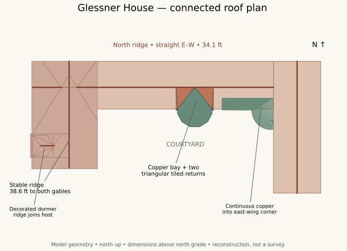
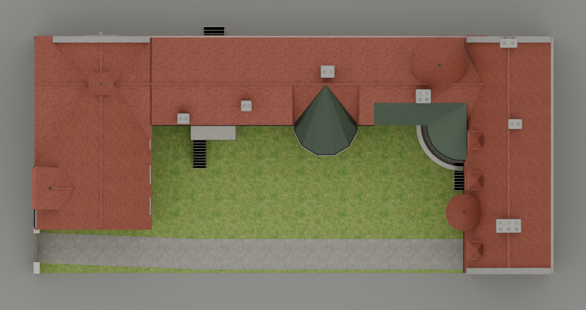
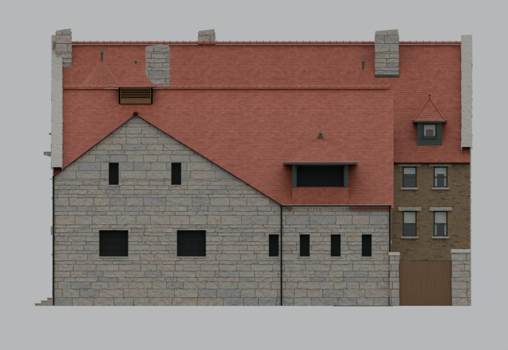
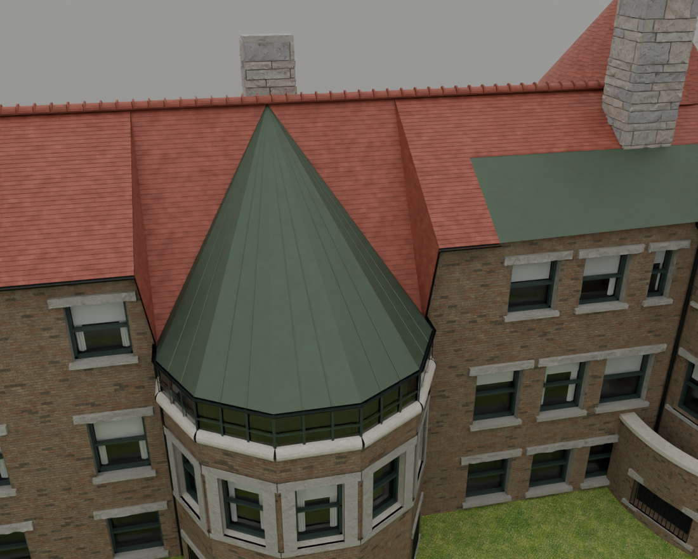
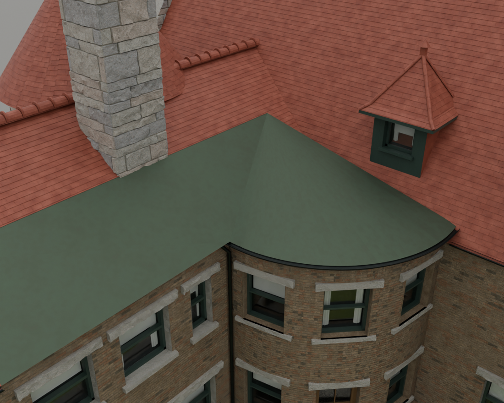
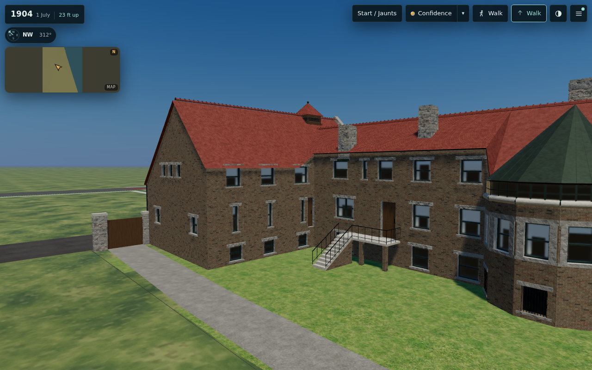
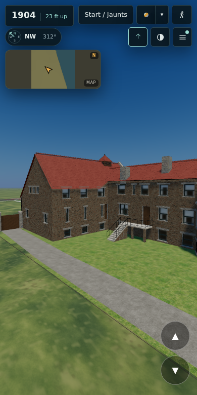

# T-2016 — Glessner connected roof plan

The owner supplied an east-up current-model view and a north-up modern aerial on
3 October 2026 (`Pasted Graphic 30.png` and `Pasted Graphic 31.png`). The latter
is a geometric target, not proof of the building in 1904. No photograph is used
as a texture. This revision supersedes T-1999's lower rear roof interpretation;
its north opening heights, west aperture layout and carved stonework remain.

## Geometry decisions

* North ridge: straight at S14.6 ft, 34.1 ft above north grade, continued to the
  west wall. The north courtyard slope is one plane. This removes the former
  5.7-ft eave kick read from HABS sheet 4; the disagreement is explicit.
* West stable ridge: W141 ft, 38.6 ft high, continued to the south gable at
  S59.75 ft. The two gable roofs intersect analytically. The higher stable ridge
  hides the lower north ridge locally; it does not bend that ridge in plan.
  The stable turret moves onto their plan intersection at S14.6 ft.
* The west dormer is a hipped-front projection with a decorated ridge returning
  into its host roof. Its rear intersects the roof instead of ending in midair.
* The dining-room bay's faceted copper cap reaches the north ridge, flanked by
  two triangular tile returns. The adjoining wall, tile field and gutter are
  trimmed together; the adjacent courtyard windows retain their clearance.
* Copper continues around the entrance-hall bow and across the northeast
  interior courtyard corner to the east-wing wall. Its boundary meets the
  north roof plane. The earlier disconnected rectangular cap is removed.

All measurements above use the existing record's feet west/south from the
northeast corner. The new joins and unmeasured dimensions are reconstructed,
not newly surveyed dimensions. The roof drawing shows the model's topology.

## Chimneys and the 1904 limit

The modern aerial suggests two additional service-range courtyard stacks.
The owner requested omission if we were fairly sure they were absent in 1904.
The archive does not establish that absence: HABS photo 1 (1963 northwest),
photo 5 (circa 1923 courtyard), sheets 2–4 and the data pages were reviewed.
The service roof is incompletely visible in the photographs; plan wall masses
cannot by themselves establish the shape, height or date of a projecting stack.
HABS data page 2 describes the 1946 removal of the coal furnace, bins and chutes,
but does not date these two stacks. Page 23 likewise only says the furnace was
removed. Neither statement proves a post-1904 chimney installation.

Accordingly the two stacks are retained as **reconstructed**, at approximately
W94–97/S20–23 and W113.5–117/S24–27 ft, with 36- and 33-ft tops. Locations are
bounded to roughly ±2 ft and the flue count, caps and dimensions are invented.
They must not be cited as HABS-attested or demonstrated 1904 fabric. A dated
pre-1904 roof photograph, original roof plan or chimney restoration record can
settle whether either should be removed. The existing five stacks are retained.

## Validation

The independent roof-envelope test samples 1,800 positions and checks one
continuous upper surface. Added controls pin both straight ridge axes, the
full-height south gable and dormer penetration. Actual exported-GLB close views
cover the overhead plan, west elevation, south gable, dining bay and copper
corner. Final gate and browser receipts will be recorded below.

### Measured review

The exported full model passes six first-hit material rays in each of 31 north
and west windows (186 samples); none hit roof, stone or missing geometry inside
the aperture. The independent envelope test passes its 1,800 samples. Full
master: 125,028,268 bytes; compressed full: 47,910,928 bytes; light: 25,165,408
bytes and 193,679 triangles, below the 200,000-triangle limit. Historical pre-v4,
v2 and v3 builds were re-emitted with their original UV bake setting: their GLBs
are byte-identical to the base; only recipe-freshness hashes change.

Desktop/full and mobile/light both boot the published 1904 app, fetch full and
light assets with HTTP 200, switch detail levels and show west/courtyard views
with zero page errors, failed requests or loader problems. The animation loop
was paused after normal readiness to keep software-rendered capture bounded;
each view uses the app's existing step() with unchanged rendering settings.
See `browser-validation.json`. Source preflight and official stage 13 are still
being completed; this receipt does not claim all thirteen town stages ran.

