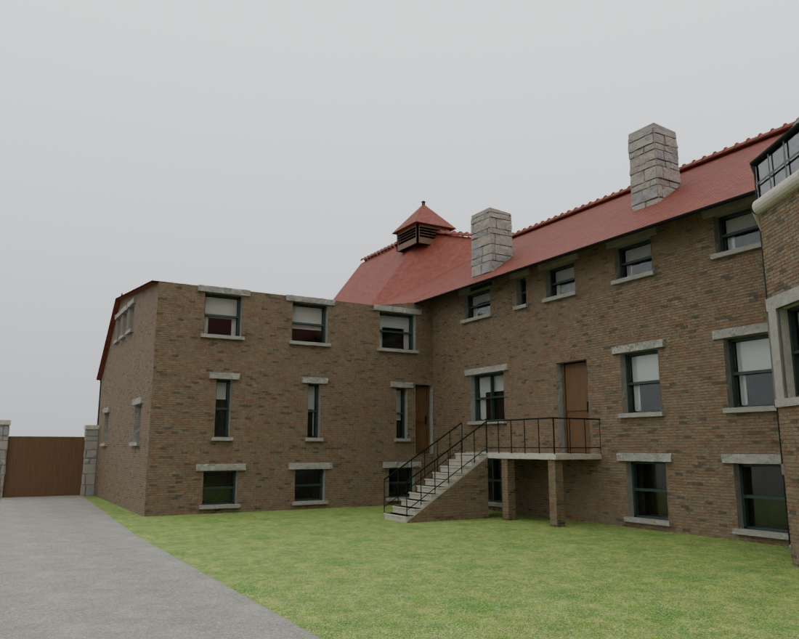
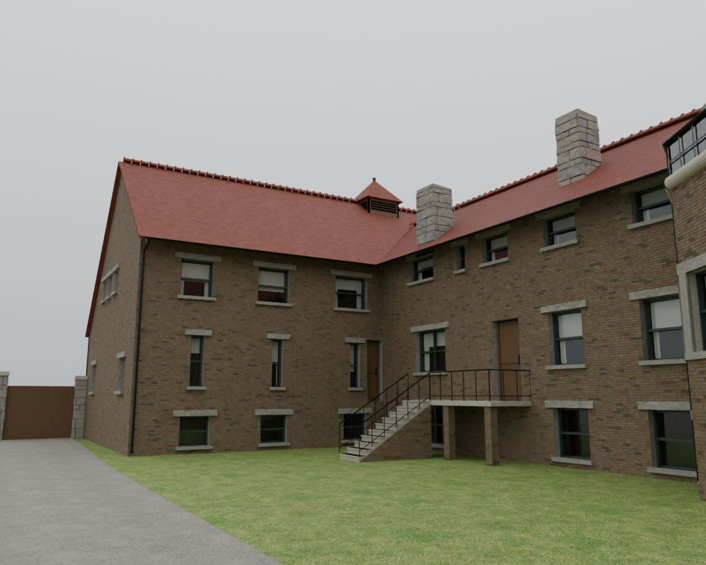
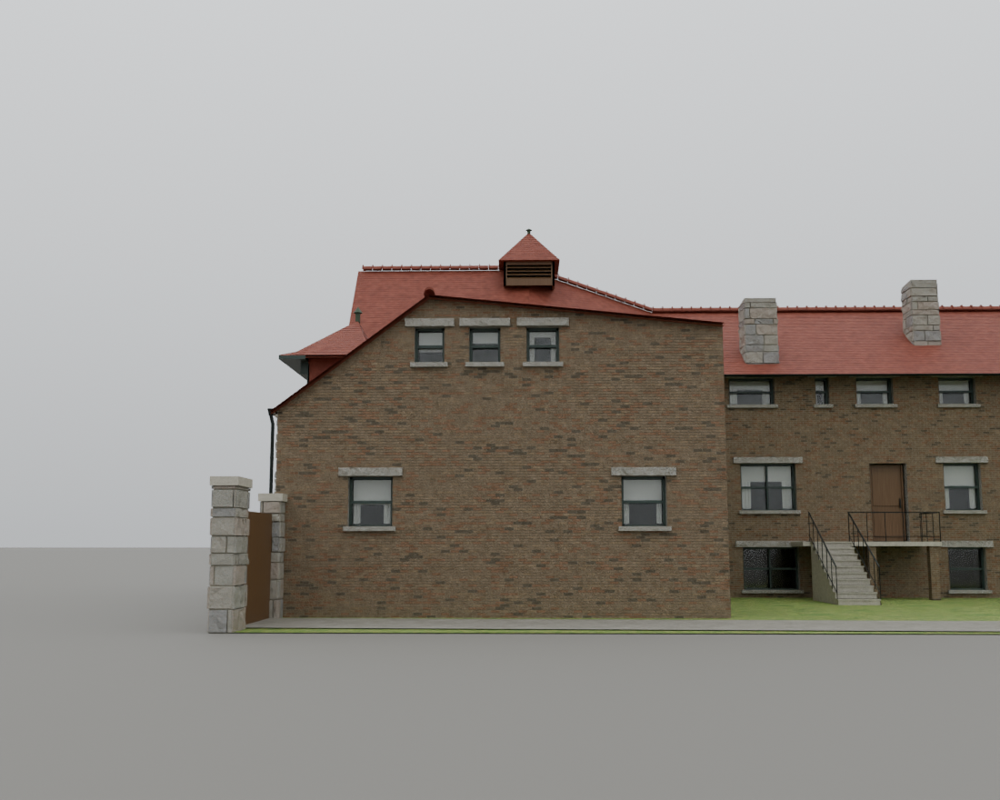
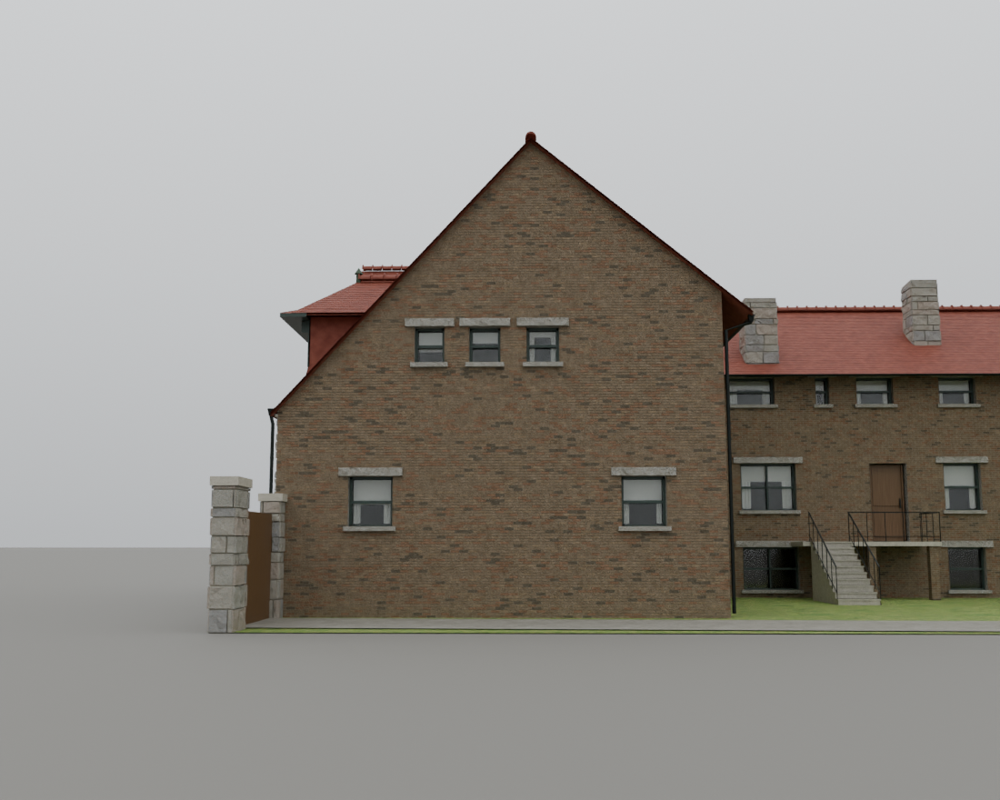
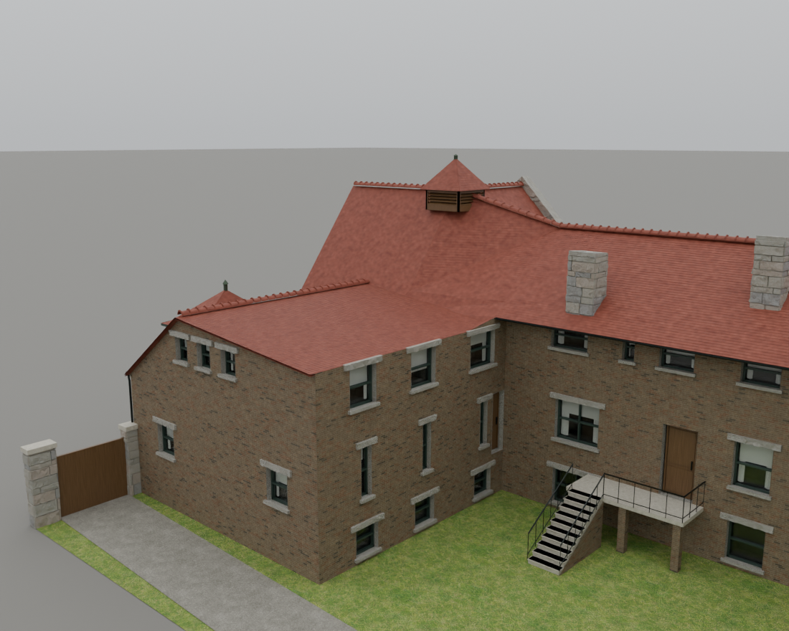
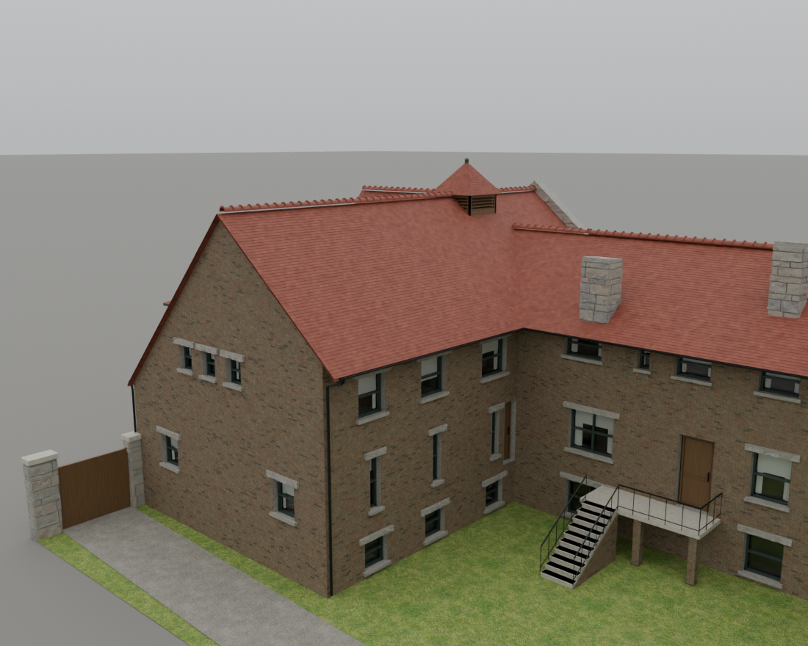
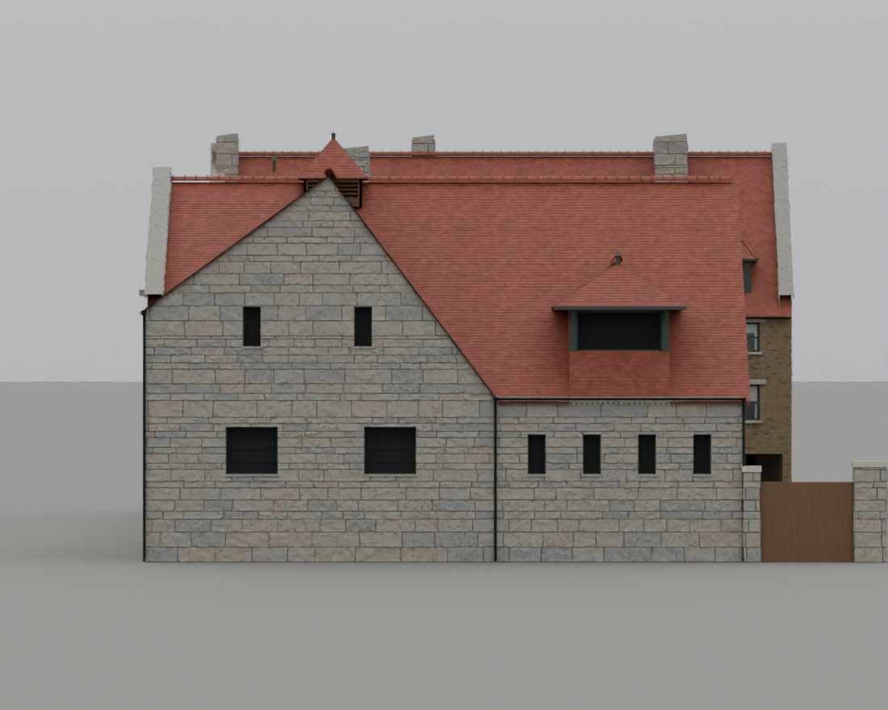
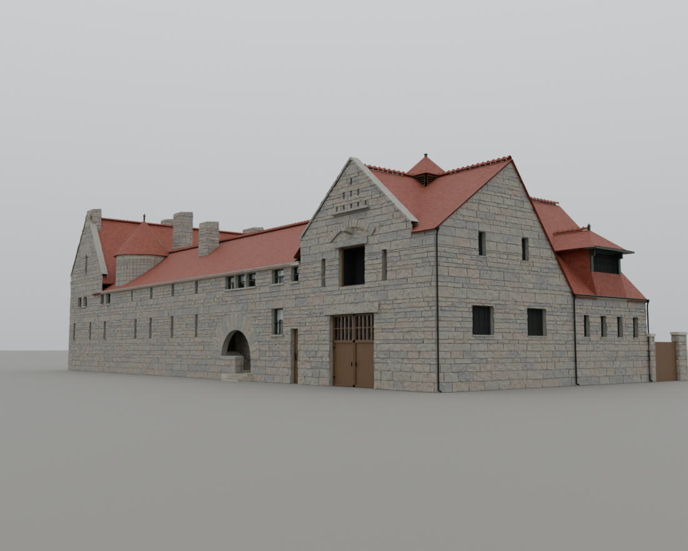
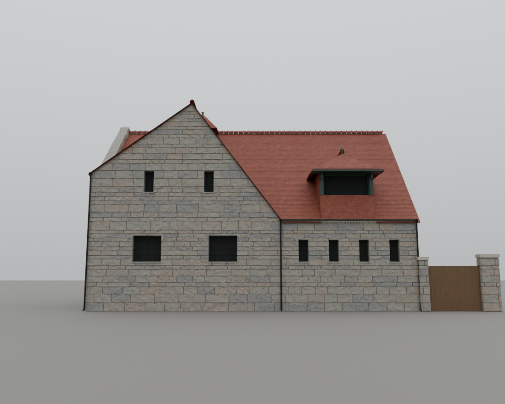

# T-2235 — Restore the west wing's full courtyard roof

The owner identified a regression in T-2231: the west wing's rear peak was
lowered, leaving the courtyard wall exposed above the roof. The follow-up
explicitly calls for the rear and front peaks at the same height, simple front
and rear gables, and the same overhang on the courtyard side.

## Reference reconciliation

All three supplied conversation images were inspected: the northwest photograph,
the isolated west elevation study, and the new 890 × 762 courtyard screenshot.
The earlier T-2016 `glessner-connected-roof-plan/roof-plan.svg`, `overhead.png`
and `desktop-courtyard.png` establish a straight north-south west-wing ridge.
The courtyard screenshot reproduces the actual before-model failure below.
HABS photo 05 was also inspected for the north courtyard eave treatment; it
does not directly show the west roof slope. T-2183 supplies the retained north
courtyard projecting-edge controls.

The isolated west study constrains the west cross-gable and frontage; it is
not an independently verified survey of the hidden roof. T-2231 incorrectly
extended that profile into a lowered whole-wing rear ridge. Here the explicit
owner clarification and earlier plan control the roof topology. The west
cross-gable intersects the full-height main roof. The original photos are not
republished or used as textures. Dimensions are reconstructed, approximately
+/-1 ft; see L-glessner-courtyard-ridge-2235.

| Control | Before (T-2231) | Corrected |
|---|---:|---:|
| Rear ridge height above north grade | 25.5 ft | 38.6 ft, equal to front |
| Rear ridge westing | W149.25 ft | W141 ft, equal to front |
| Main ridge | Lower/skewed rear construction | Straight for all 59.75 ft |
| South end | Low rear roof below courtyard wall | Full triangular gable |
| Courtyard outer edge | Incomplete slope above exposed wall | 2.36-ft projection at z24 ft |
| Courtyard wall/roof intersection | Wall exceeds lowered roof | Derived at z25.957 ft |
| West cross-gable apex | S18.4/z38.6 ft | Retained |
| West cross-gable rear foot | S35/z16.5 ft | Retained |
| West dormer eave/peak | 21.8/26.2 ft | Connected form, 25.5/29.9 ft |

The complete courtyard slope meets the north roof by plane intersection.
The north roof starts at the west overhang boundary, avoiding duplicate roof
strips. A small masonry wedge closes the inside corner to the actual roof
underside. A continuous gutter meets the north courtyard gutter at z24 ft.
The north range's independent ridge, footprint, recent bay/window details,
dark glass and T-2198 evidence review are retained. Comparison versions
pre-v4, v2 and v3 reproduce their original master bytes.

## Actual model review

`tools/render_glessner_t2235.py` imports the actual canonical GLB. Before is
dev `6e5a9ec2` (T-2231 geometry); after is this rebuild. Identical cameras,
1100 px, 20 samples, overcast sky, -1.5 EV. No mesh or background part is hidden.
The courtyard and south views expose the failure that west-only review missed.
The overhead view shows one uninterrupted ridge, the complete courtyard slope
and its joint to the north range. West and northwest cameras retain the earlier
photo comparison angles. The taller east house remains visible behind the
west facade; the isolated supplied study removes that background.

## Validation

The geometry regression test independently holds all 121 ridge samples at
38.6 ft, the triangular south gable, all 81 projecting-edge samples at 24 ft,
the full courtyard slope, the closed inside-corner wall and clearance above
every courtyard window. It retains west-profile controls and checks internal
roof-patch continuity. The existing 1,800 west-roof and 1,200 courtyard-roof
samples pass; all nine masonry/window/glass tests pass.

Reproduce with `python3 tools/test_glessner_roof_envelope.py`,
`python3 tools/test_glessner_block_clipping.py`, and
`python3 tools/recover_glessner_v4.py --check`.
`tools/qa_glessner_t2235.mjs` checks the actual published `/1904/` app at
1280 × 800/full and 390 × 780/light, six views each, with detail switches,
asset responses, glass mode, errors and budgets. Its animation is paused after
normal readiness for deterministic review; it does not measure moving FPS.

Published focused review passes both viewports: six views each, no page errors,
no failed asset responses, valid budgets, and dark glass after balanced/light/full
switches. The mobile light asset has 199,420 triangles, below its 200,000 limit.
`browser-validation.json` and the twelve desktop/mobile screenshots are the
receipts. `asset-hashes.json` identifies the exact master, full and light assets;
the recovery archive verifies against them.

Two broader desktop stage-13 invocations timed out during normal 1835 boot
while the repository suite was running (the first also overlapped other browser
checks). They reached no stage-13 assertions and are preserved separately as
`smoke-desktop-initial-load.log` and `smoke-desktop-source-load.log`; neither
is counted as a pass. Focused `/1904/`
review above completed successfully in both viewports. No timeout or readiness
assertion was changed.

The final repository run passes all 792 steps, including 323 negative self-tests.
The initial run found a stale published liberties copy after a precision-only
prose edit, and its writer-drift snapshot caught a concurrently growing smoke
log inside the source tree. Republish and moving active logs outside the tree
resolved both; no model or assertion change was needed.

Published mobile stage 13 passes all 126 assertions with zero page errors.
This is the applicable staged check, not the full fourteen-stage town smoke.
Its renderer and Glessner assets are the hashes above; the rounded liberties
prose was republished during its run, so the standing record does not claim
an exact-tree hash for that mixed metadata timing.

## Dev integration

Dev advanced to `22685d12` (T-1273 household home/work associations) during
validation. That change is integrated verbatim; the shared source index is
regenerated and only this branch's changelog entry is re-stamped, now v1558.
Dev's shipped v1557 remains unchanged. Glessner's geometry and asset hashes
are unchanged. The focused visual review and mobile smoke predate this merge;
the broader desktop run overlaps the published metadata/household refresh,
so its standing record likewise must not claim an exact-tree hash. The final
combined source tree is covered by the integrated preflight.
