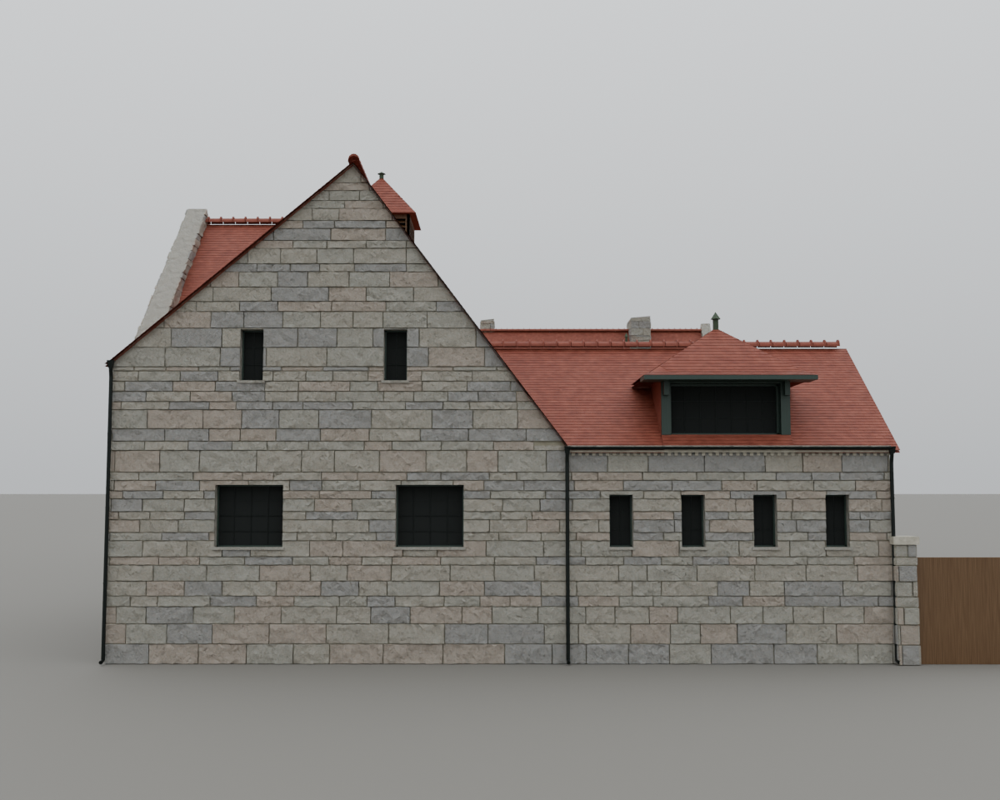
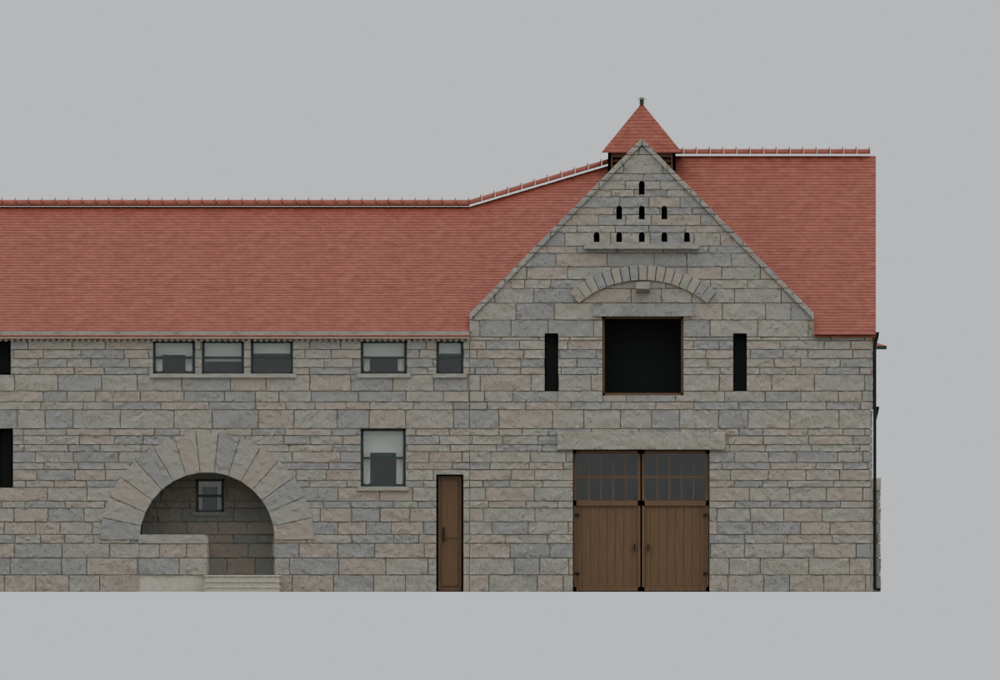
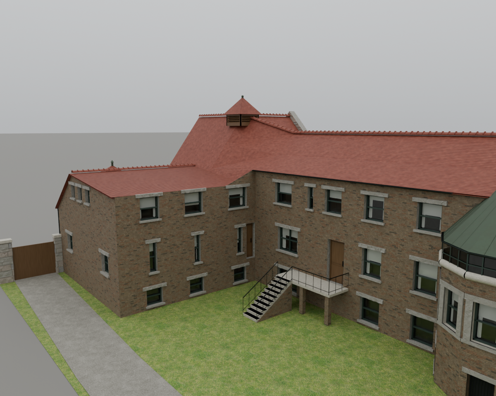
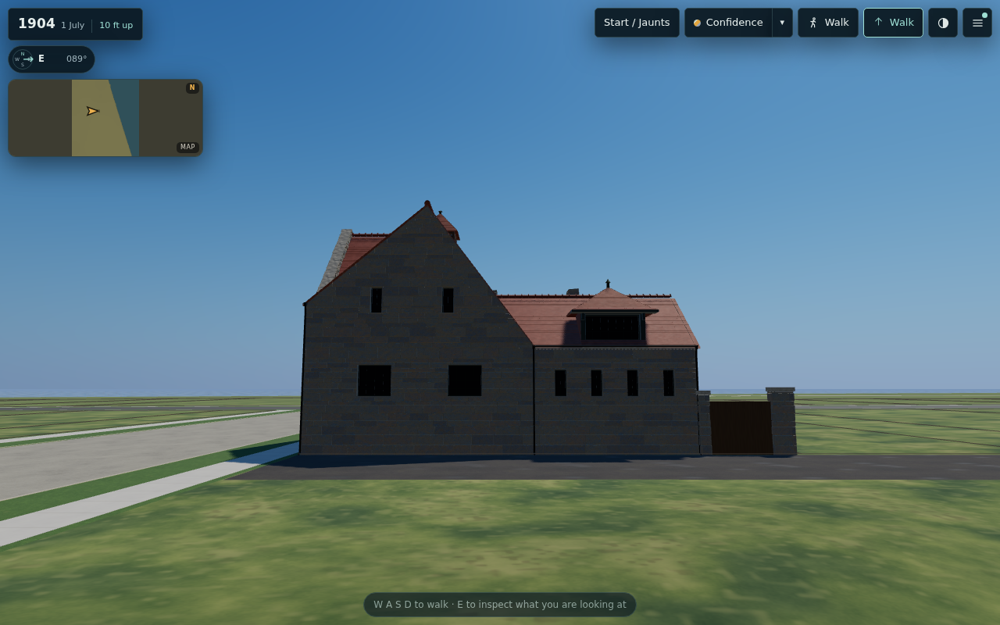
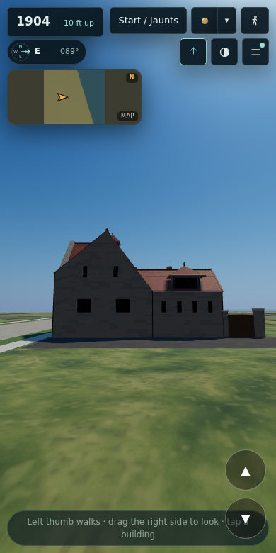

# T-1999 — Glessner north and west elevations

## Controlling references

The owner supplied five images on 2 October 2026. `image.png` is the northwest
photograph-like architectural reference; its capture date is not independently
established. `image(2).png` is the owner's reconstructed square-on west target.
`image(3).png` shows north windows piercing the roof; `image(4).png` shows the
misaligned west façade; `Untitled.png` requests turret alignment with the west
gable. These images are read in the conversation, not redistributed as textures.
HABS IL-1015 sheets 2–5 and the existing dossier remain dimensional evidence.

## Findings and construction

The north eave is 23.1 ft, but the former upper aperture heads reached 23.8 ft.
Independent rays through the prior shipped light model hit roof material inside
11 scheduled north windows (22 sampled intersections). Printed stone-course
dimensions correct these to 19.25–22.25 ft; lower corridor lights become
9.25–14.4583 ft. Horizontal placement and measured entrance widths are retained.

The previous rear stable ridge 38.6 ft/eave 26.5 ft hid the intended tall west
gable. The new owner target instead requires a high front gable and genuinely
lower rear roof. The original full-building silhouette also includes the taller
Prairie Avenue wing behind it; that background is absent from the supplied
elevation study and is not removed from the model to match a flattened image.

Eight west windows receive deliberate proportions and common sill alignment; rear
lights share widths, heads/sills and spacing. Fine leadwork replaces domestic
white shades. The hood has two side supports, no center post, a straight-edged
hipped tile cap and a finial. Three alley downpipes and the low rear gutter follow
the roof. The turret shifts from S8 to S18.4 to align with the west gable peak.
North stable doors, loft lintel/relieving arch and hoist stone, and the rounded
porch cheek are rebuilt from the references. All unmeasured choices remain
reconstructed under L365.

## Verification

The independent roof-envelope check passes 1,800 samples, internal joins, the
measured north-range seam and upper south-window lintel clearance. Emitted light
ridge-cap vertices are now checked against that same host envelope: visual
review caught an initially horizontal cap over the sloped cross-ridge transition,
and the reduced producer now carries the full model's vertical slope.

Both full and exact decoded light GLBs passed 186 aperture-interior ray samples,
with zero roof, stone or missed-surface hits. The previous light model had 22 roof
hits across 11 north windows. Ordinary north upper heads now leave 0.2591 m below
the eave. The turret and west-gable apex share y=16.9469 m in model coordinates.
Four rear windows are 0.5486 m wide on equal 1.6764 m centers.

The full master is `aecf5e9407fb7aafd34b585b27b9f126c1b569670c31cb67ca5891a0025c8ef9`.
Seven neutral-overcast views were inspected: west street, true west, north
entrance, north grazing, northwest, south and courtyard. No model parts were
hidden for the images. The actual building includes taller eastern masses behind
the west wing, unlike the flattened owner elevation study. Perspective also
shows the turret's depth; true west is the alignment check.

The full model retains approximately 1.06 million triangles; the same-geometry
light derivative is 192,117 triangles, within the existing 200,000 limit. The
package contains the exact master, compressed full and compressed light files.
Archive hashes and sizes are recorded in the adjacent recovery package manifest.

The dormer eave stays at 21.8 ft ng with its back at W154.5, clear of the host
roof. The rear ridge at W149.25 clears south-window lintels and roof thickness.

The merged source tree passes all 745 checks (309 are intentional-failure self-tests),
and preflight passes against dev base `5b500ef5`. Published desktop 1280×800
uses the full asset at west/northwest/north/courtyard stands; mobile 390×780
uses the light asset at west/north stands, with the entry overlay dismissed.
Both switch to the other detail level successfully, fetch both GLBs with HTTP
200, and report zero page errors, failed requests or model-loader problems.
`browser-validation.json` records the observed detail levels and capture method.
The browser snapshot uses runtime `81e41588` and the exact final model bytes.

SwiftShader required pausing the continuous animation loop after normal readiness
and calling the app's existing `step()` for each capture; no geometry, material,
lighting, shadow or pixel changes were made. Early contended attempts and an
initial mobile capture behind the welcome gate were rejected. Official staged
smoke results are recorded in the PR; these bounded checks are not a claim that
all thirteen unrelated town smoke stages ran. The images support the visible
corrections, not a quantitative claim of photographic perfection.

