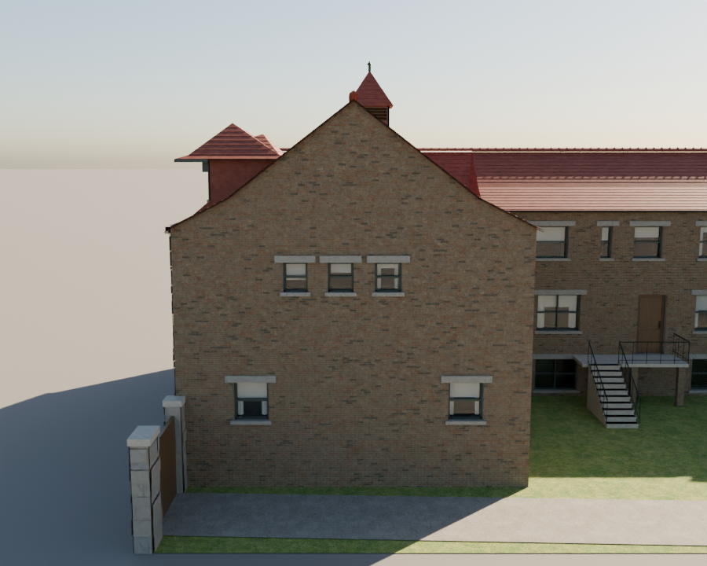
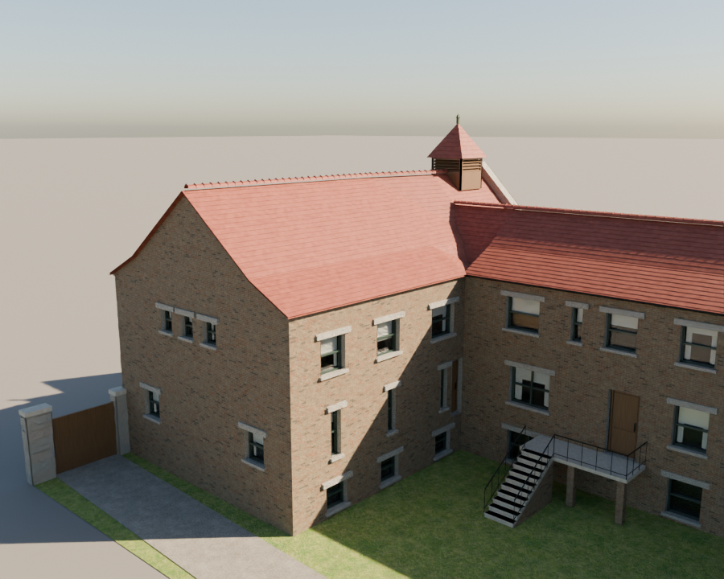
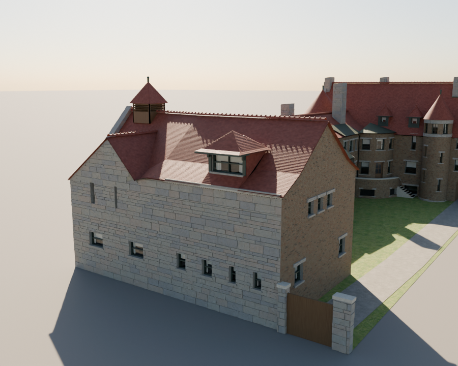

# T-1833 — Glessner rear ridge, south gable and courtyard eave

Owner correction of T-1830/PR #243, 2026-10-01. The two current-model screenshots
CFE16716-57CC-4436-9253-4E603CCCE1DA.jpeg and
EA861238-AF6F-4205-84C0-51608DBF23C5.jpeg show the rejected asymmetric rear hip.
06496DA0-6009-4D86-A67A-0965B6F542C0.png is the owner's balanced south-gable sketch.
The images are read in the conversation, not redistributed or used as texture pixels.

## Geometry

Retain HABS sheets 2–3's 35.5-ft width and all window plan positions. Replace the
south hip with a full brick gable: shoulders 26.5 ft ng, centered ridge W143.5 at
38.6 ft ng. The ridge remains at the front gable's height; it shifts 2.5 ft in plan
between S14.6 and S26.83, preserving the front door/loft axis. Each station strip
is triangulated into exact planes and clipped against the crossing roof. There
is no longitudinal fall toward the south wall.

The rear roof copies the north courtyard's 5.7-ft, 26.6-degree flared eave and
0.20-m overhang. Equal rear shoulders also raise the alley cornice to 26.5 ft.
The existing alley dormer is raised 7 ft (33-ft eave, 37-ft hood peak) so its
sash and cheeks stand clear of the higher roof; its plan and hood proportions
are unchanged. The north entrance alcove is unchanged.

All revised heights and the south-gable choice are owner-directed reconstruction,
not a newly discovered historic elevation. They supersede L331's rear hip and
unequal eaves only; a measured original roof section would replace them. L338.

## Progress

- T-1833 filed and claimed on chicago-tickets/main; branch saved.
- Independent 1,800-ray envelope check passes, with balanced gable, continuous
  ridge, matched court eave, and dormer clearance assertions.
- First full model rendered from south, southeast courtyard and southwest alley.
  South shape matches the sketch. Raised roof exposed the old dormer; its height
  and the matching overhang have been corrected for the second bake.
- Final full-model views reviewed from south, courtyard, alley, northwest and
  overhead. Raised dormer sash is clear of the roof. Roof returns beneath its
  hood close the cheek seams exposed in the first review.
- Full and light meshes carry reconstructed confidence for the changed roof and
  wall silhouette. The light model has 197,258 triangles (below the 200,000 cap).
- Full/light package complete. Decoded exact light derivative reviewed from south,
  courtyard and alley: architectural forms match the full model. Captures below.
- Local preflight initially interrupted by an unavailable GitHub API transport.
  Re-run with network transports explicitly offline: 725/727 steps passed; both
  failures identified missing refreshed web metadata for the three comparison
  versions rebuilt alongside v4. Regenerating those derivatives, then rerunning.
- Published mobile/desktop browser checks pending.

