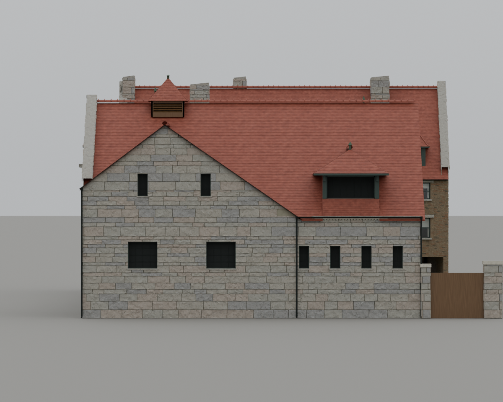
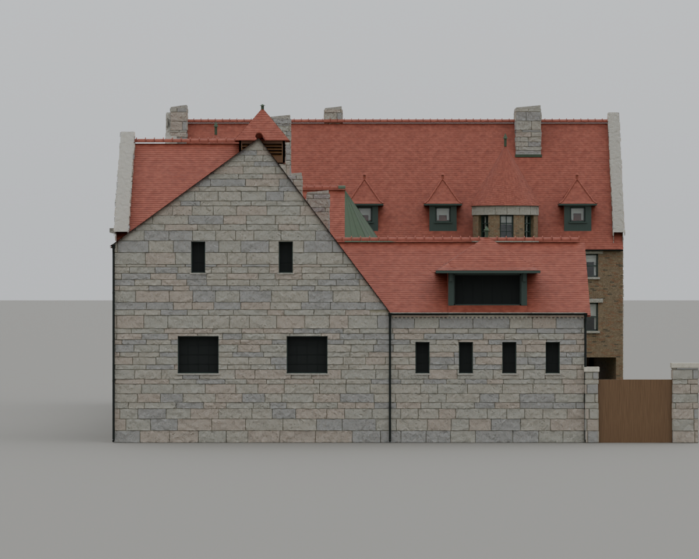
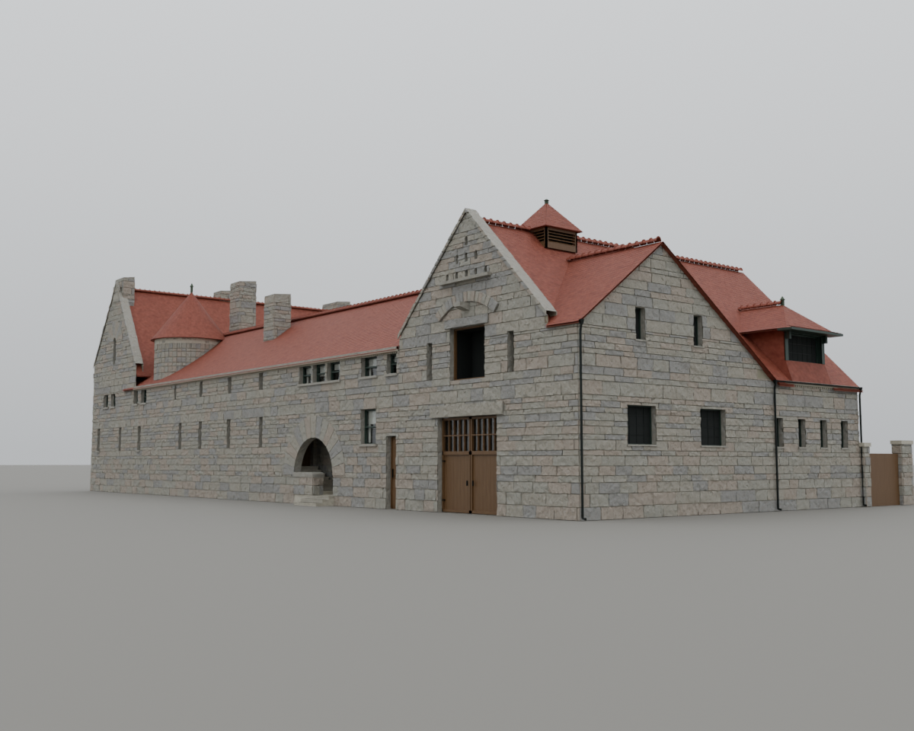
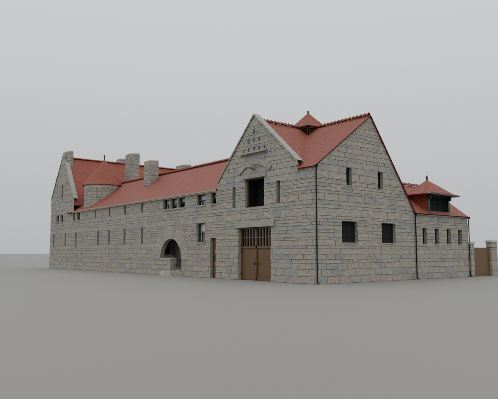
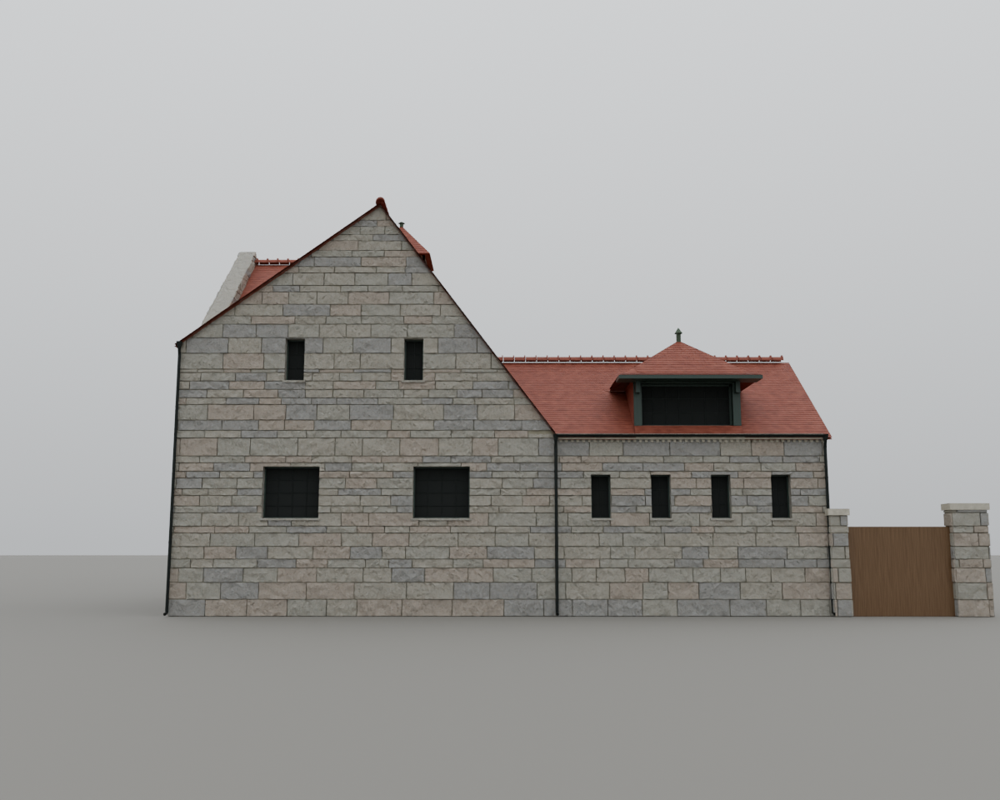

# T-2231 — West front gable angle and rear frontage

The owner supplied a 1196 x 864 northwest photograph and a 1047 x 717 isolated
west elevation, then clarified that the **front gable angle** is the roof defect.
Both were inspected in the conversation on 9 October 2026 UTC. The second image
is an elevation study, not an independently verified survey. No supplied pixels
are republished, projected onto geometry, or used as textures.

## Reference controls and correction

Approximate west-image controls (pixels, origin at upper left): north wall x20,
gable apex (324,55), north shoulder (20,280), rear break (600,400), south wall
x1020. Coping thickness and image rectification introduce uncertainty. The front
part occupies about 58% of the frontage; the apex is about 30% of the way from
the north corner. The apparent slopes are approximately 37 and 51 degrees.
The northwest photograph independently shows the steeper falling rear slope,
lower rear section, and intersecting north/west gables. It is not used to infer
absolute dimensions from uncalibrated perspective.

| Control | Before | Corrected | Reference interpretation |
|---|---:|---:|---|
| Measured total west frontage | 59.75 ft | 59.75 ft | HABS plan retained |
| Apex station from north | 14.60 ft / 24.4% | 18.40 ft / 30.8% | about 30% |
| Tall-to-low roof break | 37.83 ft / 63.3% | 35.00 ft / 58.6% | about 58% |
| Low rear frontage | 21.92 ft / 36.7% | 24.75 ft / 41.4% | about 42% |
| Northward west-gable slope | 37.0 degrees | 36.1 degrees | about 37 degrees |
| Southward west-gable slope | 34.7 degrees | 53.1 degrees | about 51 degrees |
| West-gable apex above north grade | 34.1 ft | 38.6 ft | proportional reconstruction |
| Northwest shoulder | 23.1 ft | 25.2 ft | proportional reconstruction |
| Rear alley eave | 18.02 ft | 16.5 ft | proportional reconstruction |

The roof now uses the existing lower-rear construction with a separate northwest
shoulder. Its north gable masonry and short return roof meet that shoulder; the
rear cornice and gutter follow the lower eave. The low hood and cupola follow
the corrected silhouette. Hidden planar joins reconcile the stable with the
retained north-range ridge and the T-2183 courtyard overhang. These choices are
reconstructed, approximately +/-1 ft, under L-glessner-west-profile-2231. They
supersede the west-stable part of T-2016, while retaining its courtyard work.

## Actual-model comparison

`tools/render_glessner_t2231.py` imports the actual GLB and uses identical west
and northwest cameras, 1200 px, 32 samples, CIE overcast and -1.5 EV. Before is
dev 14ee07c9; after is the rebuilt model. No model parts are hidden. The distant
west camera exposes the taller east house behind the stable; the supplied
isolated elevation removes that background, so silhouette comparisons concern
the west stable itself. A street-height west camera provides a second reading.

The first candidate revealed a floating rear cornice and a gap at the raised
northwest shoulder. Both were corrected before the final renders and package.
The comparison versions (pre-v4, v2, v3) were rebuilt with their original UV
settings and reproduce their original GLB bytes.

## Verification

The independent roof test passes 1,800 stable-envelope samples, shared-edge
continuity, south aperture clearances, new reference-proportion bounds and the
rear cornice datum. Another 1,200 samples preserve the courtyard roof envelope;
the T-2172/T-2183 window and eave relationships also pass. All nine masonry,
aperture, glass, door and light-geometry checks pass, and the rebuilt recovery
package verifies against its manifest.

Manual review of the final west, street-height west and northwest GLB renders
against both owner references confirms the revised asymmetric gable and rear
frontage. This is visual and proportional validation, not a surveyed dimension
claim. `geometry-validation.json` records the controls and exact asset hashes.

The actual published 1904 app passes the focused desktop Full and mobile Light
review: west, northwest and courtyard views, no page/resource/loader errors,
existing draw budgets respected, and dark glass retained through all three
detail settings. The six screenshots and `browser-validation-*.json` receipts
are included here. `tools/qa_glessner_t2231.mjs` reproduces the checks.

The final repository gate passes all 792 steps (323 negative self-tests).
Published mobile stage 13 passes all 126 assertions with zero page errors;
`smoke-mobile-13.log` records that run. The broader desktop stage-13 run is
still running at this checkpoint; its final verdict will be recorded on the
PR before merge. The focused desktop review above is complete.

The first repository pass exposed an incomplete sparse checkout and stale
source-use/liberties outputs. Restoring the required checkout and compiling
those outputs resolved all four failures; the complete final rerun is green.
The first mobile smoke invocation selected 1904 at boot, contrary to the
harness's 1835 startup precondition, and was cancelled after that assertion.
The recorded pass is the normal invocation, which reaches 1904 itself.

Reproduction: `python3 tools/test_glessner_roof_envelope.py`,
`python3 tools/test_glessner_block_clipping.py`,
`python3 tools/recover_glessner_v4.py --check`, `./tools/check.sh`, and
`SMOKE_VIEWPORT=mobile SMOKE_STAGE=13 node tools/smoke_renderer.mjs --published`.
Use the installed Chromium via `PW_EXECUTABLE` for the browser commands.
