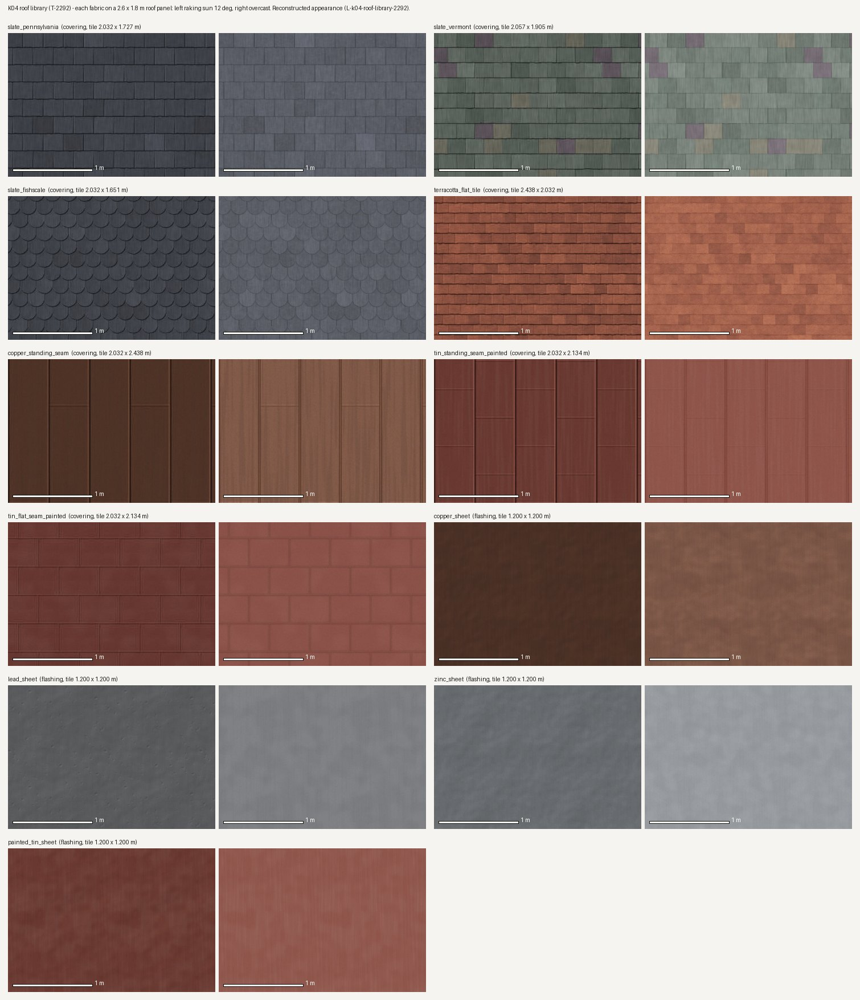

# K04 roof library — the study (T-2292)

**What this is.** Every fabric of `assets/textures/prairie_1904_roofs/` laid on a 2.6 × 1.8 m panel
of roof at 140 px/m, mapped as a K01 roof maps it (TEXCOORD_0 = surface metres / tile_m, so each
panel repeats its tile and would show a seam if the tile had one), and shaded from its own **web**
maps — the three files a renderer binds — twice:

- **left, raking**: one sun 12° above the roof plane from up-slope left. It finds every butt step,
  seam rib, lock and dent, and would find a baked highlight (there is none: the albedo carries no
  light) or a slate out of scale against the 1 m bar.
- **right, overcast**: a sky light, how most of the town is seen.

A plain Lambert + GGX shader on the CPU (`tools/study_prairie_1904_roofs.py` in the library): a
study of what the maps carry, not a render of the scene. The scene's first K04 roof is T-2293's.

**What it shows.** The slates sit at their data's size against the bar: 10 × 20 in Pennsylvania at
8.5 in to the weather, 9 × 18 in Vermont at 7.5 in, 8 × 16 in scalloped at 6.5 in, the flat tile at
HABS's 6 × 5 in. Courses break joint by half a slate and the tile wraps mid-slate (the generator's
`course_phase_m`), so no repeat line shows across the panels. Vermont's mix is dealt per slate from
weighted colours with a gentle tone spread, so no two neighbours repeat and nothing reads as a
checkerboard. The copper is brown, not green; the tin is red oxide with a faint chalking.

**What was changed after looking.** The first sheet's Vermont mix was too loud (purple and buff
slates read as patches) and the metals' downslope streaking read as wood grain; both were cut back
to the version above. The first wrap check failed on every coursed map because the tile edge fell
on a butt line and a joint, which is why the courses are now phased a quarter-slate and half a
course off the tile's origin.

## Costs

Every map is 512 × 512. *Masters* are the four PNGs and material.json in the library; *web* is
the three JPEGs a renderer would ship; *GPU* is three RGBA8 textures with a full mip chain.

| fabric | px | px/m (u × v) | masters | web | GPU (est.) |
|---|---|---|---|---|---|
| `slate_pennsylvania` | 512² | 252 × 296 | 538 KiB | 102 KiB | 4.0 MiB |
| `slate_vermont` | 512² | 249 × 269 | 570 KiB | 107 KiB | 4.0 MiB |
| `slate_fishscale` | 512² | 252 × 310 | 660 KiB | 117 KiB | 4.0 MiB |
| `terracotta_flat_tile` | 512² | 210 × 252 | 829 KiB | 150 KiB | 4.0 MiB |
| `copper_standing_seam` | 512² | 252 × 210 | 469 KiB | 58 KiB | 4.0 MiB |
| `tin_standing_seam_painted` | 512² | 252 × 240 | 480 KiB | 63 KiB | 4.0 MiB |
| `tin_flat_seam_painted` | 512² | 252 × 240 | 553 KiB | 68 KiB | 4.0 MiB |
| `copper_sheet` | 512² | 427 × 427 | 560 KiB | 38 KiB | 4.0 MiB |
| `lead_sheet` | 512² | 427 × 427 | 515 KiB | 46 KiB | 4.0 MiB |
| `zinc_sheet` | 512² | 427 × 427 | 581 KiB | 47 KiB | 4.0 MiB |
| `painted_tin_sheet` | 512² | 427 × 427 | 565 KiB | 39 KiB | 4.0 MiB |
| **all eleven** | | | **6.17 MiB** | **836 KiB** | **44.0 MiB** |

None of it is published yet: `tools/publish.sh` mirrors no file of this library, and no scene
loads one, so these bytes cost a visitor nothing until T-2293 binds a fabric — and then only the
fabrics that roof uses. Machine-readable: [`costs.json`](costs.json).

## The gate

`python3 tools/check_roof_library.py --check` (in `tools/check.sh`) holds every map to
`data/components/prairie_1904/k04_roofs.json`: tile = columns × width by courses × exposure, the
double-lap rule, the reconstruction rules' slate range (0.20–0.30 m wide, 0.15–0.25 m exposed), an
even bond so the wrap stays in bond, a seamless wrap edge, the manifest, and the flat tile's
restriction to roofs a source documents with a source whose rights allow an asset. `--self-test`
breaks each of the nine and watches it fail.

The appearance is reconstructed throughout: `docs/LIBERTIES.md` § L-k04-roof-library-2292.
