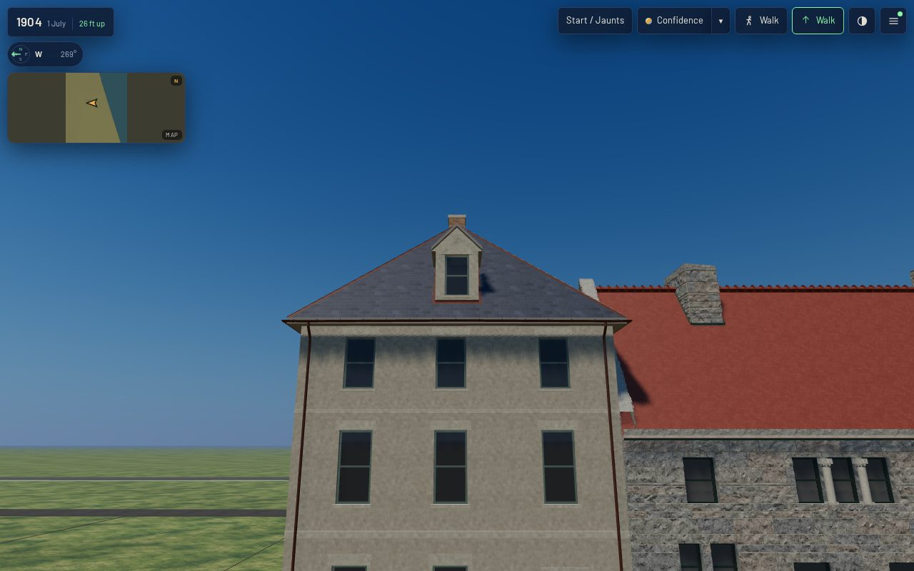
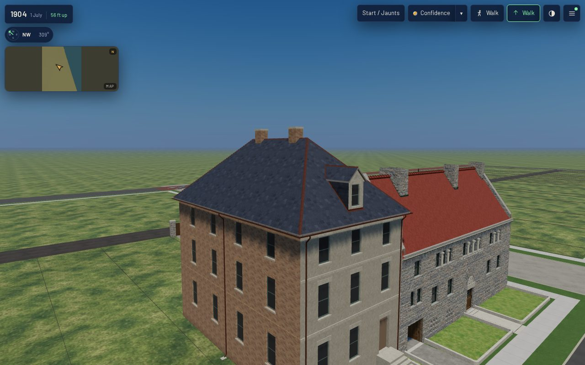
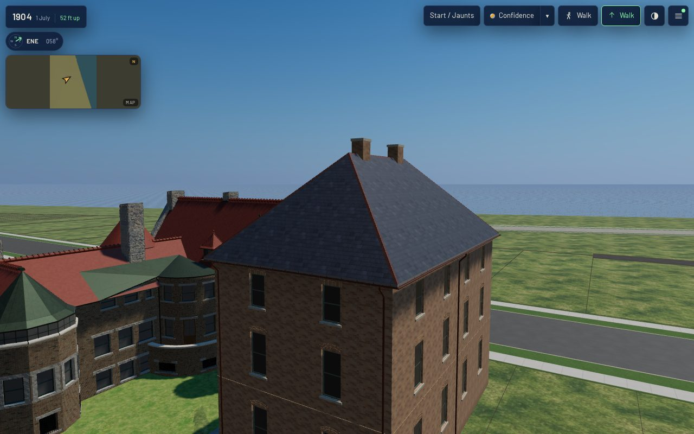
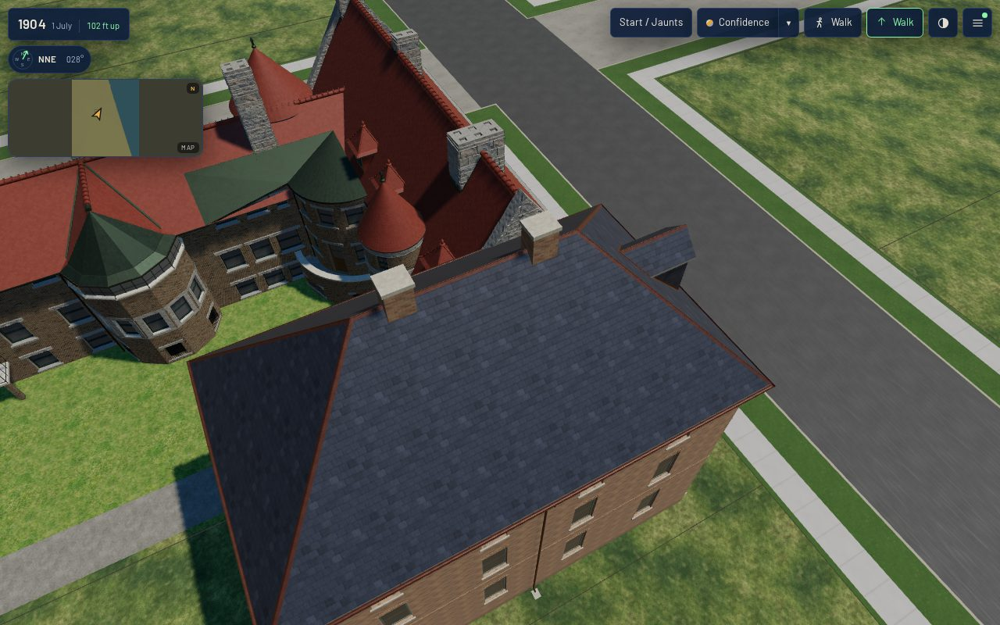

# K05 on the 1808 exemplar (T-2302)

Piece 2 of T-1847 (K05). The 1808 Prairie house (`keith_house_1808_prairie`, 1904 scene) is now
roofed from the K05 roof-construction kit (T-2301) instead of four loose planes with a dormer laid
over them.

**Acceptance, stated before the work:** the roof is built from the kit; no covering plane crosses
a gable, cheek or stack face; nothing floats; no surface is doubled; the dormer and the chimney
penetrations are closed; K04's dressing is laid on the kit's graph; baked; and verified in the
published app at 1280×800 and 390×780 from the front, an oblique, the rear and above, with costs.

| | |
|---|---|
|  |  |
|  |  |

## What changed

- **One solid.** `k01_frontage.Assembly.roof` builds the hip (`k05_roofs.hip_element`), a body
  under it, the dormer (`gable_element` on the street hip, with its eave box, verge and cheeks)
  and two chimney stacks with stone caps. They are joined by the kit's BSP union, and the dormer's
  sash recess is cut out with a new `k05_roofs.subtract`. The body's faces are never emitted: they
  are where the K01 walls stand, so the soffit is a ring and not a lid.
- **K04 on the graph.** Copper rolls go on every ridge and hip line the union leaves, and open
  valleys on every valley line. Each sheet finds its two planes from the built triangles. The
  apron and step flashing follow the dormer's abutments. A covering's courses start at the lowest
  point of their own plane, so no course is cut at the eave.
- **Chimneys.** Two reconstructed brick stacks on the ridge (`form.chimneys` in the record; liberty
  `L-k05-1808-roof-2302`). Stacks on the ridge need no back gutter. Their flues, pots and flashing
  belong to K10 (T-1857).
- **Gate.** `tools/check_roof_kit.py --check` now builds every `k01_frontage` record and holds its
  joined roof to the kit's rules (closed, one shell, doubled, crossing, hidden, every covering edge
  classed) and checks that K04 dressed every ridge, hip and valley. A new self-test lays the 1808
  roof without the union, and the **crossing** rule refuses it.

## Measured

Roof shell (from `check_roof_kit.py --check`): **closed, one shell, 0 doubled, 0 crossings, 0 hidden.**
It has 358 triangles, 334 of them emitted (the other 24 are the body under it). Its graph is ridge 4
(the main ridge in three pieces between the stacks, plus the dormer's), hip 4, valley 2, eave 6,
verge 2 and abutment 19 (7 at the dormer, 12 at the stacks). K04 dresses all 4 ridges, 4 hips
and 2 valleys.

| asset (`k01_contract.mjs --measure-asset`) | before (T-2293 + T-2291) | after |
|---|---|---|
| triangles | 11,351 | 11,658 |
| draw primitives | 17 | 17 |
| master GLB | 2,288,308 B | 2,324,596 B |
| web GLB | 922,808 B | 924,912 B |
| coincident faces | 0 | 0 |
| verdicts | all ok | all ok (scale drift, origin, coincident, metric UV) |

In the published `/1904/` app (`node tools/qa_k05_t2302.mjs`; `browser-validation-*.json`), 0 page
errors and no failed requests at either viewport. Every stand is within budget:

| stand | desktop full: draws / triangles | mobile light: draws / triangles |
|---|---|---|
| front | 68 / 2,497,306 | 67 / 466,541 |
| oblique | 69 / 2,500,013 | 67 / 467,638 |
| rear | 71 / 2,511,824 | 66 / 467,374 |
| roof | 68 / 2,487,371 | 66 / 467,946 |

The frame times in the JSON are headless SwiftShader. Use them only to compare one reading with another.

## Not done, said

- K04 carried the slate 50 mm past the fascia, with a cut edge. On a closed solid the covering
  stops at the fascia's face, so that lip is gone until K04 lays it as a part on the eave line.
- Step flashing is one strip per cheek. The dormer's eave boxes, where they meet the hip, carry
  no flashing.
- The pierced parapet the 1888 plate shows is still T-1882's to build.
