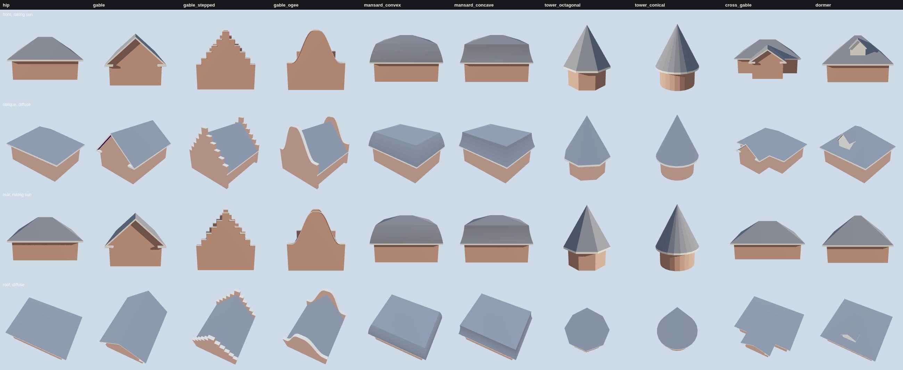

# K05 roof-construction kit (T-2301)

Piece 1 of T-1847 (K05, *Mansard, hip, gable and tower roof construction*),
split into this kit and T-2302, the kit on the 1808 exemplar, the way K02, K03, K04 and K06 were.

*Rows: front in a low raking sun, oblique under a diffuse sky, rear in a raking sun from the
other side, the roof from above. Rendered by `tools/study_k05_roofs.mjs` in the vendored three.js.*

## What it is

- **Data**: `data/components/prairie_1904/k05_roofs.json`. The parts' working sizes (eave, fascia,
  verge, return, parapet, coping, dormer), RECONSTRUCTION-RULES' pitch ranges, how the roof graph is
  read, the triangle budgets and **10 variants**, each declaring the graph it must show.
- **Generator**: `generators/archetypes/k05_roofs.py`, pure Python on K01's `Prim`. It writes
  `k05_roof_kit.glb` (the specimen).
  1. **Elements are closed solids.** Hipped, mansard and tower roofs are ring stacks (soffit, fascia,
     covering up to a ridge or apex). A gable body is extruded along its ridge: the attic with both
     eave boxes, a verge strip past each gable face (covering, rake board, sloping rake soffit) and a
     return at each eave foot. A parapet and its coping are the gable's top line extruded through the
     wall. A dormer is a small gable body whose face and cheeks are named as such.
  2. **A BSP boolean union joins them** (the csg.js algorithm). So the cross gable's valleys, the
     dormer's valleys, cheeks and apron, and the line where a roof dies into a parapet are cut where
     the surfaces really meet. Nothing is trimmed by hand.
  3. **Closure.** Vertices are welded and every point lying on another polygon's edge is inserted into
     it, so there are no T-junctions. Each plane's fragments are re-merged into their region, and split
     points left on straight edges are dropped. Each region is then ear-clipped, with an area check and
     a fan fallback.
  4. **The roof graph is read off the built surface**, not authored. Covering-to-covering edges are
     classed by dihedral as ridge, curb, hip, valley or kick, and a cone's or curve's facet joints as
     seams. Covering-to-part edges are classed as eave, verge or return where the part hangs under the
     covering, and as abutment where it stands on it. Each node's `extras.graph` carries the lines with
     their ends and lengths, so K04 can lay ridge caps, valley flashing and aprons on them.
- **Gate**: `tools/check_roof_kit.py --check`, a `check.sh` step, plus a 13-case `--self-test`. It
  rebuilds every variant and measures the built surface on K01's 1 mm quantum:
  - every pitch is in range;
  - the roof is **closed** (every edge shared by exactly two oppositely wound triangles, positive volume);
  - it is **one shell** (nothing floats);
  - no doubled or degenerate triangles;
  - **no crossing** (no triangle passes through another);
  - a parapet's covering stops at its inner face, and its top clears the roof by the upstand;
  - the graph matches the declared one;
  - no interior face survives;
  - the budget holds;
  - the specimen is the generator's bytes.

The self-test shows what the rules catch. Laying the cross gable or the stepped gable without the union
(planes through gables and parapets) is refused by **crossing**. A return lifted off its eave is refused
by **one shell**. A parapet built 0.05 m clear is refused by **parapet**.

## Measured (costs.json)

| roof | roof triangles | graph |
|---|---|---|
| hip | 34 | ridge 1, hip 4, eave 4 |
| gable | 82 | ridge 1, eave 2, verge 4 |
| gable_stepped | 670 | ridge 1, eave 2, abutment 4 |
| gable_ogee | 590 | ridge 1, eave 2, abutment 4 |
| mansard_convex | 74 | curb 4, ridge 1, hip 8, eave 4 |
| mansard_concave | 74 | curb 4, ridge 1, hip 8, eave 4 |
| tower_octagonal | 70 | hip 8, eave 8 |
| tower_conical | 214 | eave 24 (facet joints are seams) |
| cross_gable | 76 | ridge 2, hip 4, valley 2, eave 7, verge 2 |
| dormer | 138 | ridge 2, hip 4, valley 2, eave 6, verge 2, abutment 7 |

The whole board is 65 draw calls and about 2.7k triangles at 1280×800. Frame time is headless
SwiftShader, so read it only to compare kit revisions. The build plus gate takes about 1 s.

The two stepped and ogee gables are the dearest, because the parapet's every step or curve segment
is its own face. The specimen draws one material per part; K04's fabrics are bound in T-2302.

## Provenance

Every dimension, pitch and form is **reconstructed** (liberty `L-k05-roof-kit-2301`). Pitches sit in
RECONSTRUCTION-RULES' working ranges. No source is cited and none is invented.

## Not yet

- No house is roofed from this kit. **T-2302** rebuilds the 1808 exemplar's roof from it and bakes it.
- Chimney penetrations belong to T-2302 (on a real roof) and to K10 (T-1857, the stacks themselves).
- The dormer face is blank; K06's attic light goes in it on a house.
- The mansard has no curb moulding; K09 (T-1852, cornices and cresting) owns that.
