# K06 on the 1808 exemplar (T-2298)

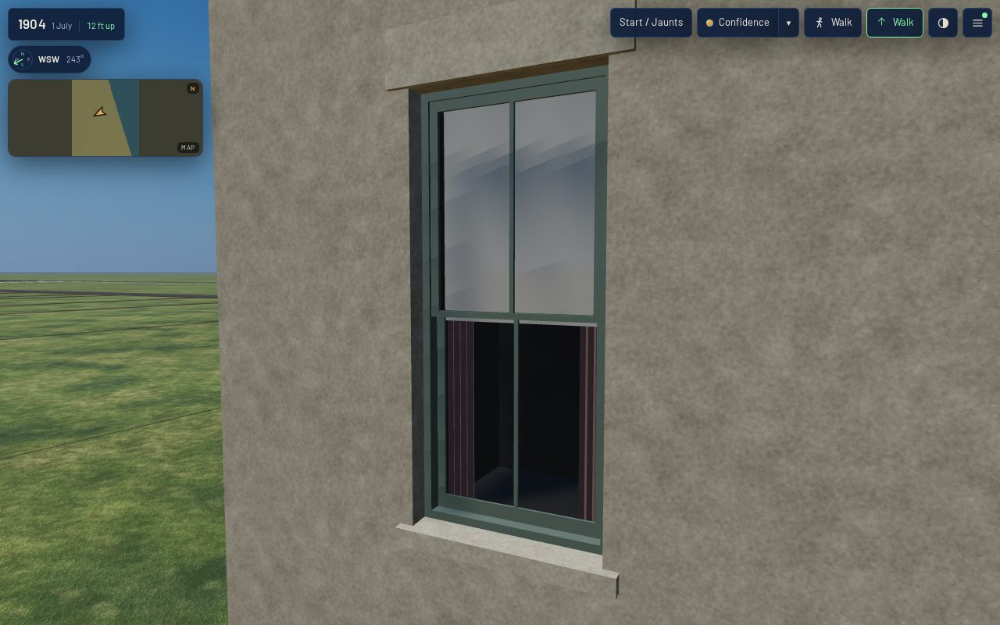

**What changed.** Every window of `keith_house_1808_prairie` (as built 1886) is now a K06 opening,
built by `generators/archetypes/k06_windows.py` from `data/components/prairie_1904/k06_windows.json`
inside the K01 assembly (`Assembly.glaze` in `generators/archetypes/k01_frontage.py`). The record
names the variants in `form.window_kit` (reconstructed, `docs/LIBERTIES.md`
§ L-k06-1808-windows-2298):

| K01 opening | K06 variant | count | clear size |
|---|---|---|---|
| `k01.opening.sash_flat` | `k06.opening.sash_2over2_flat` | 26 (front 8, south 12, rear 6) | each storey's `sash_by_storey` size |
| `k01.opening.area_light` | `k06.opening.area_light`, well left out | 2 | 0.90 × 0.70 m, sill 0.35 m above grade |
| `k01.opening.door_leaf` | unchanged (K01's recessed leaf) | 1 | |

Each window is a hole through its wall with a 0.115 m reveal in the wall's own fabric, a frame
ring, the upper sash in the outer track and the lower 56 mm behind it, glass set into each sash,
a holland blind at a seeded drop and curtain edges behind the inner glass, and the daylight
outline carried back 0.75 m behind the glass and capped dark. The stone sill falls outward
and has a throated drip, and it replaces the K01 proof's plain block. The K01 flat lintel still
dresses the head: heads are K02's and K03's to dress (T-2289, T-2291). The kit's own head band is
left out, so nothing is drawn twice. A K01 wall cuts a rectangular hole, so
`k01_frontage_params.py` refuses an arched variant, a well under a sill above grade, and a
single-sash variant on a double-hung opening.

**The glass** is the kit's one thin blended layer (alpha 0.32, rough 0.04), the only transparent
surface, one layer per line of sight. It is not KHR transmission, so the walkthrough's dark-pane
default (T-2183), which replaces transmissive glass only, draws it as it is.

## Verified

`node tools/qa_k06_t2298.mjs` runs the actual published `/1904/` app (`tools/publish.sh` first).
Desktop is 1280×800 at full detail and mobile 390×780 at light. Each viewport takes six stands:
street-eye, oblique, rear and roof, plus the K06 acceptance's two close views, a front window
square-on at 3 m and a south-wall window raked at 2.5 m. Both viewports passed with zero page
errors, zero failed requests and every stand within the scene budget.
Desktop ran in two parts (`QA_PART=a|b`), because software GL takes about 90 s a stand.
Raw readings: `browser-validation-desktop-a.json`, `-desktop-b.json`, `-mobile.json`.

| view | desktop | mobile |
|---|---|---|
| front, street-eye | 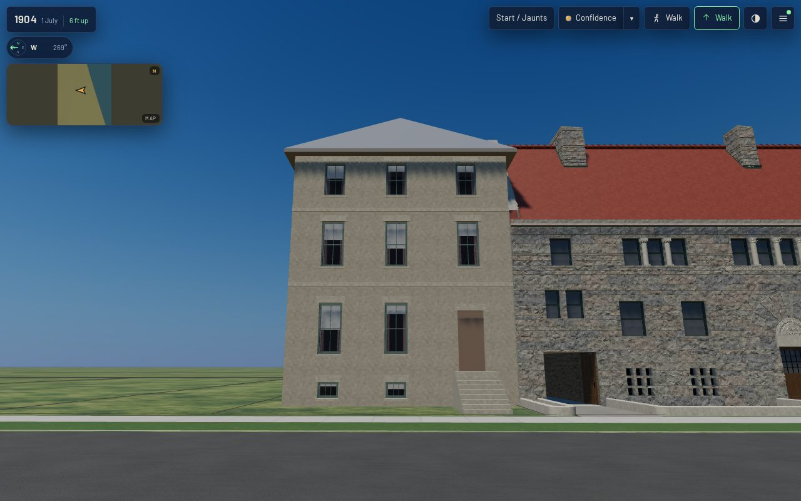 | 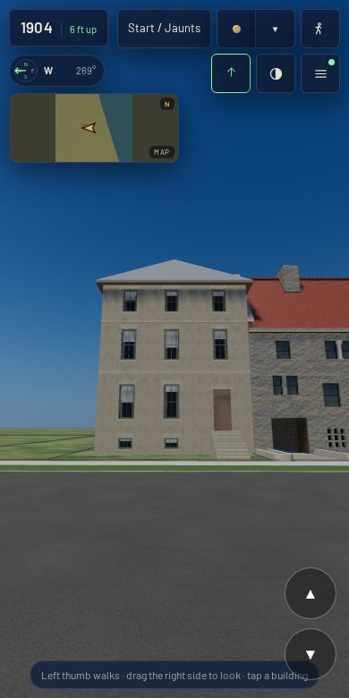 |
| oblique | 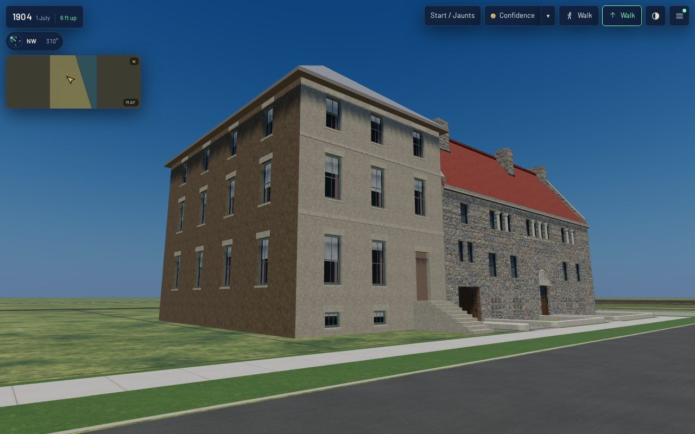 | 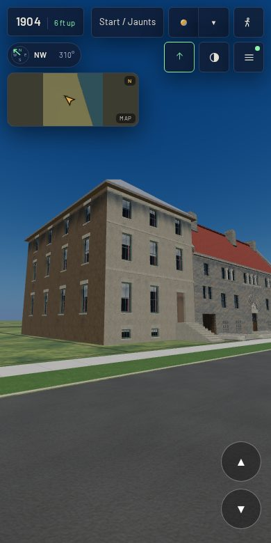 |
| rear | 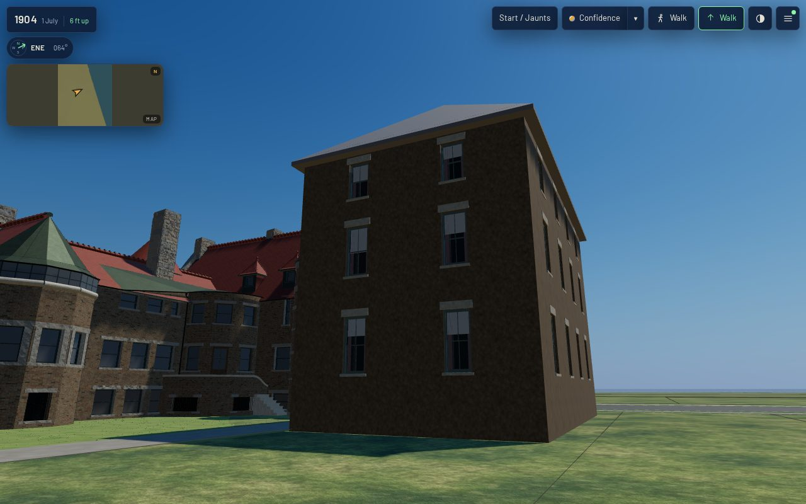 | 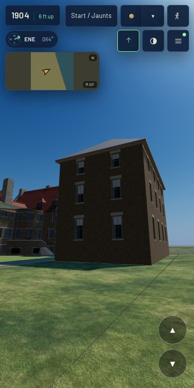 |
| roof | 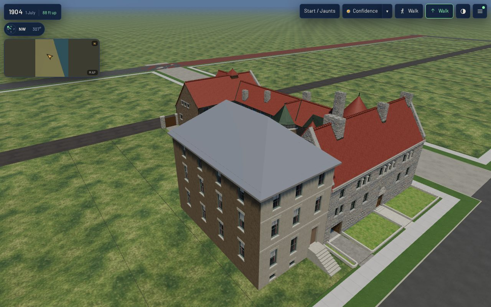 | 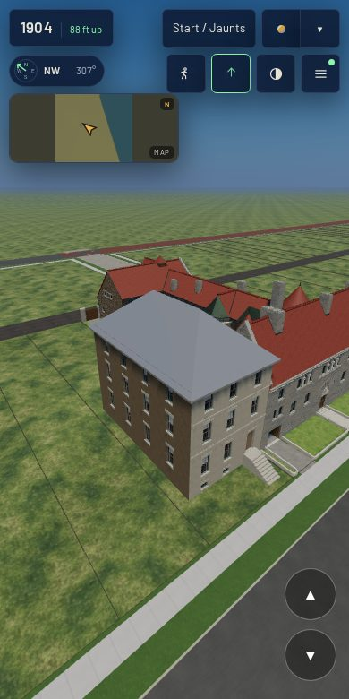 |
| front window, 3 m |  | 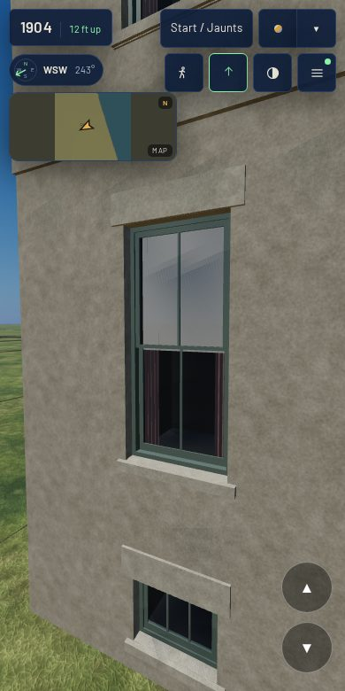 |
| south window, raking 2.5 m | 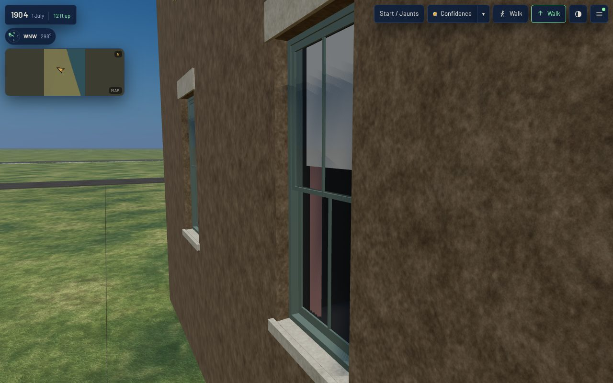 | 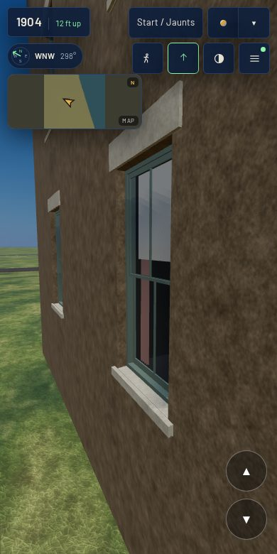 |

## Costs

| | K01 proof (T-2266) | with K06 (this) |
|---|---|---|
| house triangles (full = web) | 2,218 | 5,202 |
| house vertices, full / web | 4,438 / 3,432 | 10,406 / 9,512 |
| house materials = draw primitives | 10 | 12 (blind and curtain added) |
| master GLB / web GLB | 1.86 MB / 893 KB | 2.10 MB / 933 KB |
| scene draw calls, desktop street-eye | 62 | 64 |
| scene draw calls, mobile street-eye | 61 | 63 |
| scene load to ready, desktop / mobile | 17.6 s / 9.6 s | 23.4 s / 12.4 s |

Each material is merged across all 28 openings, so the windows add two draw calls to the scene, not
two per window. Scene triangles are within 0.6 % of T-2266's at every shared stand: 2.48 M on
desktop and 0.45 M on mobile, because the 1904 scene's Glessner tiers dominate. The house's
own 3,000 extra triangles are noise at that scale. The frame and load times are headless
Chromium on a software rasteriser on a different run from T-2266's. They are relative readings,
not device timings, and they do not isolate this change.

**After K03 landed** (T-2291, #632, merged into this branch before it shipped), the house carries
both packages: K03's common brick, rowlock and soldier heads and string course on the return and rear,
and these windows. It measures **11,248 triangles in 16 primitives** (master 2.10 MB). The table and
screenshots above were taken before that merge, so they isolate K06 against the K01 proof. The gate and
the smoke legs in the PR ran on the merged house.

`node tools/k01_contract.mjs --measure-asset keith_house_1808_prairie` reads 0 coincident faces,
origin ok, scale drift ok and metric UV ok at full and web, both before and after the merge.
