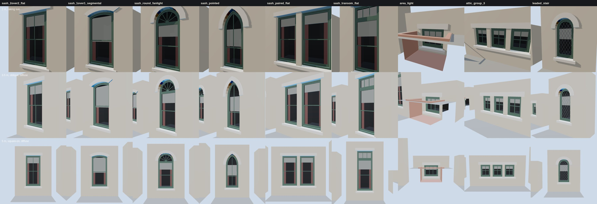

# K06 window kit — the study (T-2297)

**What this is.** The nine openings of `data/components/prairie_1904/k06_windows.json`, built by
`generators/archetypes/k06_windows.py` into the specimen `k06_window_kit.glb` (each in its own
wall panel, boxed in so its room is enclosed as a house's would be). They are drawn by the vendored
three.js the walkthrough uses (`tools/study_k06_windows.mjs`) at the distances the K06 acceptance
names:

- **top row, 2 m, raking sun**: one sun 12° off the wall plane from the left, a weak sky. It shows
  whether the jamb throws a shadow across the sash, whether the two sashes of a double-hung pair
  are at different depths (the upper sash's meeting rail sits in front of the lower's), and whether
  the sill's nose and drip stand off the face.
- **middle row, 3.5 m, oblique, diffuse sky**: the view a walker gets passing a house. The reveal's
  far jamb and the room's side walls show through the glass. Nothing behind the glass is sky.
- **bottom row, 5 m, square-on, diffuse sky**: the pane patterns and proportions read as a facade.

The glass reflects a sky (a gradient environment, the scene's own sky being the renderer's) and
lets the blind, the curtain edges and the dark room show through. It is the only transparent
surface, one layer per line of sight, so no view has to sort one transparency against another.

**What a window is made of** (each a role the gate measures, each its own depth):

| stage | depth behind the face (2-over-2) | part |
|---|---|---|
| outer face | 0 | the wall, the hole cut through it in a T-junction-free cell grid |
| reveal | 0 → 0.115 m | jambs and head soffit in the wall's own body; the stone sill closes the bottom |
| frame face | 0.115 m | the box frame's 45 mm face ring, its sight edges running back 0.11 m |
| outer sash | 0.127 m | the upper sash, in the outer track: stiles, top rail, meeting rail, muntins |
| outer glass | 0.143 m | set 16 mm into its sash |
| inner sash | 0.183 m | the lower sash, behind a 12 mm parting bead |
| inner glass | 0.199 m | |
| blind | 0.257 m | holland, drawn to a seeded 15-60 % of the daylight, a lath at its foot |
| curtain | 0.292 m | an edge each side, four folds, 30 mm deep |
| backing | 0.949 m | the daylight outline carried back and capped, dark |

Arched heads follow the same order: the segmental and pointed upper sashes follow the curve, the
round head's sash stops at a transom bar on the spring with a fixed fanlight above it, its bars
springing from a half-round hub. The basement light sits in its area well, the sill below grade.
The leaded stair light's two families of cames lie a millimetre apart in depth, so their crossings
never coincide.

**What was changed after looking.** The first board's panels were bare sheets, and the oblique
views showed each opening's dark room standing out behind its neighbour. The panels now have
returns and a back. The gate's first run found two doubled faces the eye had missed: the
fanlight's radial bars overlapped at their common centre, now a hub, and the attic casements'
horizontal bars crossed the vertical ones in one plane, now cut between them. Basement, attic and
stair lights hang no curtains (`curtains: false`).

## Costs

Exact counts from the specimen ([`costs.json`](costs.json)). *Opening* excludes the study's wall
panel and ground. One draw call per material, nine at most.

| variant | triangles (opening) | vertices (with panel) | draw calls |
|---|---|---|---|
| `sash_2over2_flat` | 160 | 372 | 9 |
| `sash_1over1_segmental` | 285 | 635 | 9 |
| `sash_round_fanlight` | 424 | 896 | 9 |
| `sash_pointed` | 382 | 836 | 9 |
| `sash_paired_flat` | 252 | 576 | 9 |
| `sash_transom_flat` | 182 | 416 | 9 |
| `area_light` | 130 | 344 | 9 |
| `attic_group_3` | 282 | 656 | 8 |
| `leaded_stair` | 364 | 796 | 9 |

The whole specimen is 294 KB and draws about 3,700 triangles at 1280×800 (3,100 at 390×780, where
the board is partly off screen). The frame times in `costs.json` are headless Chromium on a software
rasteriser: they compare kit revisions, they are not device timings. No texture is bound: the
masonry, stone and joinery here are flat colours. K02 and K03's fabrics clothe them on a house.
None of this is published: `tools/publish.sh` mirrors nothing under `docs/RESEARCH/`, and no
scene loads the specimen. T-2298 glazes the 1808 exemplar from the generator, and a house built
from it will merge each material across all its openings, so a facade's windows cost about nine
draw calls in total, not nine each.

## The gate

`python3 tools/check_window_kit.py --check` (in `tools/check.sh`) rebuilds every variant and
measures the built geometry: each stage strictly deeper than the last, the reveal no deeper than
the host wall, every edge of every hole closed by a reveal or sill face at both the face and the
frame, the backing's cap behind every point of every pane, glass the only transparent material
with no two panes overlapping, no coplanar faces overlapping, muntins dividing each sash evenly,
ordinary sashes inside the reconstruction rules' range, arches true to their kind, the drip under
the sill's nose, leaded lights only where the restriction allows, the triangle budget, metric UVs,
and the committed specimen being the generator's bytes. `--self-test` makes 16 breaks across those
rules (nine in the data, seven in a built opening's geometry) and checks that the gate refuses each
for its own reason, then checks that the committed kit passes: 17 cases in all.

The kit is reconstructed throughout: `docs/LIBERTIES.md` § L-k06-window-kit-2297.

Re-make: `python3 generators/archetypes/k06_windows.py`, then `node tools/study_k06_windows.mjs`.
