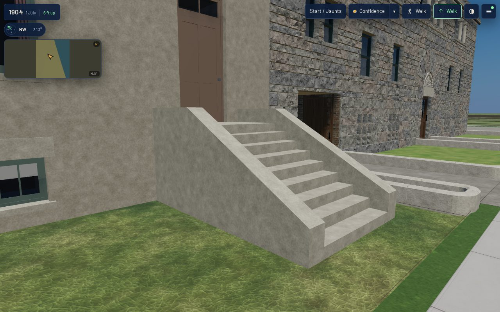

# K07 on the 1808 exemplar — the door and its stoop (T-2304)

**What changed.** The street door of `keith_house_1808_prairie` (as built 1886) and its stoop are
now the K07 kit's `k07.entrance.panel_door_stoop` (T-2303). The kit is built by
`generators/archetypes/k07_entrances.py` about the door's threshold socket and merged into the K01
assembly's materials through the same graft the K06 windows use (`Assembly.enter`, `Assembly.graft`).
This replaces the K01 proof's one-plane leaf, recessed 0.22 m, and its stoop of solid columns.

| part | as built here |
|---|---|
| hole | the K01 proof's 1.20 x 2.70 m hole at the north bay, the principal floor 1.5 m above grade |
| reveal, threshold | 0.115 m in the front's stone, the K06 windows' depth; a stone threshold at the floor |
| frame, leaf | a 55 mm frame; one four-panel leaf, panels sunk 16 mm, standing 6 mm clear of the threshold, a knob at the lock rail |
| transom | two lights over the leaf, a dark hall 0.9 m behind the glass |
| head | the K01 flat lintel, as on every window (K07's head band is left out) |
| stair | nine equal risers of 0.167 m, 0.30 m goings, a 1.2 m landing level with the threshold, 1.8 m wide, between 0.3 m cheek walls, foot on grade 3.60 m out |
| walk | the inner edge of Prairie Avenue's walk is 4.75 m out at the door (`data/street_grid/1904.json`, face `prairie__indiana_prairie_18_20`), so the stoop stops 1.15 m short |

`form.entrance_kit` on the record names the variant and the front yard. `k01_frontage_params.py`
refuses a variant that is not a flat-headed principal entrance on a straight stoop, a stoop that
reaches the walk, and a K07 riser count that disagrees with the K01 stair's. The generator
measures the built mesh against the walk again. **There is no carriage opening.** The 1911
Sanborn sheet draws this lot's carriage house as the detached rear building, which is T-1935's.
That building takes `k07.entrance.carriage_doors`.

**Accessibility in the walk renderer.** It is unchanged. The walker collides with a structure's
footprint only (`renderers/web/js/walker.js`), so the stoop is open ground to it, as the K01 stoop
was, and the walk and the front yard stay walkable.

## Costs

| | before (dev, K01 + K03 + K06) | with K07 (this) |
|---|---|---|
| house triangles (full = web) | 11,248 | 11,382 |
| house vertices, full / web | 22,498 / 21,472 | 22,762 / 21,752 |
| house materials = draw primitives | 16 | 17 (`door_iron`) |
| master GLB / web GLB | 2,096,632 / 822,848 B | 2,108,268 / 825,616 B |

In the published `/1904/` app, scene draw calls were 66-68 at 1280x800 (full detail) and 64-65 at
390x780 (light) across the six stands. Scene triangles were 2.50 M and 0.47 M, all within budget
(330 calls, 3.8 M triangles). Load to ready was 23.5-25.0 s on desktop and 12.2-12.3 s on mobile.
These are headless Chromium on a software rasteriser: relative readings, not device timings.

## Verification

- `node tools/k01_contract.mjs --measure-asset keith_house_1808_prairie`: 0 coincident faces;
  scale drift, origin and metric UV ok at full and web.
- `node tools/qa_k07_t2304.mjs` (`QA_VIEWPORT` x `QA_PART`): front, oblique, rear and roof, the
  door at 2.5 m in a raking view, and the stoop from the walk, at 1280x800 full and 390x780 light.
  PASS with zero page errors, zero failed requests, and every stand within budget
  (`browser-validation-*.json`, 12 screenshots here).
- `./tools/check.sh`: CHECK PASS.

The choices are reconstructions: L-k07-1808-entrance-2304 in `docs/LIBERTIES.md`.
