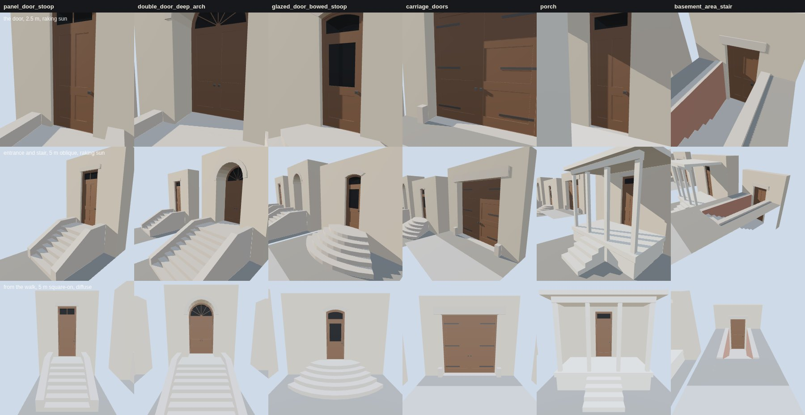

# K07 entrance kit — the study (T-2303)

**What this is.** The six entrances of `data/components/prairie_1904/k07_entrances.json`, built by
`generators/archetypes/k07_entrances.py` into the specimen `k07_entrance_kit.glb` (each in its own
wall panel, boxed in, on its own ground with the public walk drawn at its front yard's edge). They
are drawn by the vendored three.js the walkthrough uses (`tools/study_k07_entrances.mjs`):

- **top row, the door at 2.5 m, raking sun**: one sun 12° off the wall plane from the left. It
  shows whether the jamb throws a shadow across the leaf, whether the panels are sunk behind their
  rails and stiles, whether the leaf stands clear of the threshold, and the transom or fanlight's
  dark hall behind the glass. The basement door is seen from above its area's coping.
- **middle row, the entrance and its stair at 5 m oblique, the same sun**: the view a walker gets
  coming along the walk. Every riser, tread and step end is a face; the cheek walls run parallel
  to the nosing line; the carriage opening shows the wall's whole thickness.
- **bottom row, 5 m square-on from the walk, diffuse sky**: the entrance read as a facade, with
  its stair inside the front yard.

**What an entrance is made of** (each a role the gate measures):

| part | how it is built |
|---|---|
| hole | cut through the wall panel, T-junction free; flat, segmental or round head |
| reveal, threshold | jambs and soffit from the face to the frame (0.115 m; 0.95 m for the Romanesque entrance: a 0.6 m wall and a 0.4 m vestibule; 0.36 m, the whole wall, for the carriage opening); the threshold floors it at the door's floor |
| frame | a 55 mm face ring with no foot, its sight edges 0.13 m deep |
| leaves | rails, stiles and a lock rail at the frame's stop, panels sunk 16 mm; the leaf's foot 6 mm above the threshold |
| glass | a transom, a radial fanlight or a glazed upper panel, K06's sash and glass; a hall 0.9 m deep behind it, capped dark |
| hardware | a knob at the lock rail; three strap hinges on each carriage leaf |
| stair | integer risers solved from the floor height (n = round(floor / 0.17)), every one equal; landing level with the threshold, foot on grade |

| variant | floor | risers | going | front yard / stair's reach |
|---|---|---|---|---|
| `panel_door_stoop` | 1.2 m | 7 × 0.171 m | 0.30 m | 4.5 / 3.00 m |
| `double_door_deep_arch` | 1.5 m | 9 × 0.167 m | 0.32 m | 6.0 / 3.96 m |
| `glazed_door_bowed_stoop` | 0.9 m | 5 × 0.180 m | 0.32 m (on the centre line) | 3.5 / 2.28 m |
| `carriage_doors` | grade | — | — | 1.0 / 0.20 m (the guard stones) |
| `porch` | 0.85 m | 5 × 0.170 m | 0.30 m | 5.0 / 3.60 m |
| `basement_area_stair` | 1.5 m below grade | 9 × 0.167 m | 0.28 m | 4.5 / 3.24 m |

**What was changed after looking.** The first board's porch ceiling and the soffits of the heads
rendered blue. The geometry's normals were right: the study's sky, copied from K06's, extrapolated
its ground gradient past the ground colour into negative light, which a downward face picks up.
The K07 study clamps it. The basement door was first framed at grade, where only its coping shows,
and is now seen from above the area as a walker sees it. The gate's first run refused the porch:
it counted the deck's soffit as a walking level, so a walked level is now one that faces up.

## Costs

Exact counts from the specimen ([`costs.json`](costs.json)). *Entrance* excludes the study's wall
panel, ground and walk. One draw call per material.

| variant | triangles (entrance) | vertices (with board) | draw calls |
|---|---|---|---|
| `panel_door_stoop` | 218 | 488 | 8 |
| `double_door_deep_arch` | 504 | 1,058 | 8 |
| `glazed_door_bowed_stoop` | 474 | 1,008 | 8 |
| `carriage_doors` | 264 | 572 | 6 |
| `porch` | 266 | 588 | 9 |
| `basement_area_stair` | 178 | 432 | 7 |

The whole specimen is 207 KB and draws 2,622 triangles in 62 draw calls at 1280×800 (2,254 in 49 at
390×780, where the board is partly off screen). The frame times in `costs.json` are headless
Chromium on a software rasteriser: they compare kit revisions, they are not device timings. No
texture is bound: the stone, brick and joinery here are flat colours, and K02 and K03's fabrics
clothe them on a house. None of this is published: `tools/publish.sh` mirrors nothing under
`docs/RESEARCH/`, and no scene loads the specimen. T-2304 builds the 1808 exemplar's entrance from
the generator, and a house built from it merges each material across its parts.

## The gate

`python3 tools/check_entrance_kit.py --check` (in `tools/check.sh`) rebuilds every variant and
measures the built geometry: the landing, deck or area floor level with the threshold and meeting
it at the face; the stair's foot on grade (an area stair's last riser at grade); every rise between
walked levels equal and inside RECONSTRUCTION-RULES.md's 0.14-0.19 m, every going equal and inside
0.25-0.34 m; a face on every tread, every riser and both ends of every step, and every handrail
socket on its cheek or coping; nothing past the front yard onto the walk; a carriage opening's
reveal through the whole wall and its lintel bearing 0.15 m or more past each jamb; every hole
edge closed by a reveal or the threshold at the face and at the frame; frame, leaf, glass and
backing in depth order, the reveal no deeper than its wall and declared vestibule; each leaf clear
of the threshold by no more than 12 mm and filling its frame; a hall behind every light; glass the
only transparency; no doubled coplanar faces; the triangle budget; metric UVs; and the committed
specimen being the generator's bytes. `--self-test` makes 20 breaks (eleven in the data, nine in a
built entrance's geometry) and checks that the gate refuses each for its own reason, then checks
that the committed kit passes: 21 cases in all.

The kit is reconstructed throughout: `docs/LIBERTIES.md` § L-k07-entrance-kit-2303.

Re-make: `python3 generators/archetypes/k07_entrances.py`, then `node tools/study_k07_entrances.mjs`.
