# K08 on the 1808 exemplar: a curved front bay and a canted rear bay (T-2308)

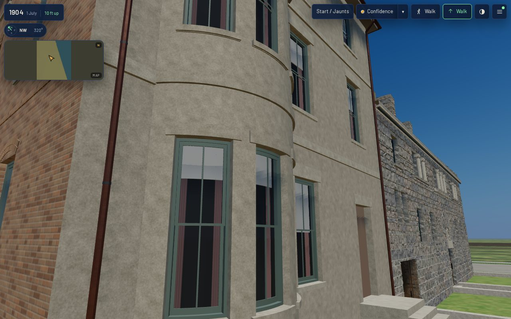

**What changed.** `keith_house_1808_prairie` (as built 1886) now carries two K08 bays, named in the
record's `form.bays` and built by `generators/archetypes/k08_bays.py` from
`data/components/prairie_1904/k08_bays.json` inside the K01 assembly (`Assembly.bay` in
`generators/archetypes/k01_frontage.py`). Both are reconstructed (`docs/LIBERTIES.md`
§ L-k08-1808-bays-2308):

| bay | kit variant | wall, centre | plan | storeys | windows | roof |
|---|---|---|---|---|---|---|
| `south_front_bow` | `k08.bay.bowed` | street front, 2.5 m from the south corner | segmental bow, 3.2 m chord, 0.9 m out | grade-5.4 m, 5.4-9.0 m | three bent 0.8 m sashes a storey at -36°, 0°, 36° | copper cone, pitch 0.25 |
| `rear_canted` | `k08.bay.canted` | rear, 3.0 m from the north corner | 45° canted, 1.5 m front, 1.1 m out | the same | 0.75 m cheeks, 0.95 m front, a storey | tin hip, pitch 0.25 |

The front bay is the T-1837 frontage register's "south curved bay" (read from the 1888 Inland
Architect plate, not a source record here), built at the kit's sizes. The rear bay is the kit's
commonest form; nothing shows 1808's rear. Window sills and heights are the front's own sash rows
(2.25 m and 6.25 m above grade), and each bay's floor band sits on the front's second-floor belt.
The bow stands 0.5 m north of the front's south window axis, so that its eaves clear T-2293's
downpipe at the south corner (s 0.35 m). Centred on the axis (2.0 m), its eave reached s 0.057 m,
through the pipe, and the build now refuses that.

**How it is keyed.** A bay's frame (+X along the wall to the right seen from outside, +Y up, +Z
out of the face) is a K01 wall's (R, Y, N) about the bay's centre, so laying it is a translation.
`k01_frontage_params` resolves each bay from its kit variant and refuses one off grade, one that
comes within 0.3 m of a corner, one in front of the entrance, and one whose junction cuts a host
opening. The host wall carries no opening behind a bay below its wall top: five openings the K01
proof cut are gone (two front sashes and an area light behind the bow, two rear sashes behind the
canted bay). The front's belt courses and the rear's K03 string course stop at each junction. A bay's
roof leans on the wall, and the build refuses one that meets the wall less than 0.15 m under the
sill of the third-floor window above it. Here the roofs meet the wall at 9.5 m and 9.55 m, under
sills at 9.75 m. The build also refuses a bay whose eaves, bands or plinth reach along
the wall into a K04 downpipe on it, with 30 mm to spare.

**Materials.** The bay bodies are two new slots, `bay_stone` (the front's limestone) and `bay_brick`
(K03's coursed common bond, its courses re-anchored to grade so they meet the rear wall course for
course). Neither begins with an envelope material, for the stoop's reason: the contract's envelope
is the main range on its footprint, and a bay stands up to 1.1 m proud. They differ from the walls'
slots in roughness, because the web derivative merges identical materials under one name, and the
first build handed the bow to the envelope that way (web overhang 0.95 m east, 1.15 m west).
Dressings, joinery, glass, blinds and fascia are the house's own slots. The copper and tin covers
are two more.

**Slivers.** The kit's slab cuts leave triangles with an edge under a millimetre. The first build
shipped 79 of them as degenerate faces, and the web derivative collapsed 109. Each bay is now laid
on the contract's 1 mm grid, and a bay triangle with an edge under 2.5 mm is dropped (627 of them).
Such a triangle is never wider than that edge. Both tiers now read 0 degenerate and 0 coincident faces.

## Verified

- `python3 tools/check_bay_kit.py --check` now builds each bay a K01 record carries and holds it to
  every kit rule at both tiers: keyed, closed, one glass layer, recesses inside the bay, no doubled
  faces, curves within sagitta with true normals, plinth, light-tier silhouette, budgets. Both pass.
- `node tools/k01_contract.mjs --measure-asset keith_house_1808_prairie` reads scale drift, origin,
  coincident faces and metric UV all ok, at full and at web.
- `node tools/qa_k08_t2308.mjs` runs the actual published `/1904/` app. Desktop is 1280×800 at full
  detail, in two parts (`QA_PART=a|b`); mobile is 390×780 at light. Each viewport has six stands:
  front, oblique, rear and roof, the bow raked at 3 m and the canted bay raked at 4 m. Both
  viewports pass with zero page errors, zero failed requests, and every stand inside the scene
  budget. Raw readings: `browser-validation-desktop-a.json`, `-desktop-b.json`, `-mobile.json`.

| view | desktop | mobile |
|---|---|---|
| front, street-eye | 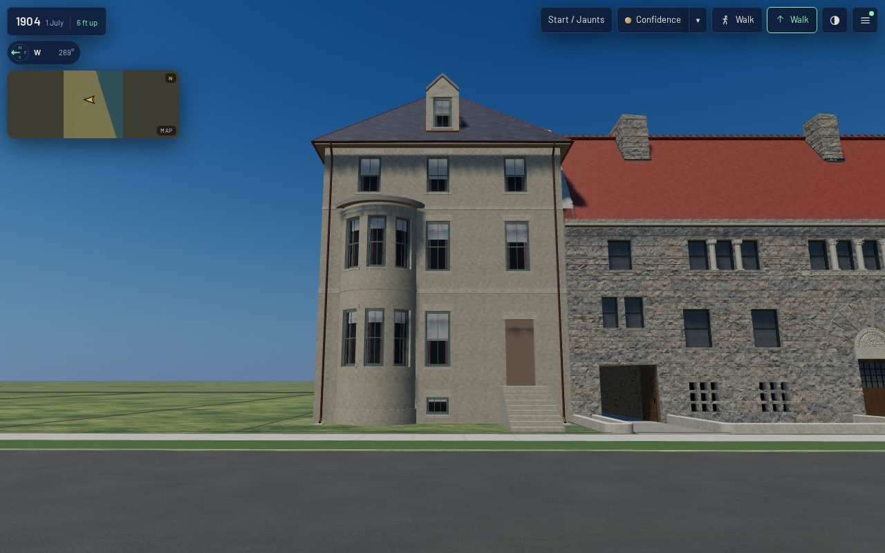 | 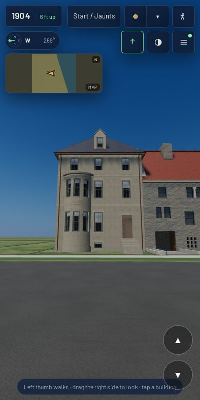 |
| oblique | 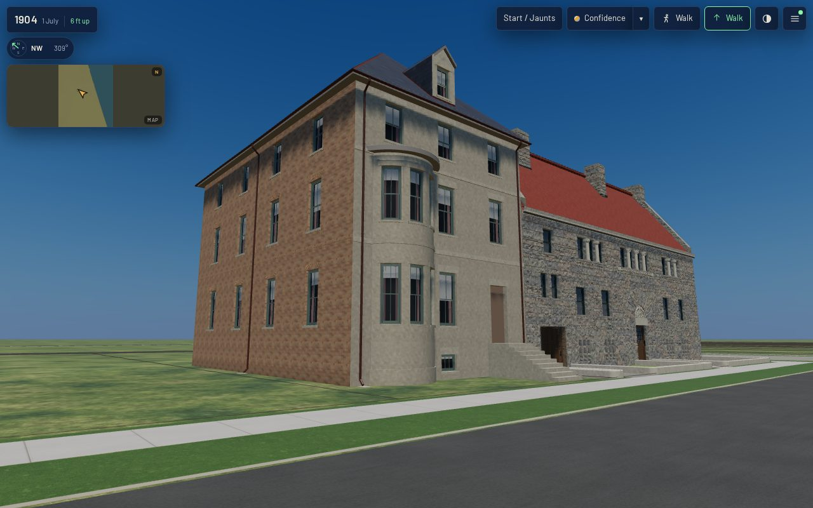 | 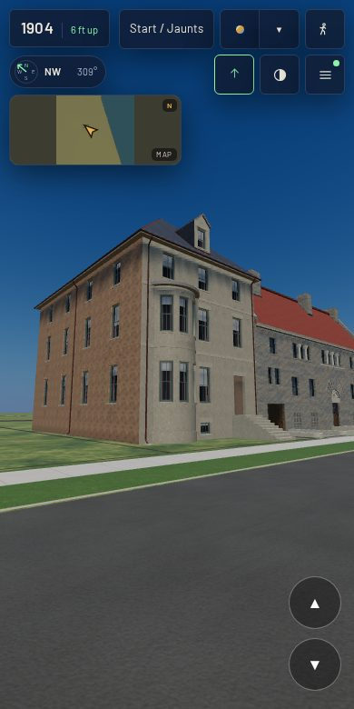 |
| rear | 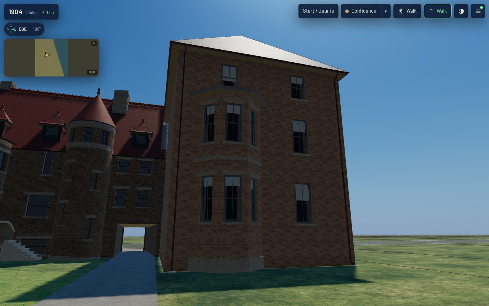 | 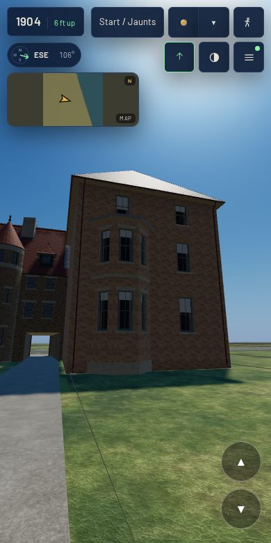 |
| roof | 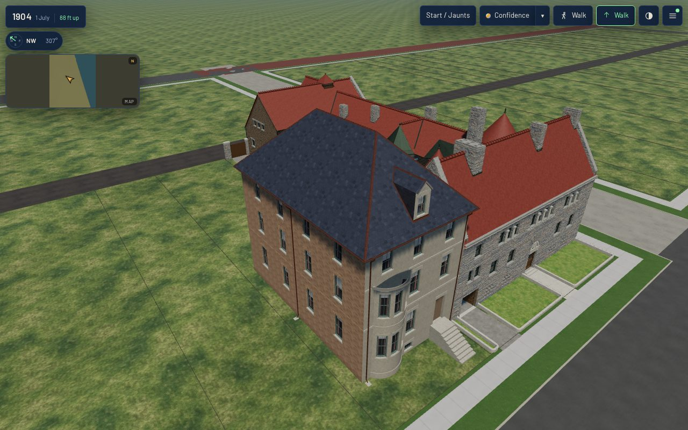 | 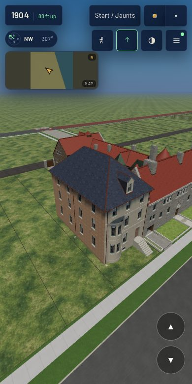 |
| bow, raking 3 m |  | 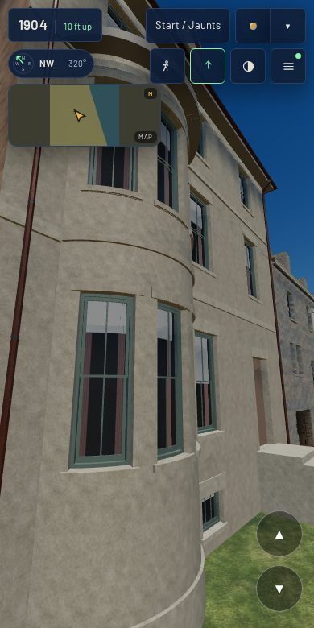 |
| canted bay, raking 4 m | 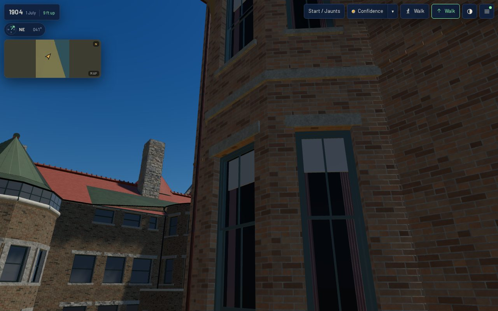 | 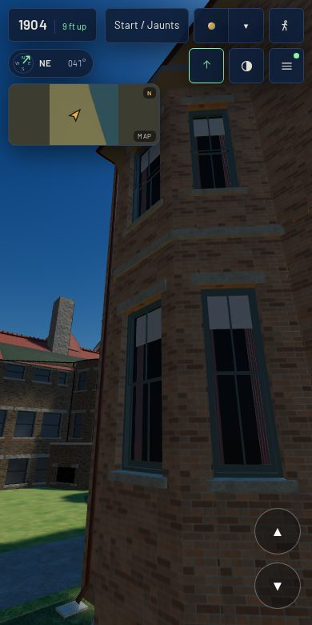 |

## Costs

| | before (K01 + K03 + K04 + K06, on dev) | with the two bays |
|---|---|---|
| house triangles (full = web) | 14,445 (T-2293's reading) | 21,709 |
| house primitives | 19 | 23 (`bay_stone`, `bay_brick`, `bay_copper`, `bay_tin`) |
| master GLB / web GLB | — / 964 KB | 3.22 MB / 1.02 MB |
| scene draw calls, mobile / desktop street-eye | — | 71 / 72 |
| scene triangles, mobile street-eye | 0.45 M (T-2298's reading) | 0.49 M |

The bow costs most: 8,434 triangles at the kit's full tier, because each bent sash is cut into
3.75° slabs. The canted bay costs 1,105. **The light tier.** A K01 house ships one mesh, and the
scene's light detail draws that mesh, as the mobile run at light shows. The kit's own light tier of
these two bays (2,456 and 517 triangles) holds the full tier's silhouette within 40 mm in the gate.
It is not shipped as a separate level of detail. The "before" figures are earlier tickets' readings,
so they do not isolate this change exactly. Frame and load times are headless
Chromium on a software rasteriser: relative readings, not device timings.

Re-make: `python3 generators/k01_emit.py --only keith_house_1808_prairie`, then
`tools/web_derivatives.sh --only keith_house_1808_prairie__as_built_1886.glb`,
`node tools/k01_contract.mjs --measure-asset keith_house_1808_prairie`, `tools/publish.sh` and
`node tools/qa_k08_t2308.mjs`.
