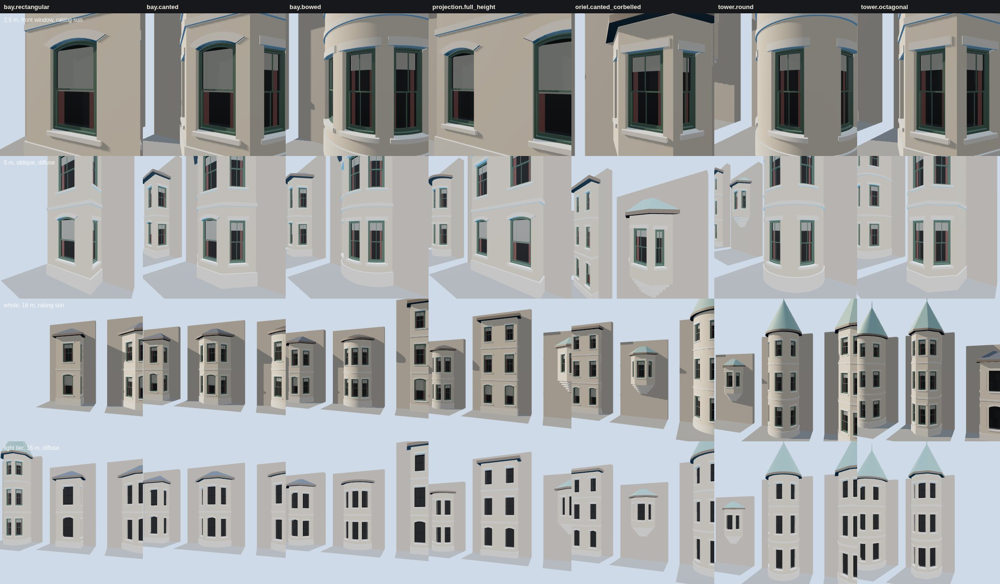

# K08 bay kit: the study (T-2307)

**What this is.** These are the seven variants in `data/components/prairie_1904/k08_bays.json`, built
by `generators/archetypes/k08_bays.py` into the specimen `k08_bay_kit.glb`. Each variant stands
against its own stretch of host wall, which is the specimen's board and not part of the bay. Each
one is built twice: at the full tier and at the light tier. `tools/study_k08_bays.mjs` draws them
with the vendored three.js the walkthrough uses:

- **row 1, 2.5 m, raking sun**: the front first-storey window from close up, with one sun 14° off
  the wall plane. This row shows whether the sash sits in a true recess, and whether a curved
  run reads as a smooth curve. The bow and the round tower carry bent sashes, and their glass is
  bent too. They should show no facet and no shading crease.
- **row 2, 5 m, oblique, diffuse sky**: the view a walker gets passing the house. It shows the
  plinth, the floor band mitred round each angle, the cheek windows, and the oriel's corbel
  courses stepping back into the wall.
- **row 3, the whole elevation at 16 m, raking sun**: plan, storeys, eaves and roof together.
  On the canted bay and the octagonal tower, the hips fall on the angles. The bow and the round
  tower take a cone.
- **row 4, the light tier at 16 m, diffuse**: the far-view copy. It loses its sash bars, blinds
  and curtains, and its curves are cut at 15° rather than 3.75°. Its silhouette should still
  match row 3.

**What a bay is made of** (each part a role the gate measures):

| part | how it is built |
|---|---|
| plan | a polyline, a segmental bow, a circle or a regular polygon, cut by the host wall's face into RUNS from one junction to the other |
| walls | each run's outer face, one storey band at a time, around its windows' holes in a T-junction-free cell grid |
| windows | K06 openings (`k06_windows.py`), each a closed recess cut to fit inside the bay: 0.55 m deep by default, shorter in a canted cheek or a bow |
| plinth | on grade: 0.6 m of stone standing 50 mm proud, mitred round every corner |
| corbels | an oriel's support: stone courses each stepped out over the one below, the lowest still bearing on the wall |
| floor band | a 160 mm string course at each floor line between storeys |
| eaves | a soffit out to a fascia 0.3 m beyond the face; the fascia's top is the roof's eaves line |
| roof | the plan's own lines, offset to the eaves and lifted at one pitch. Over a polygon this gives a hip roof cut where its planes meet; over a curve it gives a cone. A bay's roof leans on the wall. A tower's cap is whole, closed at the back where the wall plane cuts it, with a finial at the apex |

Everything a run carries is built flat in the run's own frame (K06's frame). It is then laid onto
the run: rigidly on a straight run, or bent round the centre on an arc. A bent face is first cut
into slabs no wider than 3.75° of arc, and also at every edge the outer face has (jambs, band
ends), so two faces sharing the curve share its chords exactly. Every vertex takes the true
curve's normal. At 3.75° the chord of a slab of the 1.6 m tower falls 0.9 mm inside its circle.

**What was changed after looking.** The first gate run caught five things the board had hidden:

- The recesses of the canted bay's cheek windows, and of the bow's outer windows, reached behind
  the host wall. Those recesses are now 0.40 m deep.
- The octagonal tower's wall plane crossed one face a few centimetres from a vertex. That left a
  sliver of a run, whose fascia and soffit folded back on themselves. The tower now meets the
  wall at its vertices, with its centre 0.612 m proud, so it is a true half-octagon. The
  generator also folds any junction within a millimetre of a vertex into that vertex.
- Where a head band and a reveal met on a curve, their slab chords were different, leaving a
  sliver of doubled face. Faces meeting the outer face are now cut at its edges too.
- The oriel's narrow cheek lights did not fit their 0.85 m cheeks. The oriel is now 0.75 m deep
  on five corbel courses, each oversailing the one below by 0.125 m.
- The wall plane now trims every bent face. Nothing of a bay stands behind the host wall's face.

## Costs

These are exact counts from the specimen ([`costs.json`](costs.json)). *Triangles* excludes the
board (host wall and ground). There is one draw call per material.

| variant | windows | triangles, full | triangles, light | light / full |
|---|---|---|---|---|
| `bay.rectangular` | 6 | 1,243 | 611 | 0.49 |
| `bay.canted` | 6 | 1,243 | 611 | 0.49 |
| `bay.bowed` | 6 | 8,434 | 2,456 | 0.29 |
| `projection.full_height` | 6 | 1,388 | 712 | 0.51 |
| `oriel.canted_corbelled` | 3 | 609 | 315 | 0.52 |
| `tower.round` | 9 | 17,720 | 6,092 | 0.34 |
| `tower.octagonal` | 9 | 1,757 | 875 | 0.50 |

The curves are where the cost goes. On the round tower, nine bent windows are cut into 3.75°
slabs, so the full tier spends about 1,500 triangles a window. The light tier is the one a scene
should draw beyond a few tens of metres. The whole full-tier board draws 54,000 triangles in 140
draw calls at 1280×800, and 51,000 at 390×780. The frame times in `costs.json` come from headless
Chromium on a software rasteriser: they compare kit revisions, they are not device timings. The
specimen is 2.2 MB, with its vertices welded.

No texture is bound. The masonry, stone, slate and copper here are flat colours. K02, K03 and K04
supply the fabrics on a house, and `roof.covering` already names the K04 fabric each roof takes.
None of this is published: `tools/publish.sh` mirrors nothing under `docs/RESEARCH/`, and no scene
loads the specimen. T-2308 builds the first canted and curved bays on a Prairie Avenue 1904 house.

## The gate

`python3 tools/check_bay_kit.py --check` (in `tools/check.sh`) rebuilds every variant at both tiers
and measures the built geometry:

- every window inside its run with a pier to spare, clear of its neighbours and its storey's bands
- every sash outside K06's ordinary range says why
- the plan starts and ends on the host wall's face, and nothing reaches behind it
- the outer wall stands on the declared plan
- rays from inside the bay meet the bay or its wall in every direction: no gap
- rays in through every pane meet that window's own recess before anything else: one glass layer
- every recess stays inside the bay and clear of every other
- no coplanar faces overlap
- curves are cut no coarser than their tier allows, within its sagitta, with true normals
- a plinth from grade, or corbel courses within their oversail ratio
- the light tier keeps the full tier's extent and stays within its share of the triangles
- the triangle budgets hold
- the committed specimen is the generator's bytes

`--self-test` makes 17 breaks across those rules (11 in the data, 6 in a built bay's geometry). It
checks that the gate refuses each one for its own reason, then checks that the committed kit
passes: 18 cases in all.

The kit is reconstructed throughout: `docs/LIBERTIES.md` § L-k08-bay-kit-2307.

Re-make: `python3 generators/archetypes/k08_bays.py`, then `node tools/study_k08_bays.mjs`.
