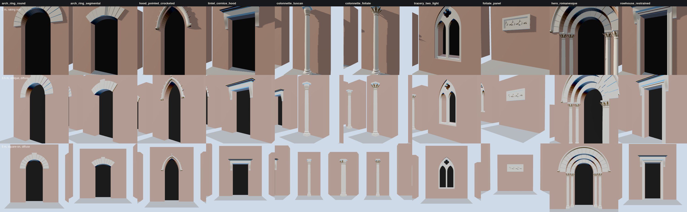

# K09 carved-trim kit — the study (T-2309)

**What this is.** The ten variants of `data/components/prairie_1904/k09_trim.json`, built by
`generators/archetypes/k09_trim.py` into the specimen `k09_carved_trim_kit.glb`, each on its own
wall with the opening it frames carried back as a dark recess (the door or window in it is K06's
or K07's, not this kit's). They are drawn by the vendored three.js the walkthrough uses
(`tools/study_k09_trim.mjs`, the K06 study's rig and lights) at three stands:

- **top row, 2 m, raking sun**: one sun 12° off the wall plane. It finds every joint between
  voussoirs, the drip under a label, the cornice's corona and the leaves' relief.
- **middle row, 3.5 m, oblique, diffuse sky**: the view a walker gets passing a house. The hero's
  stepped orders and its colonnettes read in depth; the cornice's returns meet the wall.
- **bottom row, 5 m, square-on**: proportion as a facade shows it.

**The variants.**

| variant | what it is | pieces | triangles |
|---|---|---|---|
| `arch_ring_round` | 13 voussoirs and a keystone round a semicircular head | 13 | 505 |
| `arch_ring_segmental` | 9 voussoirs and a keystone round a segmental head (rise 0.18 of the span) | 9 | 345 |
| `hood_pointed_crocketed` | a Gothic label round a pointed head, returned level at its springs, crockets along its back, a finial at its apex | 14 | 2,020 |
| `lintel_cornice_hood` | a frieze block, a cornice returned round its three faces, two scrolled consoles | 4 | 172 |
| `colonnette_tuscan` | plinth, attic base, shaft with entasis, turned cap, abacus | 3 | 862 |
| `colonnette_foliate` | the same shaft under a bell capital wrapped in eight leaves | 11 | 2,678 |
| `tracery_two_light` | a pointed slab pierced by two lancets and a quatrefoil | 1 | 342 |
| `foliate_panel` | a tablet with a sunk field, a scrolling stem and twelve seeded leaves | 14 | 1,816 |
| `hero_romanesque` | three stepped orders, a voussoir ring on each, four foliate nook colonnettes, a label over all | 84 | 12,760 |
| `rowhouse_restrained` | two-fascia architrave, frieze block, returned cornice hood on consoles, no carving | 5 | 220 |

Costs, with the board's frame time at 1280×800 and 390×780, are in `costs.json` (headless
Chromium on SwiftShader: a figure for comparing kit revisions, not a device frame time). The
whole specimen is 51 draw calls and about 36,000 triangles. The hero alone is 12,760 triangles,
most of them in its four foliate capitals, and the rowhouse 220. That difference is the K09
comparison, and the gate holds it: the hero has more orders, more pieces and more relief
(0.55 m against 0.235 m), and the rowhouse carries no carving at all.

**How a piece rests.** Each piece is built either OPEN or CLOSED, and the gate
(`tools/check_trim_kit.py`) measures which:

- **open**: a voussoir has no back, a moulding's section is open on its seat side, a console
  is open against the wall and under its block, a leaf on a sunk field is a shell rising from
  nothing at its edges. Every open edge must lie on another surface of the variant, within
  0.2 mm, and never over a hole. So nothing floats, nothing hangs, and no face lies on the
  wall behind it.
- **closed**: a capital leaf, a crocket or a finial is a thin closed solid, and one of its
  edges must cross its host's surface: it is rooted, not stuck on.

The gate also refuses two coplanar faces that overlap. That is how it found the hero's nook
abaci colliding with the next order's, and the label folding over itself where its stop meets
the arch, before this study was taken.

**Generic and distinctive.** Every generic motif here (the foliate panel, the foliate capital,
the crockets) is newly designed for this kit and copies no house. The data's restriction
records ASSET-CATALOG.md's rule: a generic motif may stand on a house whose carving is unknown,
and never in place of a landmark's documented carving. T-2310 puts the first K09 trim on a named
house and has to say which of the two it is doing.

**What is invented.** All of it is reconstructed: liberty `L-k09-carved-trim-kit-2309` in
`docs/LIBERTIES.md`.
