# K10 on a named target: 1808 Prairie's wall head (T-2317)

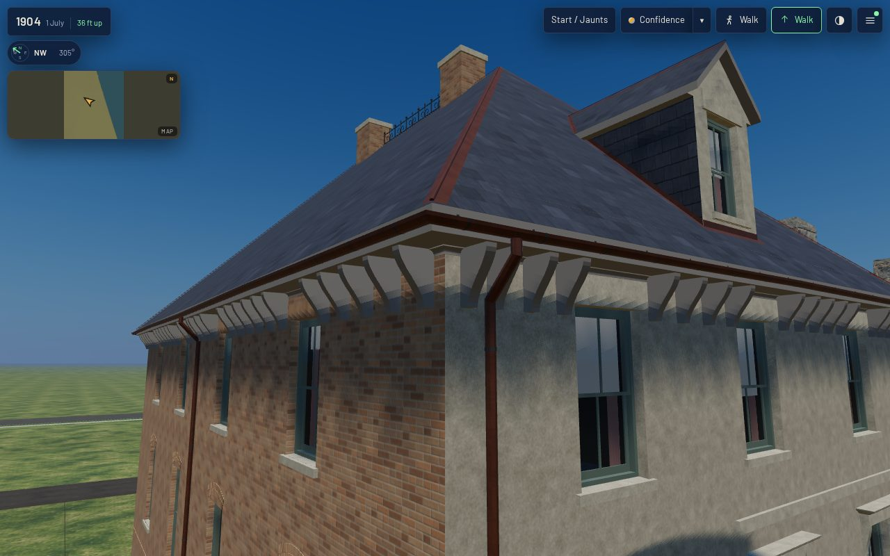

Piece 2 of T-1852 (package K10 of the T-1837 Prairie programme). Piece 1, T-2316, built the
cornice kit on specimen boards. This piece puts the kit's own pieces on a house in the 1904 scene.

## Acceptance (stated before work)

1. The target is named: **1808 Prairie** (`keith_house_1808_prairie`, register `pa-1808-6`). It is
   the only kit-built house standing in the 1904 scene. The other is Glessner, a documented
   landmark.
2. **Which of the two cases this is.** The kit's restriction lets a generic K10 section stand
   where a house's own is unknown, and never in place of a documented one. 1808's wall head is
   unknown: the register reads a "pierced parapet" off the 1888 *Inland Architect* plate, and
   that plate is not a source record here. So this is the generic case, said in the record's
   `wall_head` note and in liberty `L-k10-1808-wall-head-2317`. Glessner, the documented
   landmark, keeps its own wall head, authored from its evidence. Nothing here touches it.
3. The pieces are the kit's own builders (`console`, `sweep`, `Variant.cresting`), called in the
   assembly's frame. The kit's data and both modules are inputs to the asset's hash, so a kit
   change stales the house.
4. Corner returns are continuous: every corner of the wall head is turned by one swept moulding.
   No run ends in the air: each stretch of moulding dies into a bracket's side at both ends.
5. The work meets the K05 roof with no clash. The brackets' tops and the moulding's top lie on the
   K05 soffit, and the brackets stop 0.04 m inside the fascia. The cresting's base bar is let into
   the K04 ridge roll and stops 0.25 m clear of each chimney cap.
6. The K01 contract measure stays green on both tiers: scale, origin, 0 coincident or degenerate
   faces, metric UVs.
7. The house is read in the actual published `/1904/` app at 1280x800 (full) and 390x780 (light)
   from the front, an oblique, two eave corners and the cresting close (2-5 m), the rear and the
   roof. Every stand records load, draws, triangles, textures and a timed frame, with zero page
   errors (`tools/qa_k10_t2317.mjs`).

## What was built

`generators/archetypes/k10_frontage.py` reads the record's `wall_head` and builds:

| where | what | kit source |
|---|---|---|
| under the K05 soffit, all four walls | 88 scrolled brackets at the kit's full size (0.48 m high, 0.34 m projection, 0.10 m wide). One stands 0.20 m from every corner on both faces, and the rest stand evenly at no more than 0.60 m on every pier | `k10.cornice.bracketed_timber`'s `bracket` part, `console()` |
| between the brackets | the bed moulding: a fillet, 44 mm cove and fillet, 60 mm each way. It is open on the wall and the soffit, swept round every corner it crosses, and dies into a bracket at each end | new `bed_mould` profile in `k10_cornices.json` |
| the main ridge, between the stacks | iron cresting 3.30 m long, with six posts, five panels of back-to-back C-scrolls and a spear in each. The base bar is let 7 mm into the copper ridge roll | `k10.cresting.iron_ridge`, `Variant.cresting()` (refactored out of the specimen; the specimen's bytes are unchanged) |

**Why no frieze.** The kit's bracketed cornice has a 0.55 m frieze, but the third storey's lintels
stop 0.07 m under 1808's soffit (11.75 m against 11.82 m). A frieze could only run by cutting
the heads. So the brackets keep to the piers between the heads, and the continuous line is the
bed moulding, which clears every head by 10 mm. The generator raises an error if a head, or a bay,
would reach it. The price is the rhythm: brackets 0.4-0.6 m apart on the piers, with a 1.4 m gap
over each window, where the kit's specimen keeps 0.35-0.75 m throughout.

**What the brackets stand clear of** (each along the wall, widened by half a bracket plus 0.03 m):
every head that reaches the brackets' feet (11.34 m), every downpipe and its swan neck, every bay
whose roof does, and any stretch the record's `clear_of` names. On 1808 that stretch is the north
party wall at s 1.6-6.8 m from the street corner, where Glessner's south gable leans on it. It was
measured off `glessner_house__as_built_1887.glb` placed in this frame: within 0.40 m of the
wall, Glessner rises above 11.34 m from u 11.4 to u 16.2, to 14.70 m at u 13.5. The bed moulding
runs on through it, inside Glessner's gable, as the K05 eave above it already does.

**The cresting** stands on the one stretch of ridge long enough to carry it. The 45-degree hip's
ridge runs u 5.2-12.8, the stacks' caps take u 6.10-7.10 and 10.90-11.90, and each 0.9 m end stub
falls under the 1.0 m minimum once the 0.25 m clearances are taken.

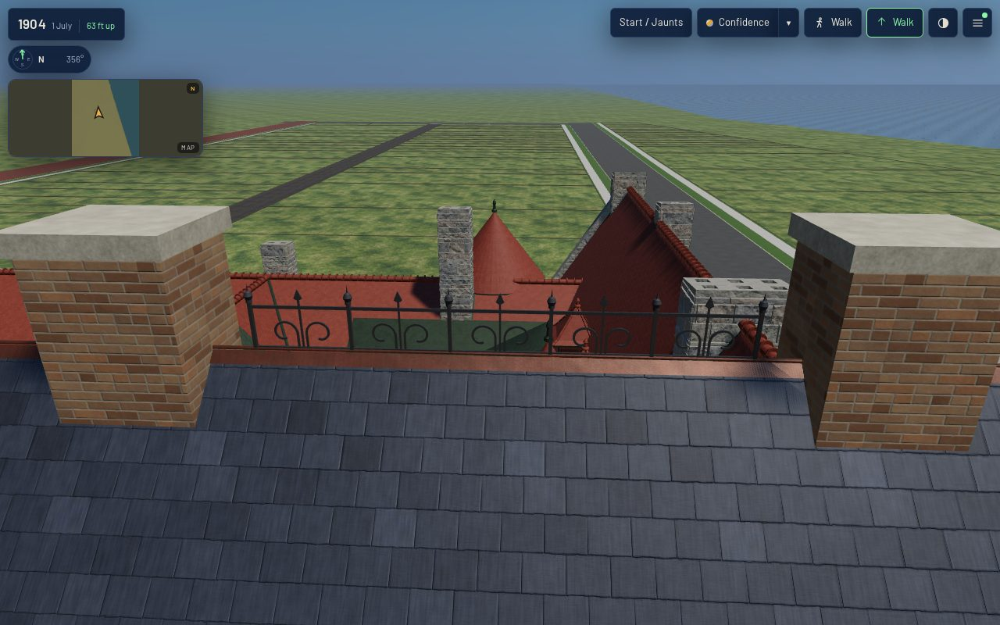

## Not built, and why

- **The dormer's face.** The kit's pediment cornice is 0.20 m deep, and the K05 dormer's sash head
  stands 0.13 m under the dormer's own cheek soffit (14.45 m against 14.58 m). Dressing that face
  means first re-proportioning the dormer (its face height or its sash), a K05/K06 change to the
  same house. It is filed as its own ticket after this one.
- **A parapet.** The house has a hipped roof with an open eave (K05, reconstructed), so there is
  no parapet wall to stand one on. The register's pierced parapet would replace the front eave
  outright. It is waiting on the 1888 plate being read as a source.

## Costs

| | before (dev) | after |
|---|---|---|
| full GLB | 3,955,696 B | 4,629,720 B |
| web GLB | 1,223,040 B | 1,299,420 B |
| triangles | 30,828 | 40,884 (brackets and moulding 7,120; cresting 2,936) |
| primitives | 25 | 25 (no new material: the brackets wear the eave's fascia, the cresting the house's iron) |

In the published app, `/1904/` at 1280x800 full detail draws 72-75 calls and about 2.55 M
triangles per stand. At 390x780 light it draws 68-71 calls and about 0.52 M. Frame times, in
`browser-validation-*.json`, are headless SwiftShader readings for comparing revisions, not
device claims.

| stand | desktop | mobile |
|---|---|---|
| front | 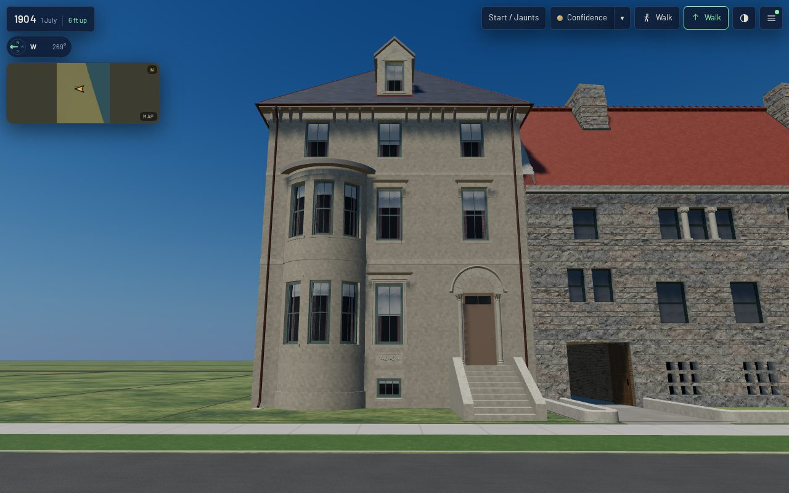 | 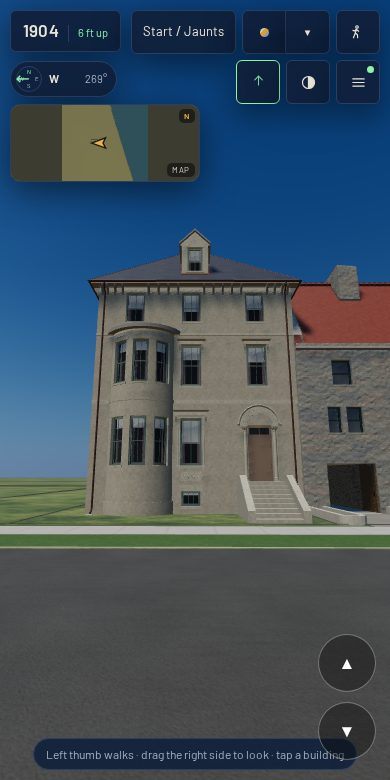 |
| oblique | 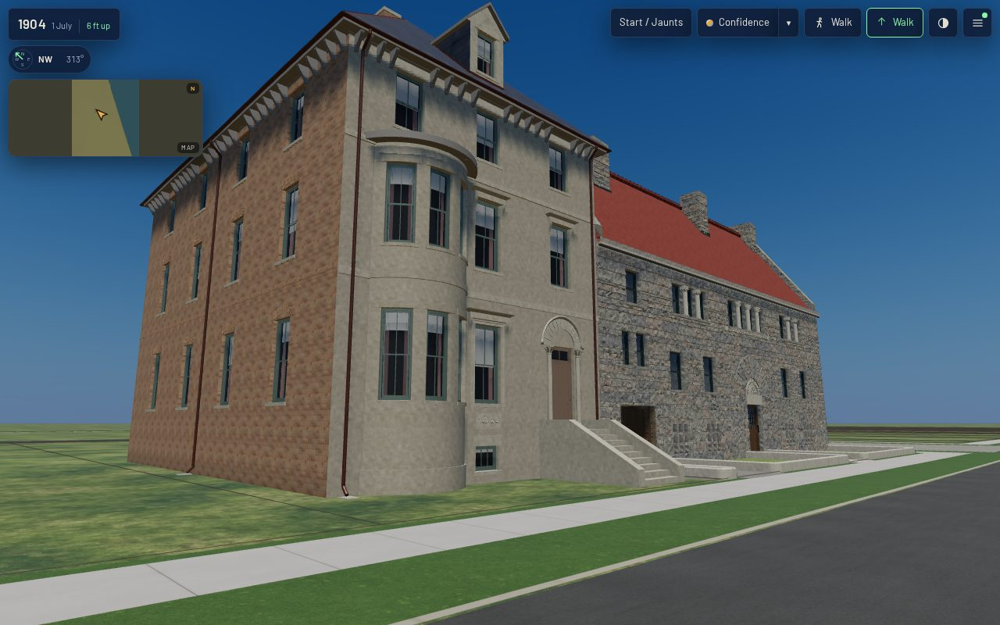 | 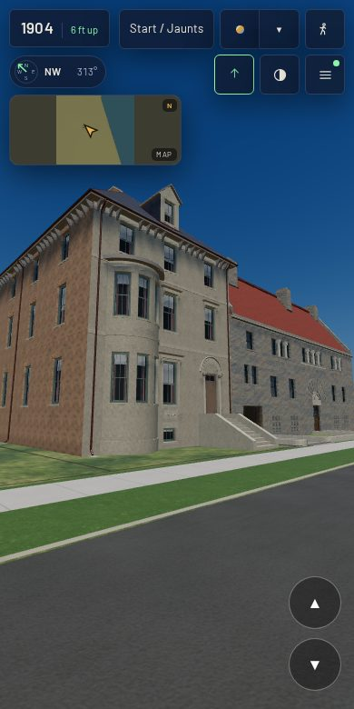 |
| north eave, beside Glessner | 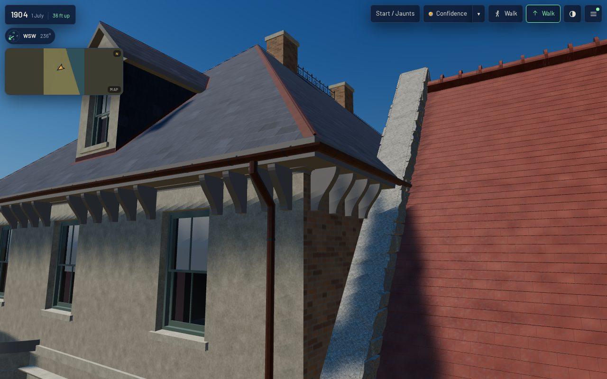 | 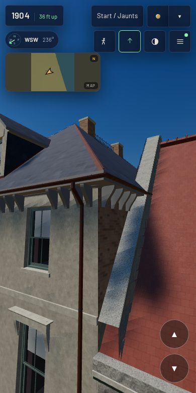 |
| rear | 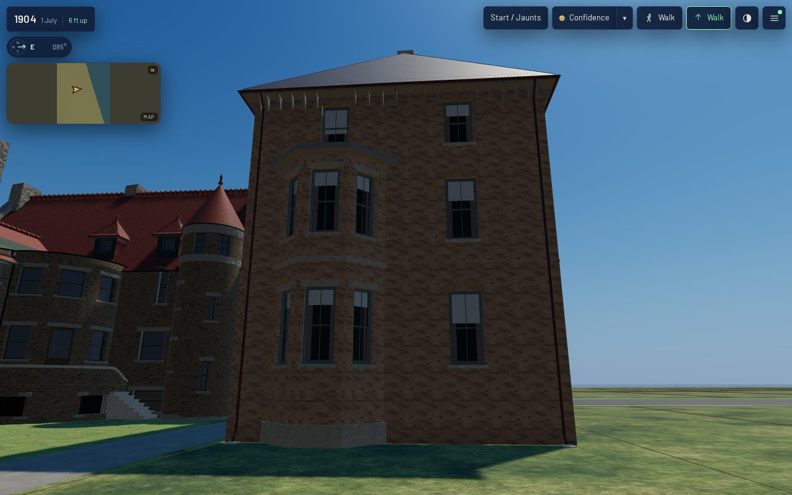 | 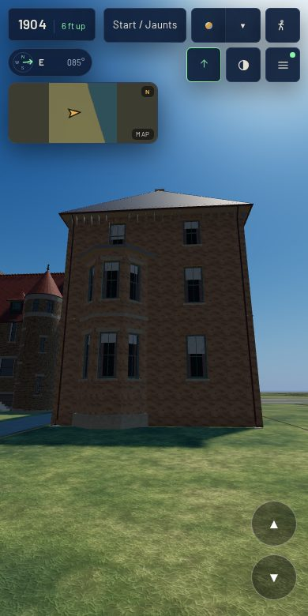 |
| roof | 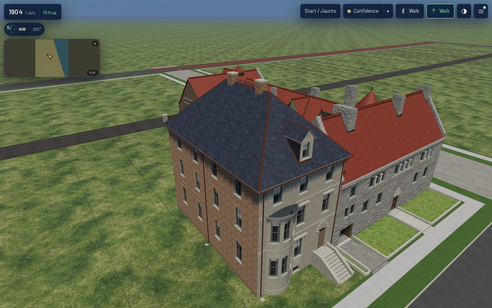 | 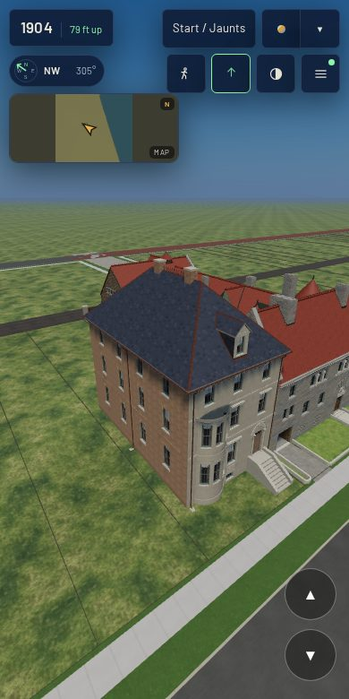 |

## Rebuild

    python3 generators/k01_emit.py --only keith_house_1808_prairie
    ./tools/web_derivatives.sh --only keith_house_1808_prairie__as_built_1886.glb
    node tools/k01_contract.mjs --measure-asset keith_house_1808_prairie
    ./tools/publish.sh && node tools/qa_k10_t2317.mjs
