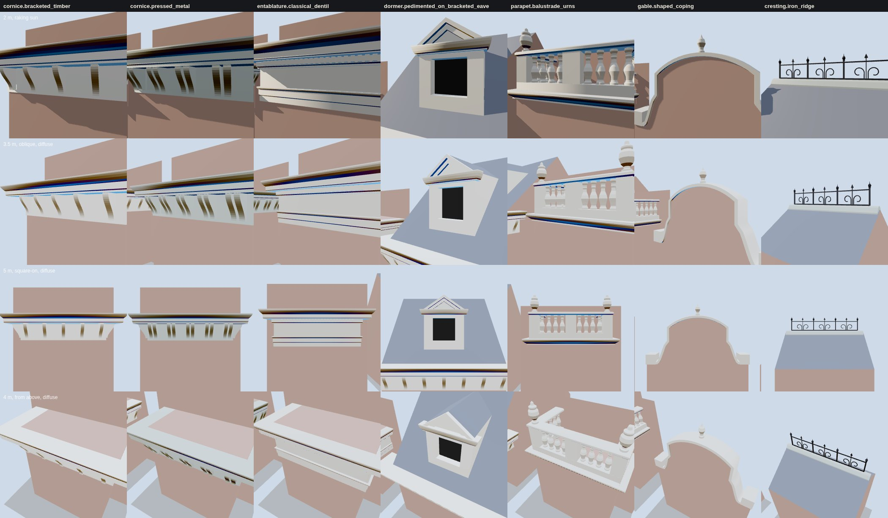

# K10 cornice kit — the study (T-2316)

**What this is.** The seven variants of `data/components/prairie_1904/k10_cornices.json`, built by
`generators/archetypes/k10_cornices.py` into the specimen `k10_cornice_kit.glb`, each on its own
specimen wall. The vendored three.js the walkthrough uses draws them (`tools/study_k10_cornices.mjs`,
the K09 study's rig and lights) at four stands, each looking at the feature itself, which on a
wall head is three metres up:

- **2 m, raking sun**: one sun 12° off the wall plane. It picks out the brackets' S, the dentils,
  the coping's weathering and the drip under every crown.
- **3.5 m, oblique, diffuse sky**: the corner returns, which are the K10 acceptance.
- **5 m, square-on**: proportion as a facade shows it.
- **4 m, from above at 40°**: the roof the dormer, the parapet and the cresting stand on, so a
  clash would show.

**The variants.** The bracketed cornice with its dormer pediment and the stone balustraded parapet
stand side by side in the middle of the board.

| variant | what it is | pieces | triangles |
|---|---|---|---|
| `cornice.bracketed_timber` | frieze, eleven single scrolled brackets, soffit and crown, round two corners into the wall behind | 13 | 744 |
| `cornice.pressed_metal` | the same in sheet metal: paired brackets, a raised panel between each pair, a thinner crown | 32 | 1,472 |
| `entablature.classical_dentil` | architrave, frieze and a cornice with 44 dentils, all three round both corners | 47 | 496 |
| `dormer.pedimented_on_bracketed_eave` | a bracketed eave returned on both gable ends, and on the roof a dormer: face, recessed window, cheeks and roof seated on the slope, a cornice returned on the cheeks, a two-band raking cornice | 17 | 751 |
| `parapet.balustrade_urns` | crowning cornice, plinth, 18 turned balusters, three pedestals, a continuous rail, two urns | 26 | 6,306 |
| `gable.shaped_coping` | a Dutch gable: ogee shoulders, neck and segmental cap under one coping that dies into a kneeler at each eave, a finial at the apex | 4 | 624 |
| `cresting.iron_ridge` | a rolled ridge cap and, let into it, a base bar, four posts with spike finials, a top bar, six C-scrolls and three spears | 20 | 1,848 |

Costs, with the board's frame time at 1280×800 and 390×780, are in `costs.json` (headless
Chromium on SwiftShader: a figure for comparing kit revisions, not a device frame time). The whole
specimen is 923 kB, 35 draw calls and about 21,500 triangles. Most of the parapet's 6,306 are in
its balusters, at twelve facets each. That is the place to cut first if a street of balustrades
costs too much: a lighter tier can drop the facets to eight, or use a flat cut-out baluster
behind 15 m.

**How a run turns a corner.** Every frieze, crown, architrave, coping and rail is ONE section
swept along the wall head and mitred at each corner, never a front piece with returns butted on.
A run ends in one of two ways: it dies into a wall (the pavilion variants stand on a block that
projects from a taller wall, so their runs die into it at both ends), or it stops in a capped
return (the dormer's eave and the dormer's own cornice). The gate (`tools/check_cornice_kit.py`)
measures this on the built geometry:

- **seated**: every open edge of a piece lies on another surface within 0.2 mm (K09's rule,
  shared). So a bracket's back is on the frieze and its top on the soffit, a dentil's top is
  on the soffit, a baluster stands on the plinth and carries the rail, a dormer cheek's foot is
  on the roof, and an end that stopped in the air would be refused.
- **rooted**: a kneeler, a finial, the ridge cap and every bar of the cresting is a closed solid
  that passes through what carries it.
- **returns**: a run reaches round both corners of the face it crowns by its own projection.
- **brackets**: evenly spaced, 0.35-0.75 m apart, with one 0.20 m from every corner on both faces.
- **roof**: no part of the dormer below the roof it stands on.

Two defects the gate found before this study was taken, both in the gable's coping: where the
shoulder's samples were closer together than the coping is deep, the mitred section folded back on
itself (doubled faces at both shoulders). The shoulder is now resampled at an even 0.1 m, and no
sample sits nearer the neck's inside corner than 1.4 times the coping's depth.

**Generic and distinctive.** Every profile and outline here is generic. ASSET-CATALOG.md asks for
"unique Wheeler/Mayer profiles authored from evidence rather than scaling a generic gable", and the
data's restriction records it: a K10 section may stand on a house whose own is unknown, never in
place of a documented one. T-2317 puts the first K10 wall head on a named house and has to say which
of the two it is doing.

**What is invented.** All of it is reconstructed: liberty `L-k10-cornice-kit-2316` in
`docs/LIBERTIES.md`.
