# K11 on a named target: 1808 Prairie's front fence, gates, piers and boundary wall (T-2319)

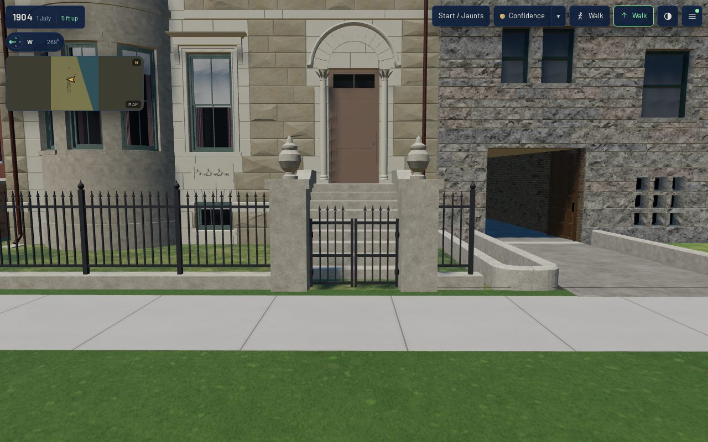

Piece 2 of T-1853 (package K11 of the T-1837 Prairie programme). Piece 1, T-2318, built the
ironwork kit on specimen boards. This piece puts the kit's own pieces round a front yard in the
1904 scene.

## Acceptance (stated before work)

1. The target is named: **1808 Prairie** (`keith_house_1808_prairie`, register `pa-1808-6`), the
   K01 exemplar every kit has been applied to (owner, 2026-10-10).
2. **Which of the two cases this is.** The kit's restriction lets a generic K11 part stand where a
   property's own ironwork is unknown, and never in place of a documented one. 1808's boundary is
   unknown: no source read here shows a fence, gate, pier or wall at 1808. So this is the generic
   case, said in the record's `boundary` note and in liberty `L-k11-1808-boundary-2319`. Glessner,
   next door to the north, is documented, and nothing generic is put against it.
3. **The line is the source's.** The street line and both lot lines are the 1911 Sanborn sheet
   28's, as `data/street_grid/1904.json` reads them for parcel `prairie_1808`. The curb's street
   face stands on the street line, so the iron is on the lot and nothing reaches the public walk.
4. **Kept off the entrance and the carriage drive.** No curb, rail or picket stands inside either
   opening, and the generator refuses one that does. A gate's leaf swings into the yard, never
   over the walk, and the entrance's leaves clear the stoop through their whole swing, measured
   against the stoop's built mesh. 1808 has no carriage drive on this front: the record's carriage
   house is the detached building on the alley (T-1935's), and the only way round to it, the side
   passage, is gated and not fenced.
5. The pieces are the kit's own builders (`fence_run`, `pier`, `hinges`, `leaf`, `wall_run`),
   called in the kit's frame and moved into the assembly's. The kit's data and both modules are
   inputs to the asset's hash, so a kit change stales the house. `hinges`, `leaf` and `wall_run`
   were refactored out of the specimen's gate and wall; the specimen's bytes are unchanged
   (`k11_ironwork.py --check`, `check_ironwork_kit.py --check`).
6. The K01 contract measure stays green on both tiers: scale, origin, 0 coincident or degenerate
   faces, metric UVs.
7. **The light tier keeps the silhouette.** The web tier is not simplified (`web_derivatives.sh`
   never simplifies), so it carries every picket: 56,710 triangles on both tiers. The light
   detail is read in the app at 390x780 from the same stands.
8. The yard is read in the actual published `/1904/` app at 1280x800 (full) and 390x780 (light)
   from the front, an oblique, the entrance pair, the side gate and the wall (2-5 m), the
   entrance square-on at walking distance (6 m, the kit's shimmer stand), the rear and the roof.
   Every stand records load, draws, triangles and a timed frame, with zero page errors
   (`tools/qa_k11_t2319.mjs`).

## What was built

`generators/archetypes/k11_frontage.py` reads the record's `boundary` and builds, in the house's
own frame (s along the street front from its south corner, south to north):

| where | what | kit source |
|---|---|---|
| the street line, s 0.5-7.25 and 9.55-10.08 | spear fence on a stone curb: 5 posts with acorn finials between the piers and an end post, 6 panels of 19 mm pickets through two rails, a spear on each | `k11.fence.spear_on_curb`, `fence_run()` |
| the walk to the door, s 7.75-9.05 | two stone piers with caps and urns, 1.30 m clear, and a PAIR of 0.61 m leaves, one hung on each pier on two pintle hinges, drawn shut | `k11.gate.walk_gate_on_piers`'s parts, `pier()`, `hinges()`, `leaf()` (the second leaf turned half round, `side=-1`) |
| the side passage's mouth, s -0.94-0 | the kit's single walk gate, 0.94 m clear, hung on the wall's street pier and shut against a latch keeper on a stone pier in line with the house's south wall | `k11.gate.walk_gate_on_piers` |
| the south lot line, u 15.2 m to the fence | brick wall with piers, 1.50 m high, its south face on the line: 4 piers at 2.36 m, a saddleback stone coping between them, caps, urns on the end piers | `k11.wall.brick_with_piers`, `wall_run()` |

**Why a pair of leaves.** The stoop's foot stands 0.69 m behind the fence's line. A gate leaf
sweeps a disc about its hinge, and any leaf longer than that gap strikes the stoop on the way
open. The kit's single leaf needs 0.90 m clear, so it cannot hang here. Two leaves of 0.61 m
cover a 1.30 m opening, and each one sweeps 0.608 m. That leaves 0.08 m to the stoop at the
worst angle, against the generator's 0.05 m floor.

**Why the north side is left open.** The fence ends at an end post whose curb stops on the
1800/1808 lot line. Beyond it is Glessner's front, whose own low curved wall is part of the
documented asset. The register gives that yard transition to T-1944. Note that the parcel's north
line falls 0.17 m inside the house's own north wall (both are inferred from the same sheet). The
fence follows the parcel.

**Why the wall stops at u 15.2.** 1812's draft stands on the lot line from its front (u 14.77 in
this frame, read off its GLB) back. The wall's rear pier stops 0.2 m short of it. The pier caps
overhang the lot line by their own 50 mm.

## Not built, and why

- **A return along the north lot line.** It would stand against Glessner's documented front.
- **An area grille, stoop rails or a canopy.** The kit has them, but this ticket's scope is the
  fence, gate, piers and boundary wall. The stoop keeps K07's stone cheeks.
- **A walk paved from the gate to the stoop.** Paving is T-1728's (road and sidewalk materials).

## Costs

| | before (dev) | after |
|---|---|---|
| full GLB | 6,299,732 B | 6,791,952 B |
| web GLB | 2,016,876 B | 2,097,300 B |
| triangles | 50,474 | 56,710 (fence 4,336; gates 1,168; wall 732) |
| primitives | 26 | 27 (the wall's brick, `k11_wall_brick`: iron and stone wear the house's own `iron` and `stoop_stone`) |

In the published app, `/1904/` at 1280x800 full detail loads in about 30 s and draws 78-85 calls
and about 2.64-2.66 M triangles per stand. At 390x780 light it loads in about 10 s and draws 64-80
calls and about 0.45-0.61 M. Every stand is inside the scene's budget with no problem reported and
zero page errors. Frame times, in `browser-validation-*.json`, are headless SwiftShader readings
for comparing revisions, not device claims. At the 6 m walking-distance stand the pickets read as
a line on both viewports, with no break-up (the kit's members are all at or above its 10.8 mm
shimmer floor).

| stand | desktop | mobile |
|---|---|---|
| front | 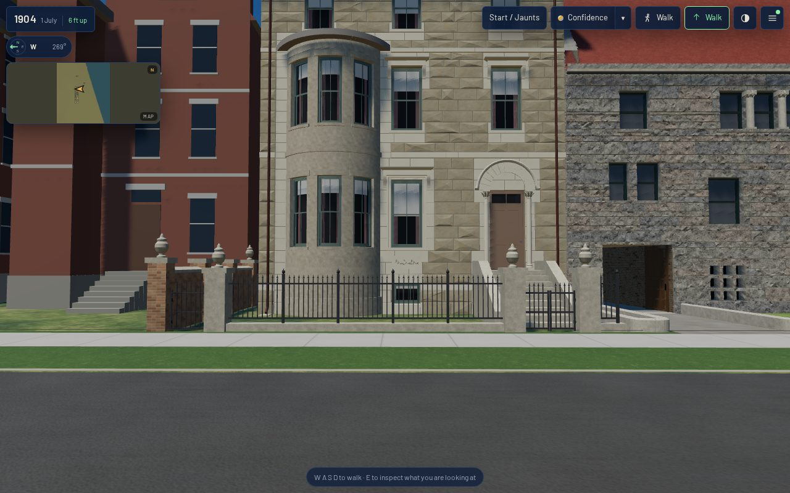 | 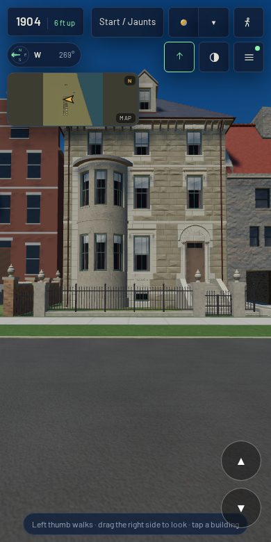 |
| oblique | 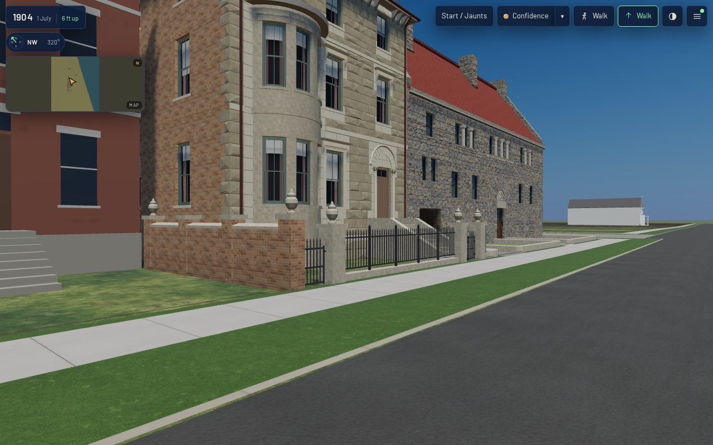 | 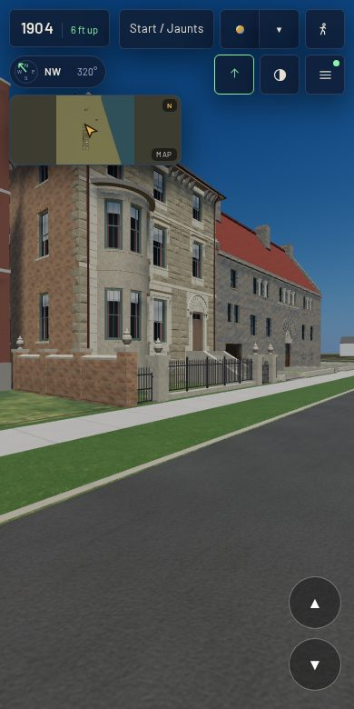 |
| entrance, 3.5 m | 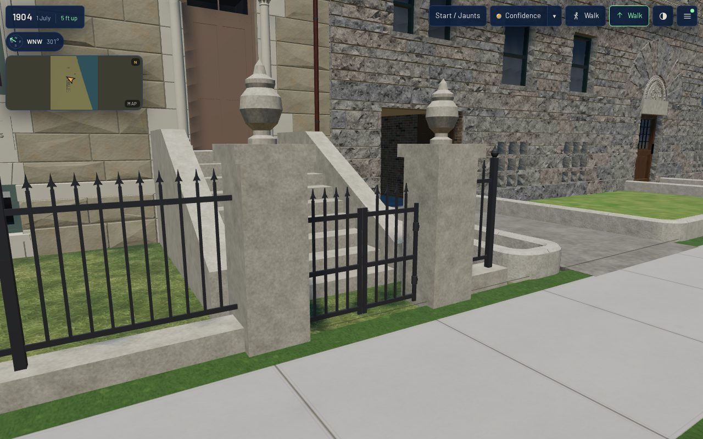 | 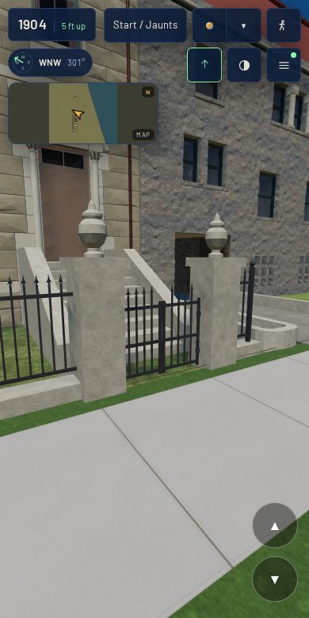 |
| walking distance, 6 m |  | 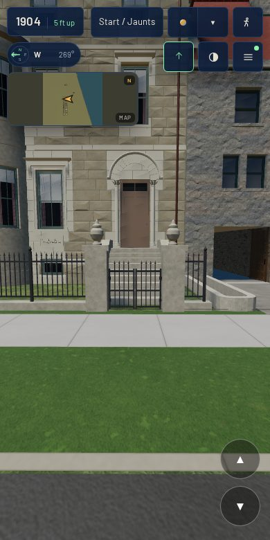 |
| side gate | 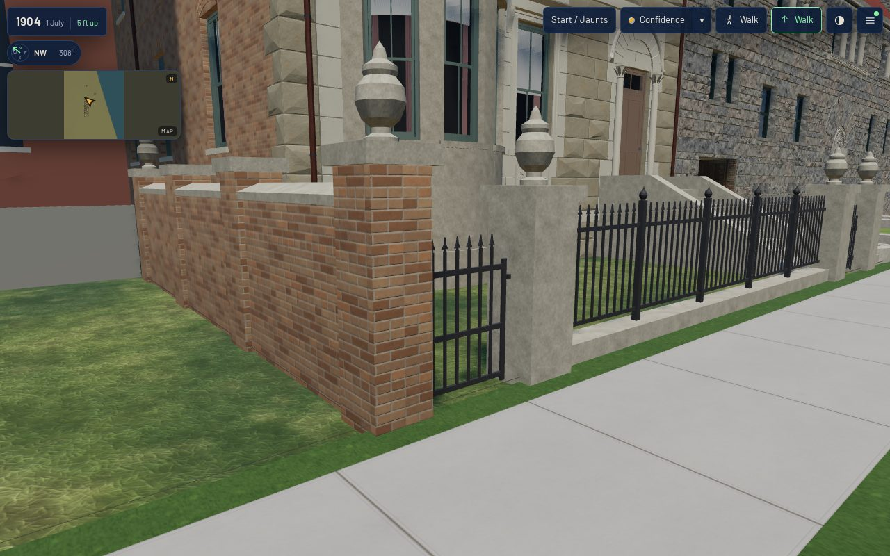 | 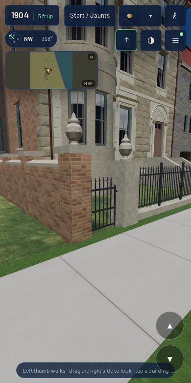 |
| wall, from the yard | 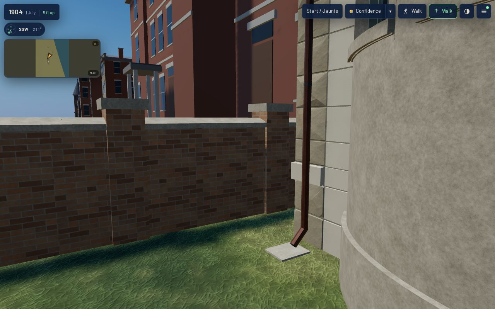 | 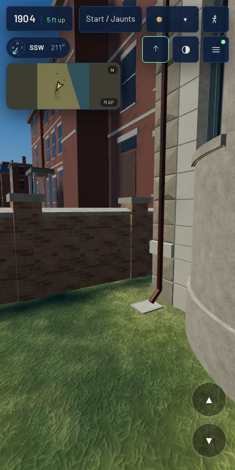 |
| rear | 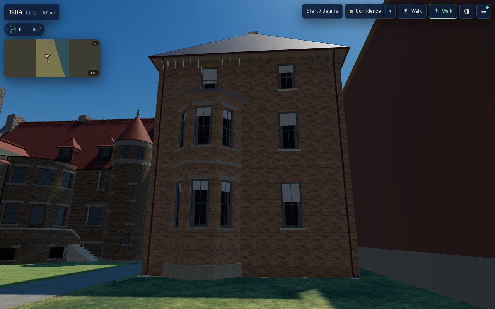 | 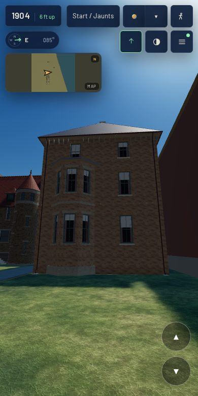 |
| roof | 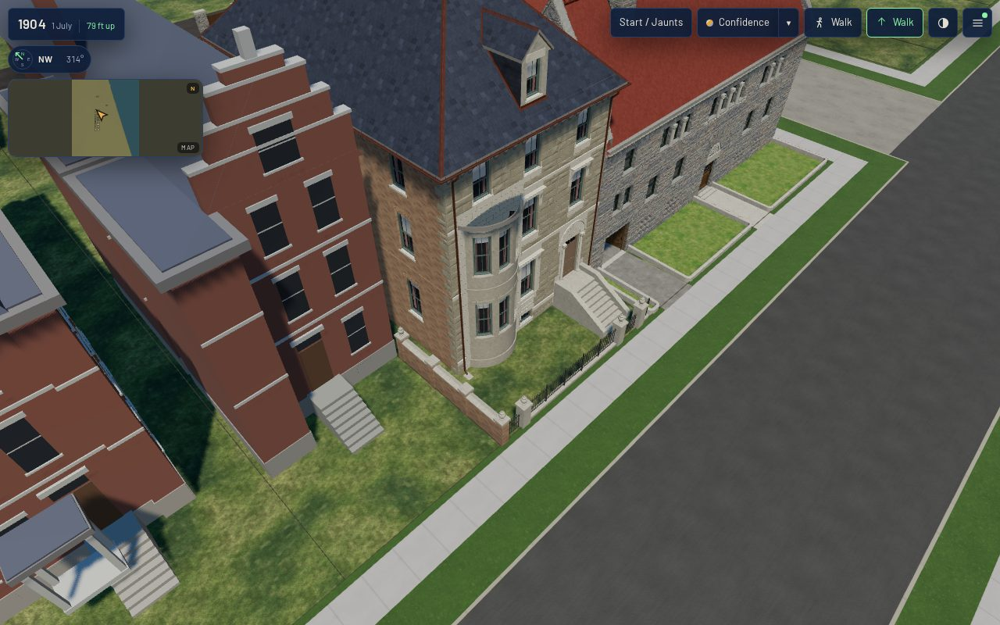 | 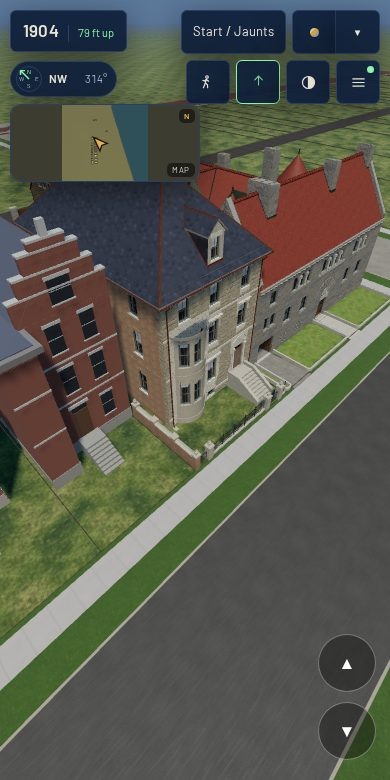 |

## Rebuild

    python3 generators/k01_emit.py --only keith_house_1808_prairie
    ./tools/web_derivatives.sh --only keith_house_1808_prairie__as_built_1886.glb
    node tools/k01_contract.mjs --measure-asset keith_house_1808_prairie
    ./tools/publish.sh && node tools/qa_k11_t2319.mjs
