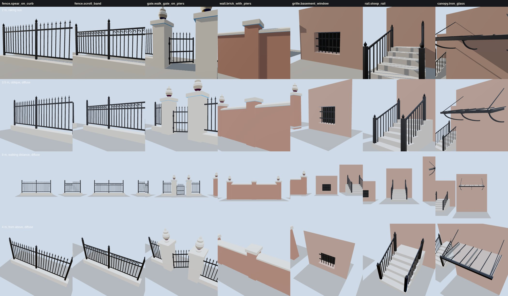

# K11 ironwork kit — the study (T-2318)

**What this is.** The seven variants of `data/components/prairie_1904/k11_ironwork.json`, built by
`generators/archetypes/k11_ironwork.py` into the specimen `k11_ironwork_kit.glb`, each on its own
board. The vendored three.js the walkthrough uses draws them (`tools/study_k11_ironwork.mjs`, the
K10 study's rig and lights) at four stands:

- **2 m, raking sun**: one sun 12° off the line. It shows the spears, the scrolls, the hinge barrels
  and the coping's saddleback.
- **3.5 m, oblique, diffuse sky**: how members meet. Rails go into posts and piers, the gate stands
  open into the yard, and the stoop's balusters sit on their treads.
- **8 m, walking distance, square-on**: the K11 acceptance. The silhouette has to read here
  without wire shimmer.
- **4 m, from above at 40°**: the gate's swing, the coping's fall and the canopy's single sheet
  of glass under its bars.

**The variants.** The gate on its piers and the brick wall with piers stand side by side in the
middle of the board, so an iron run and a masonry boundary can be compared directly.

| variant | what it is | pieces | triangles |
|---|---|---|---|
| `fence.spear_on_curb` | stone curb, three posts with acorn finials, two panels of pickets through two rails, a spear on every picket | 55 | 1,568 |
| `fence.scroll_band` | the same, with the pickets ending in the top rail and a band of C-scrolls under it, one in every bay | 55 | 3,368 |
| `gate.walk_gate_on_piers` | two stone piers with caps and urns, a 1.00 m opening, a gate on two pintle hinges drawn 32° open into the yard, a latch keeper, and fence from each pier to an end post | 62 | 2,040 |
| `wall.brick_with_piers` | a 5 m brick wall, three piers at 2.5 m, a saddleback stone coping between them, pier caps, urns on the end piers | 11 | 692 |
| `grille.basement_window` | six square bars let into the reveal's head and sill, through two flats let into its jambs | 8 | 96 |
| `rail.stoop_rail` | a rail on each side of a six-riser stoop: two newels with finials, a raked handrail, two balusters to a tread | 28 | 960 |
| `canopy.iron_glass` | three rafters on quadrant brackets let into the wall, a front beam, one sheet of glass falling 8°, six glazing bars, two tie rods | 16 | 552 |

Costs, with the board's frame time at 1280×800 and 390×780, are in `costs.json` (headless
Chromium on SwiftShader: a figure for comparing kit revisions, not a device frame time). The whole
specimen is 692 kB, 33 draw calls and about 11,000 triangles at desktop. Most of the scroll fence's
3,368 triangles are in its scrolls. A street of them is the place to cut first: a light tier can
draw the scroll band as one pierced plate behind 15 m.

**How ironwork holds together.** K09 and K10 build open mouldings laid on a wall. Ironwork is a
frame, so here nearly every piece is a closed solid let into the member that carries it. The gate
(`tools/check_ironwork_kit.py`) measures all of it on the built geometry:

- **rooted** (K09's rule, shared): each piece passes through its host's surface. Pickets go through
  rails, rails into posts or piers, posts into the curb, and the curb, piers and wall go 0.10-0.15 m
  below grade. Spears, finials, urns, caps and copings are let into what carries them. The grille's
  bars go into the reveal's head and sill, the stoop rail stands in the treads, and the canopy's
  rafters, brackets and rods go into the wall. A lifted picket or a short bar is refused.
- **shimmer**: no iron member is thinner than 10.8 mm across any of its own faces. That is 1.5 px at
  6 m under the walkthrough's 50° lens on a 780 px screen. Below that floor a bar breaks into a
  crawling dotted line as the camera moves.
- **rhythm**: the pickets, bars and balusters of each panel are evenly spaced, 60-130 mm clear.
- **gate**: two hinges; at least 0.90 m clear between the piers; no fence, rail or curb inside the
  opening (a pier cap may overhang it by its own 50 mm, above the gate); the leaf on the yard side
  as drawn, and clear of its hinge pier at every 5° of its 90° swing.
- **wall**: piers no more than 3.0 m apart, and the coping overhanging both faces by at least 40 mm.
- **canopy**: the glass falls at least 5° from the wall, and rafters are no more than 1.2 m apart.

The first run of the gate found two defects, both now fixed. The curb and the piers had been sunk
to the same depth, so their bottom faces lay on one another (the pier now goes 0.15 m down, the
curb 0.10 m). The gate's latch stile was as deep as its rails' mortise, so it held on nothing; the
stiles are now 20 mm deep and the 24 mm rails pass through them.

**Generic and distinctive.** Every pattern here is generic. The register keeps property patterns
apart: at 1905 S. Prairie, for one, the 1893 scroll fence and the c.1905 taller fence differ, and a
1904 state has to be chosen. The data's restriction records this: a K11 part may stand where a
property's own ironwork is unknown, never in place of a documented one. T-2319 puts the first K11
fence, gate and wall on a named house, and has to say which of the two it is doing.

**What is invented.** All of it is reconstructed: liberty `L-k11-ironwork-kit-2318` in
`docs/LIBERTIES.md`.
