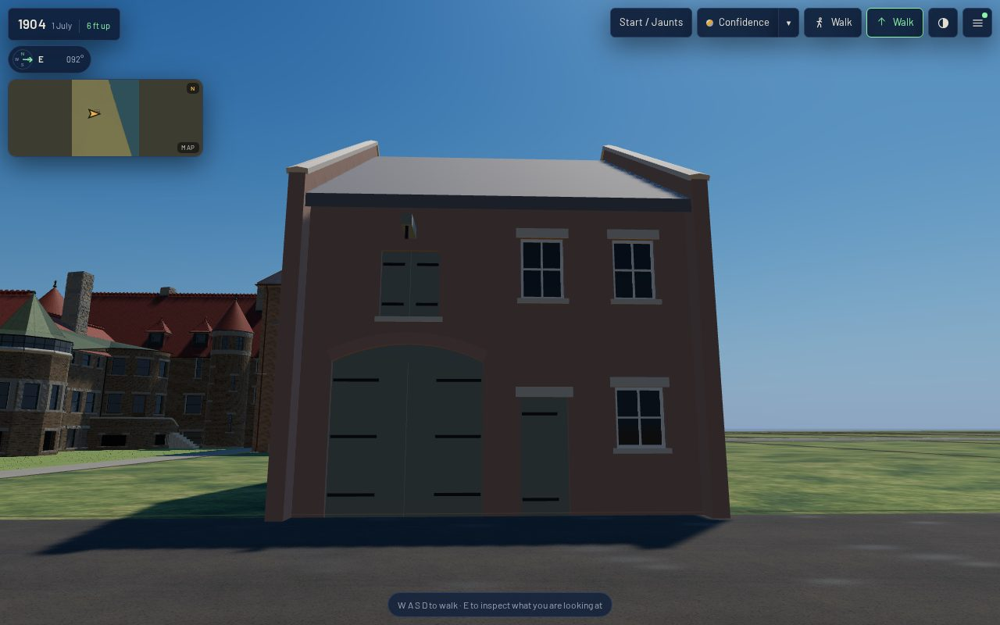
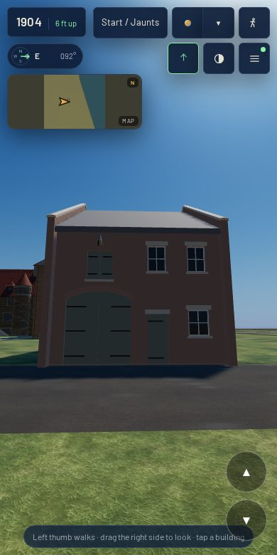
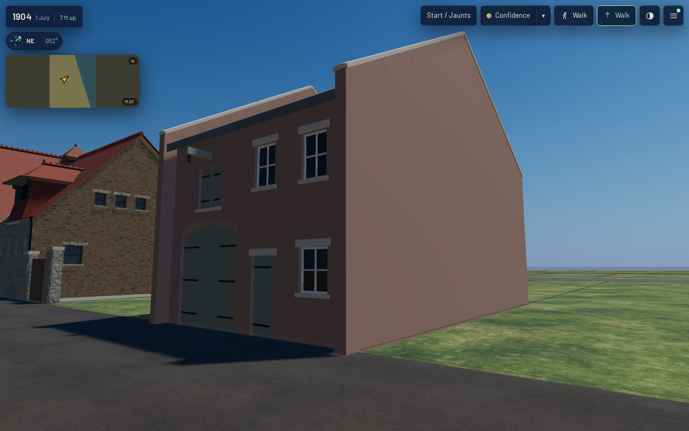
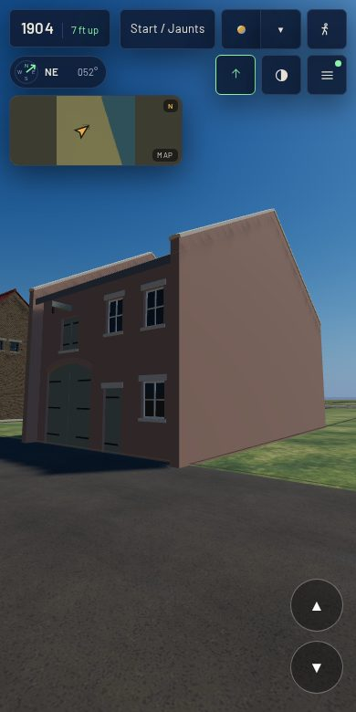
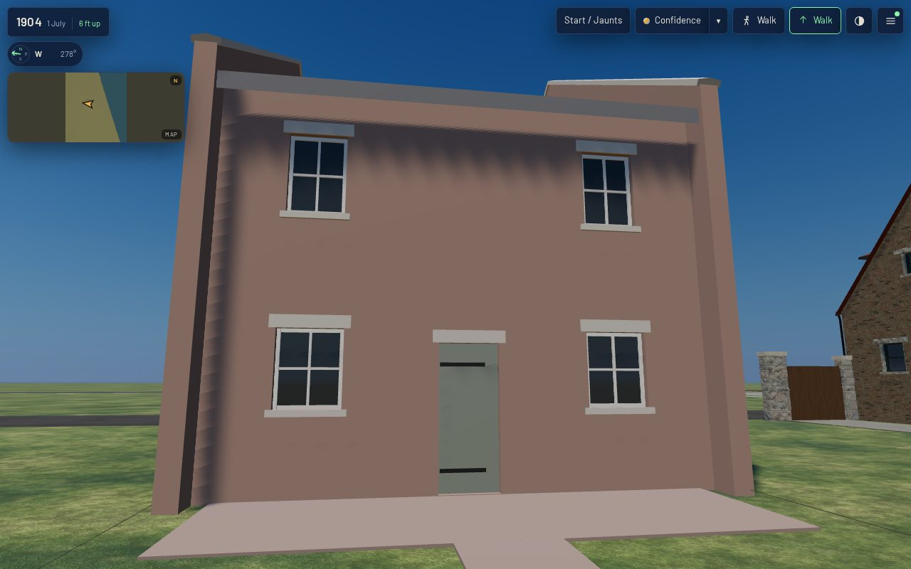
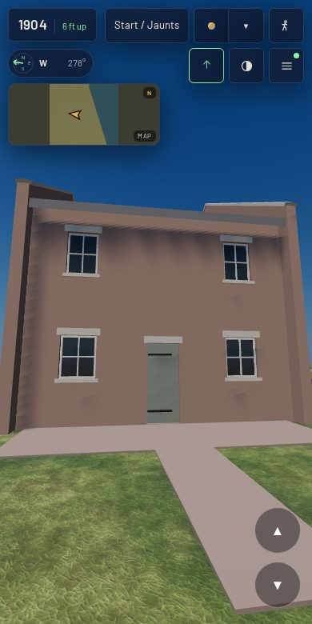
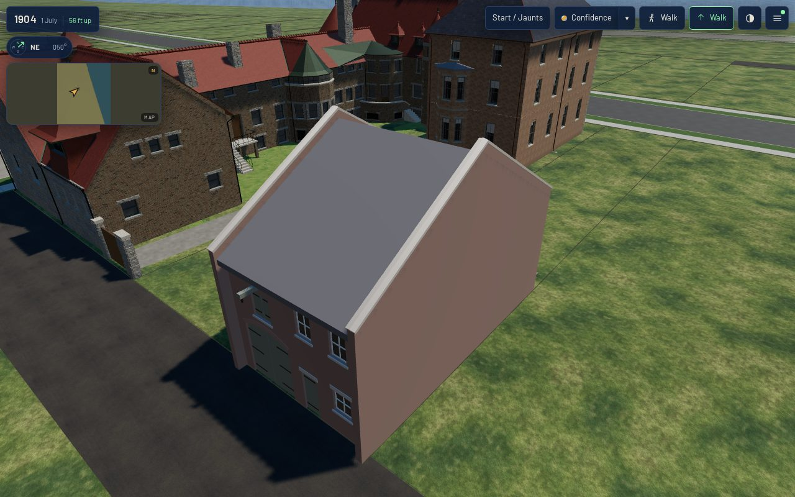
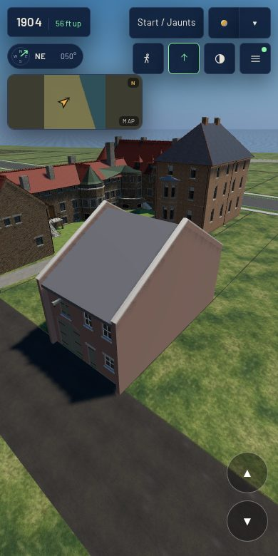
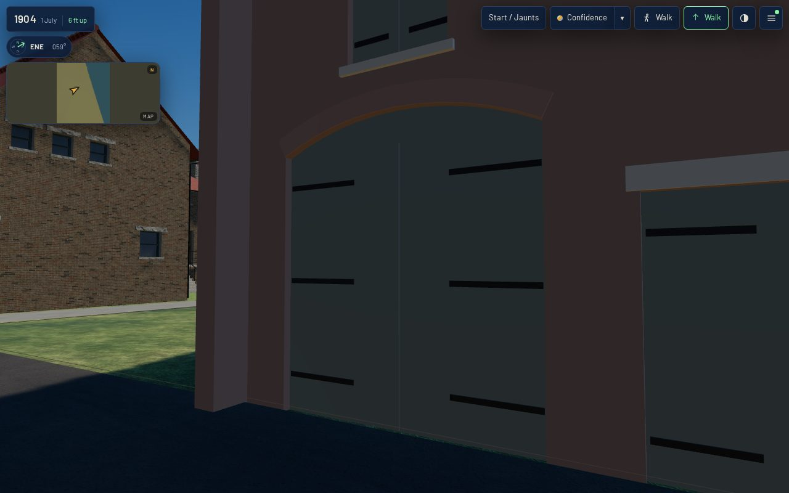
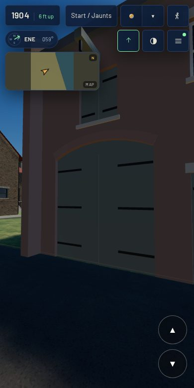

# The coach house behind 1812 Prairie — K12 on a named lot (T-2321)

**What this is.** `data/structures/wheeler_house_1812_prairie_coach_house.json`, the first coach house
built in the 1904 scene from the K12 kit (`data/components/prairie_1904/k12_coach_house.json`,
T-2320), by `generators/k12_emit.py`. It stands on the alley behind 1812 Prairie Avenue, the lot
directly south of the 1808 Keith house already in the scene, at the outline sheet 28 of the 1911
Sanborn draws for it (the T-1841 sheet census's polygon `s28-1812-rear`).

**Acceptance (stated before work).** One complete alley asset from the coach-house kit at its
mapped rear footprint: every elevation closed, its workyard connected to the house, the 1911
GARAGE label not read as 1904 use; baked and verified in the actual 1904 app at 1280x800 and
390x780 from the front, an oblique, the rear and the roof, with costs.

## What the sheet gives, and how it was read

The committed raster (`chicago/reference/prairie-avenue/sanborn-1911-and-robinson-1886/sanborn_1911_vol3_sheet_28.jpg`),
read by median darkness profile across rows 1900/1950/2000 and down columns 650/750/820/950:

| line | pixel | reading |
|---|---|---|
| alley (west) wall | column 581-582 | on the alley line, which is parcel `prairie_1812`'s rear line |
| east (yard) wall | column 869-870 | 288 px = **14.56 m** deep |
| north wall | row 1866.5 | 1808's alley building has its own line at 1858 |
| south wall | row 2035.5 | 169 px = **8.54 m**, the lot's whole width; 1816's line at 2041 |
| the house's rear wall | column 992-993 | **6.22 m** of open yard east of the coach house |

`2`, pink, walls lettered 12 and 8: two storeys, brick. Lettered GARAGE, a 1911 use; the census
backcasts the building to 1904 as the house's stable and coach house, and so does this record.
The middle of the alley wall, pixel (581.5, 1951), goes through the sheet's fitted similarity to
local E 1338.513, N -3256.390 — 0.05 m from the middle of the parcel's rear line. The bearing is
the parcel's (-0.616), so the building stands square on its lot beside the 1808 house.

## What the kit had to learn, additively

The specimen has a free gable with a stair outside it, a ramp, a lean-to and a wing. This lot
leaves room for none of them: the sheet draws neighbours hard against both ends and nothing in the
yard. So `k12_coach_house.py` gained four things a variant may ask for, and the specimen asks for
none of them — its GLB is the same 157,532 bytes (`k12_coach_house.py --check`):

- `east_end: "party"` — a second party wall, the west one turned about the middle, with its own
  coping; the roof dies into both and has no verge; the eave walls' ends lie open on the party
  walls' faces.
- `pitch_deg` — this building is 14.6 m deep; the kit's 40 degrees would stand the ridge 6.1 m
  over the eaves, so it takes 30 (4.2 m).
- `ramp`, `stair`, `lean_to`, `wing` — each built only where asked for (the ground board then goes
  round the plain outline).
- `workyard` — a brick-paved apron along the yard wall and a 1.2 m walk from it to the house's
  rear wall line (the kit's new `parts.workyard`, 40 mm proud, under the yard door's 50 mm sill).

`structure_variant` / `structure_glb` turn the kit's frame (+X along the alley wall, +Z into the
alley) into the renderer's (+x east, +z south) for an alley on the west, drop the boards, and write
one node carrying `structure_id`. `tools/check_coach_house_kit.py` now builds every
`k12_coach_house` record too and holds it to the kit's rules — seated, rooted, doubled, every
elevation closed (the two party walls in place of the gable), every opening cut through, no
ventilator, budget — plus the workyard's: paving on the ground, under every yard sill, and the walk
reaching the house line. Three new self-test cases break each (17 in all).

## The views (actual published /1904/ app)

Desktop 1280x800 at full detail, mobile 390x780 at light, `tools/qa_k12_t2321.mjs`; zero page
errors and zero failed requests on both; every stand inside the detail tier's budget.

| | desktop | mobile |
|---|---|---|
| front (the alley elevation, 12 m) |  |  |
| oblique (from the alley, south-west) |  |  |
| rear (from the end of the workyard walk) |  |  |
| roof (from above the alley) |  |  |
| carriage bay, raking, about 4 m |  |  |

## Costs

| | |
|---|---|
| triangles | **1,270** (127 pieces; 1,288 with the boards the scene does not ship) |
| materials / primitives | 9 (brick, rubbed brick, dressed stone, slate, painted timber, white sash, glass, wrought iron, brick paving) |
| master GLB | 98,532 B (`assets/gltf/`) |
| web GLB | 26,408 B (`assets/web/`, gltf-transform) |
| scene at the stands | desktop full 70-84 draw calls, 2.51-2.58 M triangles; mobile light 69-79 calls, 0.49-0.53 M — `browser-validation-*.json`, which also carries each stand's frame time on this runner's software GL (a relative reading, not a device claim) |

The buildings batch by material, so a structure on materials the scene already draws adds
triangles, not draw calls; 1,270 triangles is under 0.3% of the light tier's count at these stands.

## Not done, said

- **No brick or slate texture.** Flat colours, as in the K12 and K13 studies; K03's bond and K04's
  coverings are not laid on it.
- **The house is not built.** The walk ends at the line where the sheet draws the Wheeler house's
  rear wall; T-1884/T-1885 put the house there.
- **No basement access.** The kit's basement goes down 1.8 m all round and nothing reaches it.
- **No interior, no floor at grade.** The leaves are closed; the ground shows at the foot of the
  carriage leaves in the close view.
- **Every opening, the roof and the yard are reconstructed** — liberty `L-k12-1812-coach-house-2321`.
  A photograph of the alley behind the 1800 block, or a permit for the 1812 stable, replaces them.

Re-run: `python3 generators/k12_emit.py` (and `--check`), `python3 tools/check_coach_house_kit.py
--check` (and `--self-test`), then `bash tools/publish.sh` and `node tools/qa_k12_t2321.mjs`.
