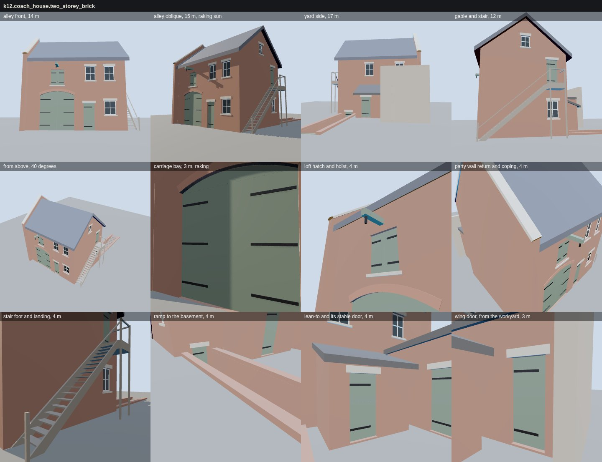

# K12 coach-house kit — the study (T-2320)

**What this is.** The variant of `data/components/prairie_1904/k12_coach_house.json`, built by
`generators/archetypes/k12_coach_house.py` into the specimen `k12_coach_house_kit.glb` on a
specimen lot: ground, a basement floor, and a stub of the house's rear wall for the wing to meet.
The vendored three.js the walkthrough uses draws it (`tools/study_k12_coach_house.mjs`, the K10
study's rig and lights). A coach house is one building with four elevations rather than a row of
small parts, so the stands are the variant's own, written into the GLB by the generator: every
elevation and the roof from 12-17 m, then each part close, at 3-5 m, in a raking sun or a diffuse
sky.

**Acceptance (stated before work).** The kit's parts are metric and parametric in data: rear
footprint, party wall, carriage aperture, loft hatch, ramp grade, stair rise and going, wall return.
The generator assembles a two-storey brick coach house from them with every elevation closed and
every opening cut through its wall. The ramp and the stair meet grade. The wing meets its walls
with no gap or overlap. The roof ventilator stays off unless a variant's evidence supports one.
The result is studied at 2-5 m in raking and diffuse light, with costs.

**What it is made of.**

| part | what it is | built as |
|---|---|---|
| shell | alley and yard walls (13-inch brick), an open gable, over a 1.8 m basement | solids with every opening cut through and lined by a reveal |
| party wall | on the lot line: 0.45 m above the roof along the whole rake, returning 0.5 m past both eaves | a solid the roof dies into, under a weathered stone coping let into it |
| roof | a 40 degree gable roof, 0.4 m eaves, a 0.3 m verge at the open gable | one slab across the ridge; the gable's rakes lie on its underside |
| carriage bay | 3.0 m clear (data range 2.7-3.6 m), segmental head rising 0.35 m | two boarded leaves on three strap hinges each, a boarded head panel, a brick ring two rowlocks deep |
| loft hatch | over the carriage bay | two leaves, a stone sill, a hoist beam let 0.25 m into the wall and reaching 0.9 m out, a hook |
| stable sash | four lights | a frame, a meeting rail and a muntin, one pane per light, stone sill and lintel |
| ramp | 1 in 4 down to a basement door, 1.3 m wide, a 1.4 m landing | paving between two retaining walls standing 0.15 m above grade, a cleat every 0.45 m |
| stair | 19 risers of 0.20 m, goings of 0.24 m, up to a loft door on the gable | two stringers, treads, a landing on two posts, a newel and a handrail, guard rails |
| lean-to | one storey against the yard wall, 20 degree pitch | three walls and a roof dying into the yard wall; a two-leaf stable (Dutch) door |
| wing | one storey, flat-roofed, from the yard wall to the house's rear wall | two walls and a roof dying into both; a door onto the workyard, a window |

**How it holds together.** The rule is the one K09 and K10 already use. An open piece leaves its
open edges lying on another surface, and a closed piece passes through what carries it. Nothing
lays a face on another face. In a building that means:

- a wall's foot lies on the ground or the basement floor;
- a wall's end lies on the wall it meets;
- the gable's two rakes lie on the roof's underside, and its shoulders lie on the eave walls'
  tops;
- the roof's end and both of the wing's ends lie on the walls they die into;
- a leaf's edges lie on its reveal.

The gate (`tools/check_coach_house_kit.py`) measures this on the built geometry:

- **seated, rooted, doubled**: the shared K09 rules (every open edge on a surface within 0.2 mm, every strap, beam, hook, coping and cleat through its host, no coplanar overlap).
- **shell**: each of the four elevations is sampled every 0.5 m above grade, and every point that is not an opening has wall behind it.
- **openings**: a ray through each opening's centre crosses nothing of its wall, openings keep 0.1 m apart and 0.25 m from the wall's ends, and the carriage bay is inside its range.
- **grade**: the ramp is no steeper than 1 in 4, with its head at grade and its foot on the basement floor. Risers are at most 0.21 m and goings at least 0.22 m, and the risers add up to the landing, which is at the loft door's sill. Stringers, posts, newel, and the lean-to's and wing's walls all stand on the ground.
- **ventilator**: the generator refuses one without a source.

Its self-test breaks each rule and must see it refused (14 cases).

One defect the gate's first build found was not in the kit but in the shared triangulator. A wall
with several openings could bridge two of them to the same outline vertex, and the second bridge
was spliced into the wrong copy of it, so the alley wall would not triangulate. The kit carries its
own copy of K09's ear clipping, with the fix: a bridge goes only to a copy of the vertex whose
interior wedge it enters. K09's and K10's own builds are unchanged.

**Costs** (`costs.json`; headless Chromium on SwiftShader, a figure for comparing kit revisions,
not a device frame time): the whole coach house is about 2,000 triangles and 13 draw calls
(one per material). The specimen GLB is 158 kB. Stair treads and sash bars are the most numerous
pieces, and none is heavy. A lighter tier is not needed at this size. The first to drop behind
15 m would be the ramp cleats and the strap hinges.

**What the views show.**

- *alley front / oblique*: the party wall rising above the roof and returning past the eave; the
  carriage bay's ring; the hatch and beam over it; the stair against the gable.
- *yard side*: the lean-to and the ramp's retaining walls. The house wall stub hides the wing from
  this side, as the house itself would.
- *carriage bay, 3 m raking*: the straps' shadows, the leaves set back in the reveal, and the ring
  standing proud.
- *party wall return and coping*: the roof dying into the party wall, and the coping stepping over
  it.
- *stair foot and landing*: stringers on the ground, treads housed between them, the landing on
  its posts at the loft door.
- *ramp*: the cleats, the curbs, and the basement door under its lintel.
- *lean-to, wing door*: both single-pitch and flat roofs dying into the yard wall; the stable door
  in two leaves.

**Generic and distinctive.** Every size and form here is generic. The data's restrictions say so:

- `no_1911_use_labels`: a lot labelled a garage on the 1911 Sanborn is not thereby a garage in 1904.
- `ventilator_needs_evidence`: no ventilator is built without a source that shows one.
- `never_replaces_landmark`: Glessner's stable is its own asset.

T-2321 puts the first K12 coach house on a named lot, at its mapped rear footprint.

**Not done, said.**

- No ventilator, by the restriction: the kit has no ventilator geometry for a sourced one to switch
  on. T-2321 or a later lot authors one from its evidence.
- No brick or slate texture. The walls are flat colour in the specimen, as in the K09 and K10
  studies. K03's brick and K04's coverings are the scene's, applied when the kit goes on a lot.
- No interior. The leaves are closed, and the panes are dark glass over a hollow building.

**What is invented.** All of it is reconstructed: liberty `L-k12-coach-house-kit-2320` in
`docs/LIBERTIES.md`.

Re-run: `python3 generators/archetypes/k12_coach_house.py`, `python3 tools/check_coach_house_kit.py
--check` (and `--self-test`), then `node tools/study_k12_coach_house.mjs`.
