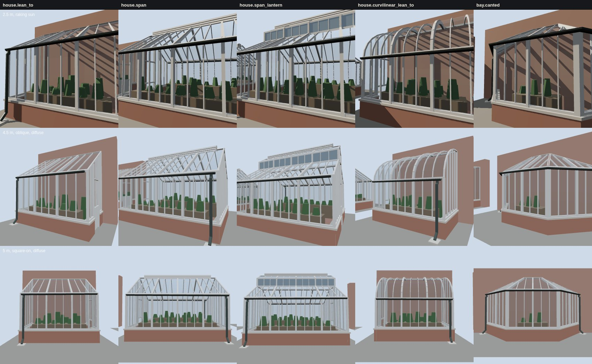

# K13 conservatory kit — the study (T-2305)

**What this is.** The five houses of `data/components/prairie_1904/k13_conservatories.json`, built
by `generators/archetypes/k13_conservatories.py` into the specimen `k13_conservatory_kit.glb` (each
on its own board, the lean-tos and the bay against a house wall). They are drawn by the vendored
three.js the walkthrough uses (`tools/study_k13_conservatories.mjs`) at the distances the kit
ticket names:

- **top row, 2.5 m, raking sun**: one sun 15° off the front's plane from the left. It shows whether
  the tiers read in order (the posts' shadows fall across the bars, the bars' across the glass),
  whether the sill plate sits on the coping and the eave plate under the gutter, and how the
  curvilinear ribs turn.
- **middle row, 4.5 m, oblique, diffuse sky**: the view a walker gets passing a garden. The near
  roof, the far slope's bars seen up through the front, the end wall and its door.
- **bottom row, 5 m, square-on, diffuse sky**: the house as a front, its bays and the planting.

| house | form | what it adds |
|---|---|---|
| `house.lean_to` | single pitch against a wall | the commonest form; a door in its end |
| `house.span` | free-standing, two pitches | a louvred ridge ventilator; a door in the gable |
| `house.span_lantern` | span with a raised lantern | the clerestory, glazed with the opaque substitute |
| `house.curvilinear_lean_to` | quarter-ellipse on curved ribs | the curved roof, eight planar facets |
| `bay.canted` | a glazed face and two 45° cants | a hipped glass roof to the house wall; two outlets |

**The frame is the reading.** Three tiers, each wider and prouder than the next (data `tiers`):
primary posts, rafters, ribs, corner posts, hips and jambs, 70 mm standing 50 mm proud; secondary
sill, eave, ridge, verge and wall plates, transoms, door heads and lock rails, 55 mm standing 35 mm;
tertiary glazing bars, 25 mm standing 20 mm, running one way only so no two bars of a tier cross in
one plane. A member between two panels (a corner, an eave, a ridge, a verge, a hip) is built once
on the edge, with faces parallel to both. A post meets the rafter above it, two rafters meet at a
ridge and two ribs at a facet joint on a mitre that bisects the panels; two verges meet at a gable's
apex the same way.

**One transparency per line of sight.** The glass of a house is one convex envelope, every pane
single-sided and facing out. A line of sight from outside enters by one pane, and every pane it
would leave by faces away from it and is not drawn, so nothing has to sort one transparency against
another. That is why the lantern is glazed with the opaque substitute: it stands up off the roof,
outside the envelope, and transparent glass there would put a second layer on the lines that cross
it. The planting is opaque and restrained, a staging bench along the glass with low pot-plant
masses on it and, in a lean-to, a taller border against the wall; it never reaches within 8 cm of
the glass or within 25 cm of the eave.

**What was changed after looking.** The gate's first run found each post's side sharing a plane
with the rafter above it, and the two rafters at a ridge, the ribs at each facet joint, the verges
at a gable's apex and two sill plates inside a corner doing the same. Those are now mitred, and a
plate runs in no deeper than the corner post's half width. The canted bay's gutter fell to its
middle; it falls to both ends now. The study's first boards showed the far slope's bars a deep blue
seen up through the front. That came from the rig (with its environment off they read grey), not the
kit, so only the glass reflects the environment and the paint, brick and ground are lit by the
hemisphere and the sun.

## Costs

Exact counts from the specimen ([`costs.json`](costs.json)). *House* excludes the board's wall
and ground. One draw call per material.

| house | triangles (house) | vertices (with board) | draw calls |
|---|---|---|---|
| `house.lean_to` | 772 | 1,524 | 10 |
| `house.span` | 1,503 | 2,913 | 10 |
| `house.span_lantern` | 2,224 | 4,304 | 11 |
| `house.curvilinear_lean_to` | 1,686 | 3,114 | 10 |
| `bay.canted` | 840 | 1,670 | 10 |

The whole specimen is 578 KB and draws about 9,600 triangles in 72 calls at 1280×800 (8,000 in 54
at 390×780, where the board is partly off screen). The frame times in `costs.json` are headless
Chromium on a software rasteriser: they compare kit revisions, they are not device timings. No
texture is bound: the frame, brick, stone and glass here are flat colours; K02 and K03's fabrics
clothe the plinth on a house. None of this is published: `tools/publish.sh` mirrors nothing under
`docs/RESEARCH/`, and no scene loads the specimen. T-2306 builds the first house in the scene.

## The gate

`python3 tools/check_conservatory_kit.py --check` (in `tools/check.sh`) rebuilds every house and
measures the built geometry: every primary standing prouder and wider than every plate, and every
plate than every bar; every pane inside the glass range with the bars dividing each run evenly; the
transparent glass one convex envelope with every pane facing out, glass the only transparent
material and single-sided in the specimen; no glass below the coping; every eave shedding into a
gutter that falls to an outlet within K04's spacing, every pipe starting inside its gutter, clearing
the coping by K04's offset and ending at K04's height over grade; the planting clear of the glass,
below the eave and inside its budget; the curvilinear roof's facets on the declared curve with no
chord more than 20 mm inside it and a rib on every facet; a ventilator wherever one is declared; no
coplanar faces overlapping; the triangle budget; metric UVs; and the committed specimen being the
generator's bytes. `--self-test` makes 16 breaks across those rules (nine in the data, seven in a
built house) and checks that the gate refuses each for its own reason, then checks that the
committed kit passes: 17 cases in all.

The kit is reconstructed throughout: `docs/LIBERTIES.md` § L-k13-conservatory-kit-2305.

Re-make: `python3 generators/archetypes/k13_conservatories.py`, then `node tools/study_k13_conservatories.mjs`.
