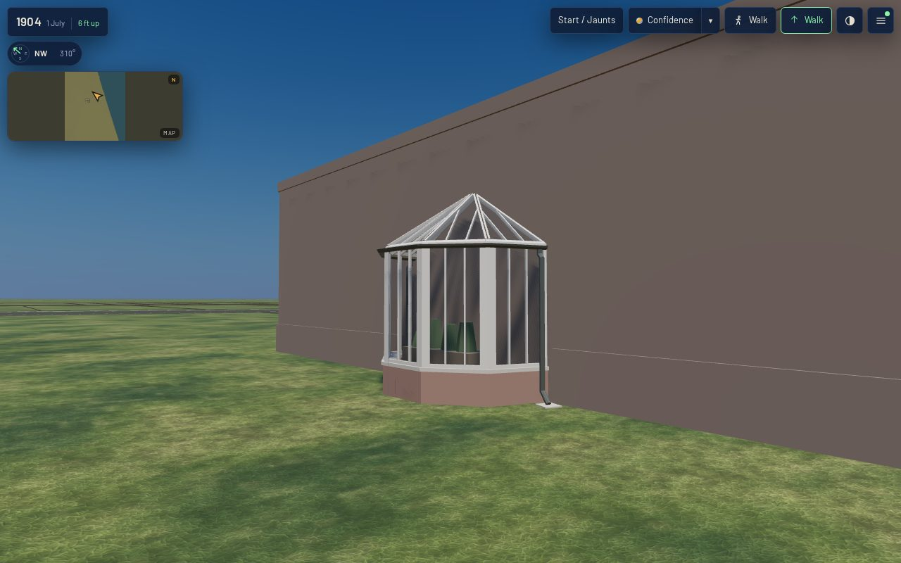

# K13 on the Pullman house — a conservatory bay on its east wing (T-2306)

**What this is.** The first house in the scene built from the K13 conservatory kit
(`data/components/prairie_1904/k13_conservatories.json`, T-2305): `pullman_house_1729_prairie_conservatory`,
a segmental glass bay on the south face of the George M. Pullman house's east wing at 1729 Prairie
Avenue. `generators/k13_emit.py` builds it from its record. It uses the kit's builder with one new
form, `segmental_bay`: a half-polygon of `facets` sides on a semicircle against the wall, under a
half-cone of glass triangles whose hips all run to one apex on the wall. The bay stands against a
plain block that stands in for the wing.

**Why here.** Sheet 20 of the 1911 Sanborn (committed raster, georeferenced at 2.46 m RMS) draws
the Pullman lot with the house (3B, stone) and a one-storey-and-basement stone wing (`1B`) running
east along the north of the lot to a two-storey garage. On that wing's south face, looking into the
court between house and garage, there is a semicircular projection:

| read on the sheet (between line centres, 0.0508 m a pixel) | value |
|---|---|
| the bay's chord centre, raster pixel | (4756.5, 5514) → local E 1463.45, N −3168.81 |
| the semicircle | 3.45 m across, 1.55 m out → built on a 1.72 m radius |
| the wing's depth (south line to north line) | 4.42 m |
| the wing's free south face, house wall line to its step | 9.115 m west, 8.201 m east of the bay |
| bearing | the sheet's own rotation in the fit, −0.815° |

The sheet prints no use or glass mark for the projection. **Reading it as a glazed conservatory is
reconstructed** (`docs/LIBERTIES.md` § L-k13-pullman-bay-2306). It is bounded by the T-1837
building register, which gives the Pullman estate a dated conservatory and palm-house complex, and
by the kit's conservatory bay. The register's own greenhouse complex south of 18th Street is not
built here.

**What the kit gives it.** Five facets, each one glazing bay with three panes of about 0.30 m.
Corner posts at the 36° facet joints; the hips (20° between neighbouring roof triangles) are
taken as half-strips on each triangle, the kit's rule for a near-coplanar edge. A 2.6 m eave on the
kit's two-foot brick plinth and stone coping. The glass rises to 3.7 m on the wall, one convex
single-sided envelope. One K04 half-round gutter round the eave falls from its middle to a pipe at
each end beside the wall, swan-necked past the coping, with a shoe over a splash stone. A staging
bench of four pot-plant masses runs across the chord. There is no door: the bay is entered from
the wing.

**The stand-in wing.** A closed block on the sheet's plan, 5.4 m high (reconstructed), in a
brownstone colour, with a 0.9 m base course stopped either side of the bay and a 0.3 m coping band.
It has no openings. T-1880/T-1881 (the house) and T-1934 (the stable, additions and conservatory
estate) replace it, and the bay moves onto the real wing's wall.

## Views

Taken in the actual published `/1904/` app by `tools/qa_k13_t2306.mjs`, at 1280×800 full detail and
390×780 light. The stands are named in the placement frame (u east, v north, metres up):

| stand | eye → target | desktop | mobile |
|---|---|---|---|
| front, from the court | (0, −9, 1.7) → (0, −0.6, 2.2) | [desktop-front.jpg](desktop-front.jpg) | [mobile-front.jpg](mobile-front.jpg) |
| oblique | (7.5, −7, 1.7) → (0, −0.6, 2.0) | [desktop-oblique.jpg](desktop-oblique.jpg) | [mobile-oblique.jpg](mobile-oblique.jpg) |
| rear (the wing's north face) | (3, 15, 1.7) → (0, 2.2, 3.0) | [desktop-rear.jpg](desktop-rear.jpg) | [mobile-rear.jpg](mobile-rear.jpg) |
| roof | (−7, −9, 11) → (0, −0.6, 2.4) | [desktop-roof.jpg](desktop-roof.jpg) | [mobile-roof.jpg](mobile-roof.jpg) |
| raking, 2.5 m | (−2.4, −2.6, 1.6) → (0.3, −0.9, 1.9) | [desktop-bay-raking-2.5m.jpg](desktop-bay-raking-2.5m.jpg) | [mobile-bay-raking-2.5m.jpg](mobile-bay-raking-2.5m.jpg) |

Zero page errors and zero failed requests at both viewports, and every stand inside the scene's
budget. The readings are in `browser-validation-desktop.json` and `browser-validation-mobile.json`.

## Costs

| | value |
|---|---|
| the bay (house) | 897 triangles; 30 panes; 12 primary, 14 secondary, 20 tertiary members; 1 gutter, 2 pipes |
| the bay with the stand-in wing | 955 triangles |
| materials (one draw call each) | 9: glass, frame, brick, stone, rainwater, staging, foliage, floor, house wall |
| master GLB / web GLB | 84,172 B / 26,032 B |
| scene load to ready | 18.1 s desktop full, 9.8 s mobile light (local server, software GL) |
| scene at the front stand | 48 draw calls, 1.30 M triangles desktop; 48 draw calls, 0.28 M triangles mobile |

Frame times in the validation files come from headless Chromium on a software rasteriser. They
compare revisions; they are not device timings.

## The gate

`python3 tools/check_conservatory_kit.py --check` now builds every `k13_conservatories` record in
`data/structures/` as `k13_emit.py` builds it. It holds each to the kit's rules: tier hierarchy,
panes, one convex envelope, plinth, rainwater to grade, restrained planting, no doubled face,
budget and metric UVs. `python3 generators/k13_emit.py --check` refuses a committed GLB that is not
the bytes its record builds. `mesh_inputs` hashes the kit data and K04's profiles for this archetype.

Re-make: `python3 generators/k13_emit.py`, then `tools/web_derivatives.sh --only
pullman_house_1729_prairie_conservatory__as_standing_1904.glb`, then `python3 tools/compile_scene.py --all`.
