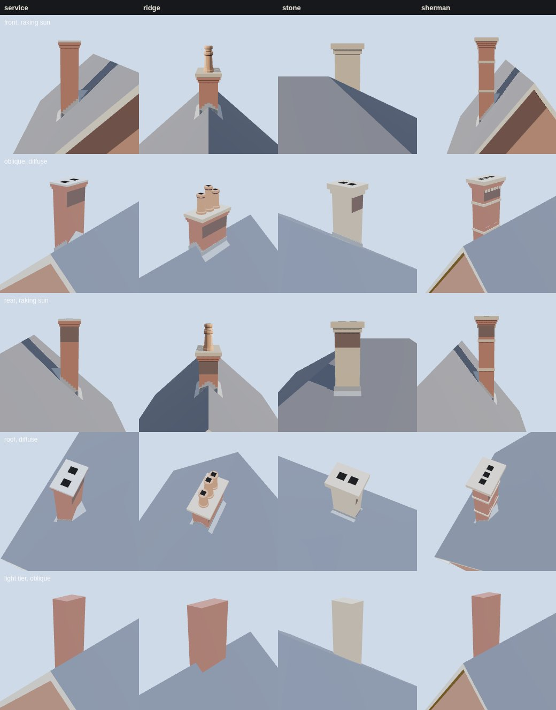

# K15 chimney kit (T-2312)

Piece 1 of T-1857 (K15, *Chimneys, flues and roof service details*), split into this kit and
T-2313, the kit on a named Prairie Avenue house, the way K02-K09 and K13 were.

*Columns: the four variants. Rows: front in a low raking sun, oblique under a diffuse sky, rear in a
raking sun from the other side, the roof from above, and the light tier from the oblique view. Each
tile is framed on its stack. Rendered by `tools/study_k15_chimneys.mjs` in the vendored three.js.*

## What it is

- **Data**: `data/components/prairie_1904/k15_chimneys.json`. It holds:
  - the parts' working sizes: a half-brick plan module, a 0.07 m course, the flue opening and recess,
    flashing, cricket and shaft;
  - the draught rule, the soot band and the clay pot profiles;
  - the triangle budgets;
  - **4 variants**, each standing in one of K05's roofs.
- **Generator**: `generators/archetypes/k15_chimneys.py`, on K05's own machinery: its roof elements,
  BSP union and closure.
  1. **Parts are closed solids** built in the stack's own frame (up the slope, up, across it):
     - the shaft, with its leeward top band sooted;
     - corbel courses, string courses, a row of corbel blocks and the cap;
     - clay pots, as ring stacks;
     - stepped side flashing, an apron, and back flashing or a cricket. Each piece of flashing is
       extruded from its profile against the covering.
  2. **The union joins them to the roof.** So the shaft is cut where it passes through the covering,
     and the cricket's valleys are cut where its slopes meet the roof plane.
  3. **The difference cuts the flues** (and the carved stack's sunk panels) out of the joined solid.
     So each flue is a recess with walls and a floor in a near-black material, not a painted square.
  4. **A stack is built in two halves, joined on the cap's bed.** The *body* is everything below the
     cap. The *head* is the cap and its pots. Each half is joined and cut on its own. They are then
     joined by a union whose two BSP trees are both rooted on the level plane of the bed. Why: a BSP
     plane is infinite, so a round pot's twelve faces otherwise split every shaft, corbel and flashing
     polygon they span. The slivers left behind were thinner than K01's 1 mm quantum: 29 degenerate
     triangles and 53 misoriented edges on the grouped stack, measured before the change. Rooted on
     the bed, no polygon meets the other half's planes. The roof's covering lies wholly below every
     bed, so it never meets a pot's planes either.
  5. **The pots' bores are square**, on the stack's own axes, for the same reason: three round bores
     sliced each other's pots.
- **Light tier**: each stack as one box on its shaft's plan, from inside the roof to the full top (a
  pot's lip where it has pots), joined to the same roof. It is 10-12 triangles, keeps location and
  height, and drops the head, flues and flashing.
- **Gate**: `tools/check_chimney_kit.py --check`, a `check.sh` step, with a 14-case `--self-test`.
  It rebuilds every variant and both tiers, and measures the built surface on K01's 1 mm quantum,
  reusing K05's `measure`:
  - **closed**, **one shell**, no doubled or degenerate face, no crossing, no interior face;
  - **seated**: no stack face lies below the covering;
  - **flue**: every flue is a recess open at its top, at least its depth deep, in a material darker
    than 0.06 luminance;
  - **draught**: the cap's top is 0.6 m above the covering within 3 m, and 0.9 m above it where the
    stack emerges;
  - **cricket**: a cricket behind a slope stack wider than 0.75 m, and back flashing behind a narrower
    one or on a ridge;
  - **flashing** on all four sides, the side flashing in at least two steps on a slope;
  - **light**: the same plan centre and top to the quantum, within its budget;
  - **budget**;
  - the **specimen** is the generator's bytes.

  Each self-test case breaks one rule, and that rule must refuse it:
  - a hole, and a face wound inward;
  - the stack laid in the roof without the union;
  - a shaft stood a metre clear of the roof, and a shaft dropped through it;
  - flues left uncut, and a flue painted grey;
  - a stack too short for its ridge;
  - the cricket taken away, and one side's flashing taken away;
  - a light tier short of the pots, and a light tier moved off its stack;
  - a stack over its budget;
  - a stale specimen.

## The variants

| id | roof (K05) | stack | flues | behind it | top |
|---|---|---|---|---|---|
| `k15.stack.service` | front gable, 42° | brick 0.84 × 0.525 m, 2 corbel courses, cement wash cap, mid-slope | 2 | cricket | 6.40 m (ridge 5.70) |
| `k15.stack.ridge` | front gable, 42° | brick 1.155 × 0.525 m, 2 courses, stone cap, astride the ridge | 3, potted | apron (ridge) | 6.65 m cap, 7.37 m pots |
| `k15.stack.stone` | hip, 35° | ashlar 0.735 × 0.525 m, one stone course, deep stone cap, rear plane | 2 | back flashing | 5.80 m (ridge 5.10) |
| `k15.stack.sherman` | front gable at 52° (steep) | pressed brick 1.05 × 0.63 m, sunk panels, 2 sandstone bands, 6 corbel blocks a face, 3 courses, sandstone cap | 3 | cricket | 8.20 m (ridge 6.84) |

## Costs

Measured by the study on the specimen (`costs.json`). Triangles and draw calls are exact. Frame
times are headless SwiftShader: a relative figure, not a device's.

| variant | stack triangles, full | light | draw calls (with its roof) |
|---|---|---|---|
| service | 423 | 10 | 10 |
| ridge, grouped | 1616 | 12 | 11 |
| stone | 345 | 10 | 9 |
| sherman | 1271 | 10 | 10 |

- The specimen is 638 kB uncompressed.
- The whole board at 1280×800 draws 57 calls, 6.5k triangles, 0.8 ms. At 390×780 it draws 47 calls,
  4.8k triangles, 0.4 ms.
- Three pots are most of the grouped stack's cost. A distant view takes the light tier.

## Provenance

- Everything here is **reconstructed** (liberty `L-k15-chimney-kit-2312`). No source is cited and
  none is invented.
- The course is RECONSTRUCTION-RULES' brickwork starting size. The choice of variants reads the
  study's building register:
  - "tall chimneys" for the Second Empire and Chateauesque houses;
  - "carved chimney tops" for 2100 Prairie (Sherman, Burnham & Root, 1874);
  - "end chimneys" for a five-bay red-brick front.
- **The Sherman-type stack reads only the register's sentence.** The register lists the *American
  Architect* plate of 30 September 1876 (`dw-aabn-1876-09-30-sherman-2100-plate`) for that house.
  It was not read for this kit, and is not a source here. Bounding a named house's stack by its
  drawing or photograph is T-2313's work.
- The draught rule (0.6 m within 3 m) is a modelling prior chosen so stacks read as the register's
  tall stacks. It is not a period code.
- The soot band's west-south-west wind is a working choice, not a dated reading.

## What it does not do yet

- Nothing in the walkthrough changes: no scene loads the kit.
- T-2313 builds a named house's chimneys from it, at their source-bounded number, height and position.
- K04's slate and K03's brick are not bound here. The specimen's colours are placeholders, as K05's are.
