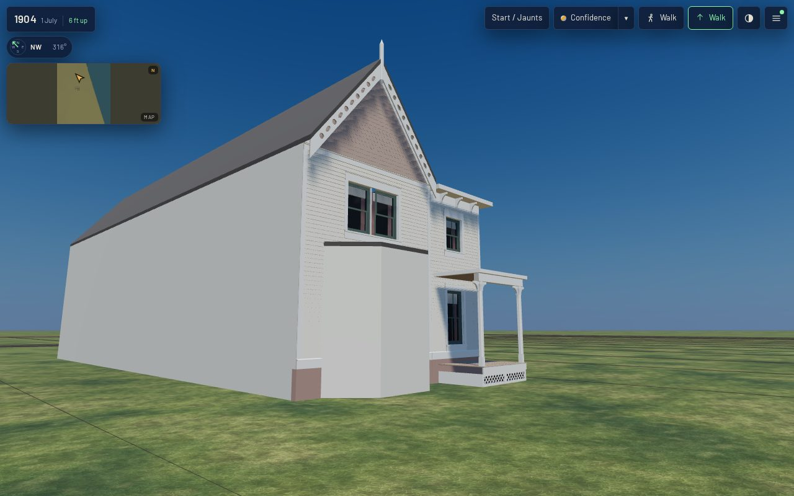

# K16 on 1638 Prairie — the Shortall-Gregory house's timber front (T-2323)

**What this is.** The first house in the scene built from the K16 timber kit
(`data/components/prairie_1904/k16_timber.json`, T-2322): `shortall_gregory_house_1638_prairie_front`,
the street front of the Gothic Revival frame house at 1638 Prairie Avenue. `generators/k16_emit.py`
builds it from its record. Three of the kit's samples, sized to this house, stand along the front:

| part | kit variant | what it is here |
|---|---|---|
| the gable | `gable` | 5.21 m wide over the south part of the front: clapboard on a raised basement to a belt at 6.4 m, square and fish-scale shingles inside rake boards, pierced bargeboards at 52° meeting at a finial (apex 9.9 m), one paired two-light sash in a timber casing |
| the wing wall | `clapboard_wall` | the north 2.92 m and its corner onto the north side: clapboard, corner boards, a frieze, a boxed eave on scroll brackets, a long two-over-two sash onto the porch and a shorter one above |
| the porch | `porch` | across the wing wall, 1.75 m deep: two mirrored halves so it has a post at each end, its ends closed under the floor by a painted skirt board |

Behind them stands a plain closed body (the envelope is T-1864's), and on the front a plain canted
bay block (its sash and timber are T-1865's). Neither has an opening or trim. Both are painted a pale
body colour so they read as stand-ins beside the timber.

**Read off sheet 20.** The committed 1911 Sanborn raster (georeferenced at 2.46 m RMS), between line
centres at 0.050779 m a pixel:

| reading | pixels | value |
|---|---|---|
| the front wall line | column 3103.3 | 10.8 m behind the Prairie line (column 3316) |
| the front's south and north ends | rows 3722.7, 3562.7 | 8.13 m; the north wall 0.36 m inside the lot line |
| the canted bay | rows 3708.3–3624 at the wall, 3686.7–3648.3 at its face, column 3125 | 0.73–5.01 m along the front, 1.10 m out |
| the open porch (dotted, `1`) | rows 3620–3562.7, to column 3142.7 | 2.91 m wide, 2.0 m out |
| the house's depth | columns 2643 and 2850 | 23.4 m (south range), 12.9 m (north range) |
| labels | `2BB`, yellow, `x` | two storeys and basement, frame, shingle roof |

The origin (the front's south end, at grade) is pixel (3103.3, 3722.7): local E 1378.215,
N −3079.055. The bearing is the fit's 0.815°. Where the gable's range ends is not on the sheet, which
draws one front line: the porch's south end (5.21 m) is taken. Every height, every sash and the
gable's pitch are the kit's, recorded as `docs/LIBERTIES.md` § L-k16-1638-front-2323.

**What the register asks for that is not built.** The T-1837 register describes a steep front gable
with an oculus, pointed twin windows with hood moulds, a polygonal corner tower with a pyramidal cap,
a canted ground bay, a pierced timber porch and a separate lower wing. Here the gable, the twin
windows (flat-headed: the kit's casing is square), the bay's plan and the porch stand. The oculus,
the pointed heads, the hood moulds and the tower are T-1865's. The bargeboard's roundels and vesicas
are the kit's working pattern, not 1638's own. The Chicagology page on the house was read
(2026-10-10: "Hudson River Gothic", a "sweet little frame house", demolished 1944). It carries no
usable elevation and is not a source record here.

## Views

Taken in the actual published `/1904/` app by `tools/qa_k16_t2323.mjs`, at 1280×800 full detail and
390×780 light. The stands are in the placement frame (u east, v north, metres up from the origin):

| stand | eye → target | desktop | mobile |
|---|---|---|---|
| front | (15, 4.2, 1.7) → (0, 4.2, 4.6) | [desktop-front.jpg](desktop-front.jpg) | [mobile-front.jpg](mobile-front.jpg) |
| oblique | (10, −7, 1.7) → (0, 3.6, 4.2) | [desktop-oblique.jpg](desktop-oblique.jpg) | [mobile-oblique.jpg](mobile-oblique.jpg) |
| rear | (−36, 13, 4) → (−12, 3, 5) | [desktop-rear.jpg](desktop-rear.jpg) | [mobile-rear.jpg](mobile-rear.jpg) |
| roof | (17, −12, 19) → (−7, 4, 6) | [desktop-roof.jpg](desktop-roof.jpg) | [mobile-roof.jpg](mobile-roof.jpg) |
| gable, raking, 3 m | (3.2, −0.4, 7.2) → (0.2, 2.2, 8.2) | [desktop-gable-raking-3m.jpg](desktop-gable-raking-3m.jpg) | [mobile-gable-raking-3m.jpg](mobile-gable-raking-3m.jpg) |
| porch, raking, 3 m | (3.4, 9.6, 1.8) → (0.7, 6.6, 2.3) | [desktop-porch-raking-3m.jpg](desktop-porch-raking-3m.jpg) | [mobile-porch-raking-3m.jpg](mobile-porch-raking-3m.jpg) |

Zero page errors and zero failed requests at both viewports, and every stand inside the scene's
budget (`browser-validation-desktop.json`, `browser-validation-mobile.json`).

**What was changed after looking.** In the first views, the north range's stand-in roof stopped
0.15 m short of its wall, leaving a slot behind the boxed eave, and left a strip open at its back.
The porch's open ends showed the dark crawl space, so a skirt board now closes them. The shingle roof
read paler than the walls: glTF colours are linear, so 0.3 is a light grey on screen, and the
covering is now 0.13/0.11/0.095. The first gate run refused the gable: a course under the sash ran
3.74 m on a 3.66 m board. The kit dropped a joint that fell within `min_piece_m` of an end. The
builder now puts that joint back where both pieces stay whole, and the specimen's bytes are
unchanged.

## Costs

| | value |
|---|---|
| the front | 10,113 triangles: gable 7,481, wing wall 1,382, porch 2 × 568, body, bay and skirts 132 |
| materials (one draw call each) | 14: body, trim, shingle, sash, stained, end grain, sheathing, glass, blind, curtain, backing, foundation, roof, stand-in |
| master GLB / web GLB | 997,096 B / 128,152 B (flat colours, no image) |
| scene load to ready | 24.1 s desktop full, 12.5 s mobile light (local server, software GL) |
| scene at the front stand | 50 draw calls, 1.32 M triangles desktop; 37 draw calls, 0.26 M triangles mobile |

Frame times in the validation files come from headless Chromium on a software rasteriser. They
compare revisions; they are not device timings.

## The gate

`python3 tools/check_timber_kit.py --check` now builds every `k16_timber` record in
`data/structures/` as `k16_emit.py` builds it. It holds the gable, the wall and a porch half to the
kit's own rules, as it holds the specimen: board scale, laps resting with a shadow line, staggered
joints, no board longer than it comes, trim proud of cladding, every piercing open and cut through,
end grain at every joint, timber materials and never masonry, paint wear, no doubled face, the
per-part triangle budget and metric UVs. Its self-test adds two breaks on the house. `python3
generators/k16_emit.py --check` refuses a committed GLB that is not the bytes its record builds.
`mesh_inputs` hashes the kit data and K06's for this archetype.

Re-make: `python3 generators/k16_emit.py`, then `tools/web_derivatives.sh --only
shortall_gregory_house_1638_prairie_front__as_standing_1904.glb`, then `python3 tools/compile_scene.py --all`.
