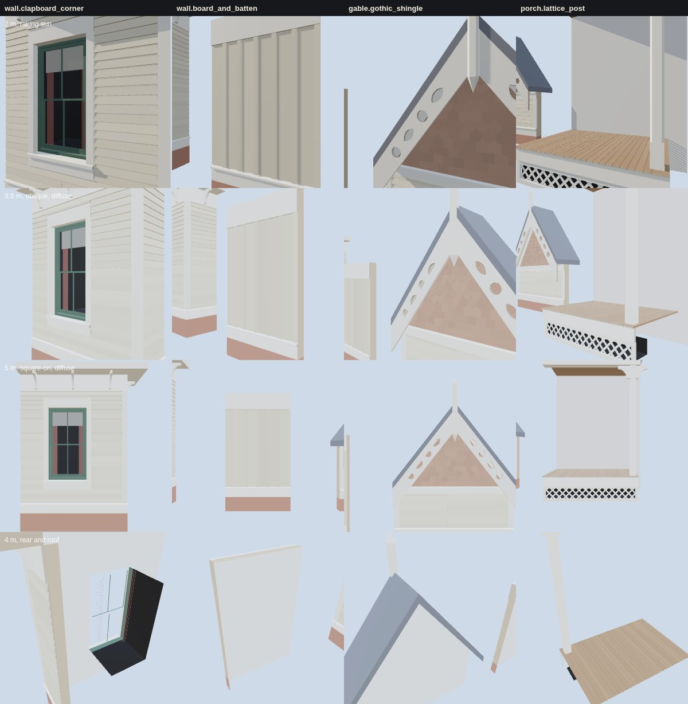

# K16 timber kit — the study (T-2322)

**What this is.** The four samples of `data/components/prairie_1904/k16_timber.json`, built by
`generators/archetypes/k16_timber.py` into the specimen `k16_timber_kit.glb`, each on its own
board. They are drawn by the vendored three.js the walkthrough uses
(`tools/study_k16_timber.mjs`) at the distances the kit ticket names:

- **first row, 2 m, raking sun**: one sun 12° off the wall's plane from the left. It shows whether
  every clapboard butt casts its shadow line, whether trim stands proud of the cladding, whether
  the battens shadow the boards and the bargeboard's piercings show their depth.
- **second row, 3.5 m, oblique, diffuse sky**: the view a walker gets passing a house. The corner
  and its return, the casing's depth, the shingle bands, the porch nosing and lattice.
- **third row, 5 m, square-on, diffuse sky**: the sample as an elevation.
- **fourth row, 4 m, from behind and above**: the rear and the roof, so a sample with an open back
  or a missing face shows it.

| sample | what it is | what it adds |
|---|---|---|
| `wall.clapboard_corner` | clapboard on a water table, an outside corner with a 0.9 m return | corner boards, a cased K06 sash, a frieze, a boxed eave and scroll brackets |
| `wall.board_and_batten` | 10 in boards with a batten over every joint | vertical cladding, its board and batten ends as end grain |
| `gable.gothic_shingle` | a 52° gable over clapboard and a belt | square and fish-scale shingle bands, rake boards, pierced bargeboards, a finial |
| `porch.lattice_post` | a porch bay against a plain board | an oiled board floor, lattice over a dark crawl, a chamfered post, a beaded ceiling |

**Board by board.** Every lapped course (clapboard and shingle) is built by one rule: its front
face falls from its butt, proud of the sheathing by the support the course below gives it plus the
butt, back by the butt over one exposure, so the next course's butt underside sits exactly on it.
That puts a shadow line a butt deep (5/8 in for clapboard) at every course and never a gap or one
board through another. Clapboards come in 12 ft lengths whose joints step 4 ft from course to
course, with a 1.5 mm gap and an end-grain face either side; a board ends against trim without
one. Corner boards are a pair, the front board lapping the side board's edge so both read 5 in and
no end grain shows. The casing's apron and drip cap end on clapboard butt lines, so every course
meets the casing whole rather than notched; the frieze is as thick as the corner boards so they
meet flush, and deep enough to take the brackets' legs. The wall behind is 0.15 m, sheathing to
plaster, inside the K01 contract's frame range: a timber face never carries a masonry wall's
thickness.

**The Gothic gable.** Shingles stop against rake boards prouder than their butts, sit on the belt's
drip cap and stagger half a shingle course to course. The bargeboards hang on the verge, 0.30 m out
from the wall, and are pierced with alternating roundels and pointed (vesica) openings: each
piercing is a hole through the board with its cut edges built the board's whole thickness, so sky
shows through and a raking light finds the depth. The two boards meet at the apex on the vertical
plane, hidden by a chamfered post that rises to a finial and hangs to a pointed drop. The pattern
is a working design; 1638's own is T-2323's to author from its photograph.

**Painted, stained, end grain.** Three classes of timber surface, kept apart as materials: painted
softwood (body, trim, shingles, sash), stained joinery (the porch floor, oiled, and its ceiling,
varnished) and exposed end grain (board ends at a joint or a cut, the cut edges of a piercing, the
nosing of the floor), which takes paint darker and rougher than the face. Paint wear is a seeded
per-board tone inside 10 %: a house in 1904 is painted and kept, not a ruin.

**What was changed after looking.** The gate's first run found the shingles reading prouder than
the belt and corner boards; they are not stopped by either (the shingles sit on the belt's drip cap,
which is proud of them), so the proud rule now holds each family to what actually stops it: corner
boards, casings, frieze and belt for clapboard, the rake boards for shingle. Two self-test breaks
were not refused at first: a butt measured against its own size (now against `min_shadow_m`), and a
single course stood off the one below while its neighbours rested (now every butt face is held
individually). The study's first boards showed every downward face (soffits, butts, the reveal
head) a saturated blue. That was the rig, not the kit: the sky sphere the study borrows from
K06's blends toward the ground colour by `-t * 3` without a clamp, so below t = −1/3 it runs into
negative light. This study clamps it; K06's still carries it (its head soffits read blue in its
own study.jpg).

## Costs

Exact counts from the specimen ([`costs.json`](costs.json)). *Sample* excludes the board (the
foundation, roof stubs, backdrop, plaster and the specimen's cut faces). One draw call per
material.

| sample | triangles (sample) | vertices (with board) | draw calls |
|---|---|---|---|
| `wall.clapboard_corner` | 776 | 1,548 | 13 |
| `wall.board_and_batten` | 102 | 240 | 6 |
| `gable.gothic_shingle` | 2,574 | 4,861 | 9 |
| `porch.lattice_post` | 732 | 1,476 | 7 |

The whole specimen is 456 KB and draws about 7,750 triangles in 56 calls at 1280×800 (and at
390×780). The gable is the dear one: a fish-scale shingle is nine triangles of face and sixteen of
butt. The frame times in `costs.json` are headless Chromium on a software rasteriser: they compare
kit revisions, they are not device timings. No texture is bound: the timber here is flat colour
with a per-board tone, and its grain is K14's. None of this is published: `tools/publish.sh`
mirrors nothing under `docs/RESEARCH/`, and no scene loads the specimen. T-2323 builds the first
timber in the scene.

## The gate

`python3 tools/check_timber_kit.py --check` (in `tools/check.sh`) rebuilds every sample and
measures the built geometry: clapboard exposure and board length inside the reconstruction rules'
ranges and the built wall inside the K01 frame range; every clapboard butt one exposure above the
last, every butt at least `min_shadow_m` deep and every clapboard course resting exactly on the one
below; no joint within the stagger distance of a joint in the next course, and no clapboard longer
than its board; a batten bearing on both boards over every board-and-batten gap; trim proud of the
cladding it stops; every bargeboard piercing open and its cut edges built front to back; an
end-grain face either side of every clapboard joint; every timber role on a painted, stained or
end-grain material, the three classes present and distinct, masonry on none; per-board paint wear
inside its range; no coplanar faces overlapping; the triangle budget; metric UVs; the restrictions
on shingles and pierced bargeboards; and the committed specimen being the generator's bytes.
`--self-test` makes 19 breaks across those rules (eleven in the data, eight in a built sample) and
checks that the gate refuses each for its own reason, then checks that the committed kit passes:
20 cases in all.

The kit is reconstructed throughout: `docs/LIBERTIES.md` § L-k16-timber-kit-2322.

Re-make: `python3 generators/archetypes/k16_timber.py`, then `node tools/study_k16_timber.mjs`.
