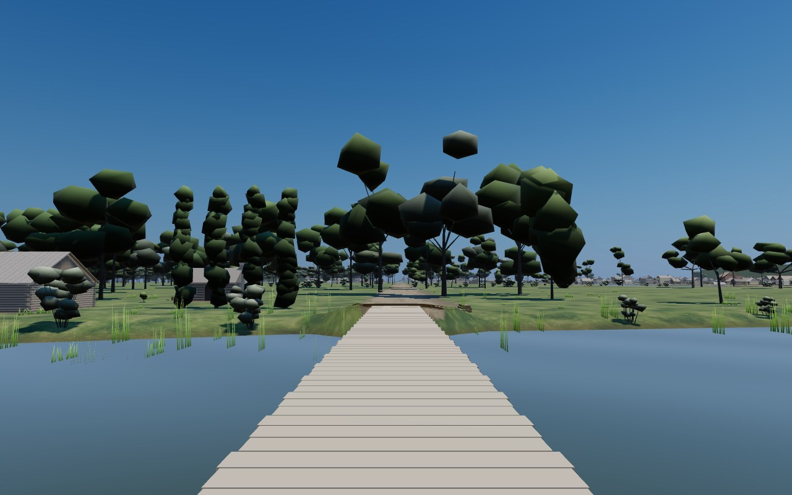
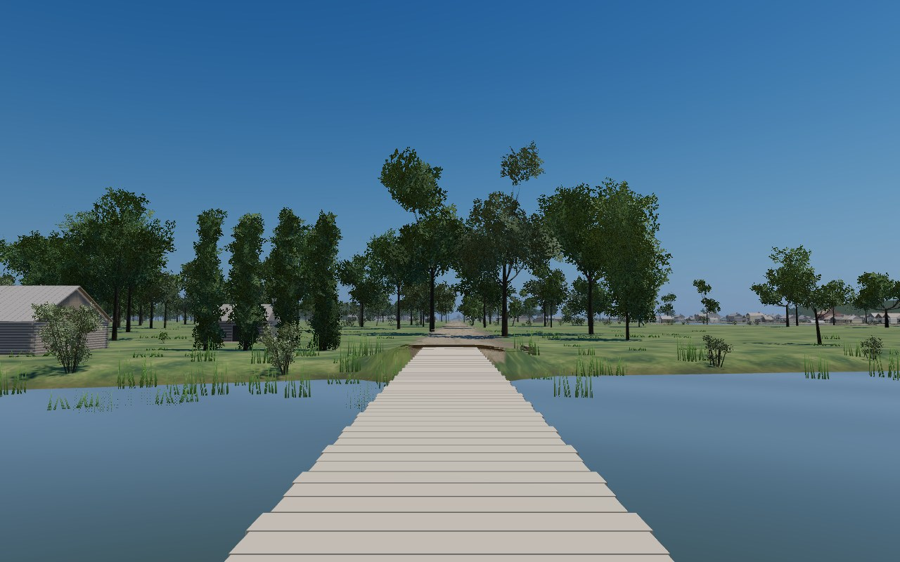
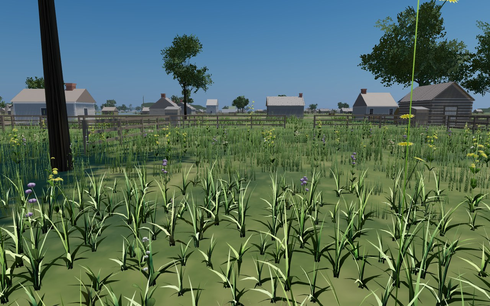
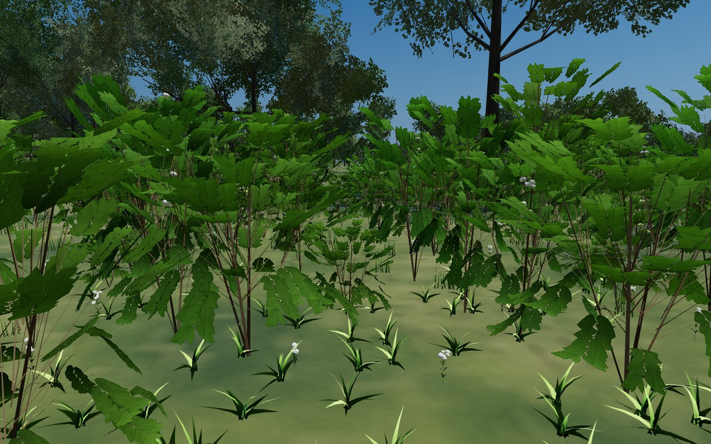

# T-2015 — Procedural vegetation quality

## Request and diagnosis

The owner supplied two views on 2026-10-02: solid polygonal tree crowns and oversized rectangular understory leaves. The shared renderer already carries researched species, dimensions, placement constraints, summer colours and phenology. Its visual primitives were the defect: jittered 20-face solids in `trees.js` and opaque trapezoid shrub sprays in `flora.js`.

The requested standard is photographic quality comparable to the detailed Glessner model. The work replaces these primitives with leaf-scale silhouettes, bark grain, porous crowns and more legible branching. Photorealism is a visual target, not a claim established merely by adding procedural noise.

## Boundaries

Species, community extents, historical placement, dimensions and July flowering eligibility remain owned by `data/flora`. New visual surfaces are deterministic code-authored reconstructions. No downloaded photograph, paid asset, external runtime service or additional network request is involved. Detailed geometry varies within the existing botanical forms rather than re-rolling ecological stations. The shared renderer is used wherever the current year loads the corresponding flora; this ticket does not plant missing 1812 or 1904 landscapes.

## Rendering approach

- Trees: multioriented branch sprays with species-family leaf silhouettes, transparent gaps, midribs/veins, varied leaf tones, mapped bark and tapered forks. Full and balanced spend detail on branch structure and overlapping sprays; light retains the low-end geometry floor.
- Understory: replace opaque spray rectangles with actual leaf/twig silhouettes; preserve recorded shrub width and plant distribution. Near higher-tier leaves and grasses gain curvature.
- Materials: alpha-tested opaque rendering avoids per-leaf transparent sorting. Wind and tree shadow passes share deformation and cutoff. Confidence grading remains attached to the source records.
- Placement randomness is separate from visual surface variation. New detail must not change downstream tree or species choices.

## Reproducible visual review

`tools/vegetation_review.mjs <site-root> <output> --tag before|after --viewport both --detail full`

The script serves the published mirror, freezes the animation clock and shoots 1280×800 and 390×780 at the river bank, North Branch bridge, west prairie and one deterministic plantable woodland point. The output includes the actual woodland pose, scene and vegetation census, hardware renderer, startup interval and page/console errors. Startup on this shared software-rendering host is not a consumer GPU performance claim.

The existing `measure_detail_ceilings.mjs` checks all three tiers at the five established worst-case stands plus the newly covered prairie view. `measure_timber_detail.mjs --gate` checks the timber distribution. Published smoke parts 10–11 cover physical rooting, species/flower census and sward reach. Moving camera, confidence mode and shadow views are reviewed separately because still images cannot establish those behaviours.

## Coordination with T-2014

The owner flagged active T-2014 during this run. PR #328 (`claude/project-thread-uzqpmm`) extends shrubs to 140 m at full detail, using the same lattice slots and a coarser `farShrubGeometry`. It landed as dev `b06a063a` during recovery and is included in the final integration. T-2015 keeps its reach/deal/seeding logic and makes its near and distant geometry use the same leaf-cutout material. The shared `shrubGeometry(grain, name, reach, segments)` signature permits the distant 48-triangle form to remain inexpensive. The resolved module matches the previously validated composition except for an explanatory comment; the current geometry audit reads 48 far triangles and 136 / 392 / 520 near triangles at light / balanced / full, all finite.

## API references

- [Three.js Material](https://threejs.org/docs/pages/Material.html): alphaTest and shader cache behavior.
- [Three.js MeshDepthMaterial](https://threejs.org/docs/pages/MeshDepthMaterial.html): alpha cutouts in the depth pass.

## Recovery and verification state

Ticket: T-2015 in `kevinrhaas/chicago-tickets`. Code branch: `steward/photographic-flora`. Checkpoints are pushed during implementation. Verification results and before/after images are added before merge; until then this document is the implementation record, not a passing test report.

## Checkpoint findings

The isolated real BatchedMesh review passes 180 species/seed/tier cases: unchanged placement RNG consumption, finite attributes and light geometry no larger than the previous solid crown. Four representative full trees use 1,864 triangles / 3,232 vertices; light uses 832 / 1,408. Bark winding and atlas seams were corrected after close review. The atlas has 2048 × 2048 pixels with alpha-coverage-preserving mipmaps (approximately 21.3 MiB GPU); surfaces are reconstructed botanical families, not scanned species specimens.

The first scene preview was rejected: two flora shader programs exceeded the 16-attribute floor, hiding grass. Botanical UV/kind now occupy unused components in existing `aDir`/`aSide` attributes; CPU audit metadata remains available. Fixed-scene verification is in progress.

The previous published scene at `de81fad2` already exceeded its full and balanced limits at Lake/Canal (1,857,270 and 1,626,747 triangles), and its light limit at the forks (851,431). The previously uncovered prairie view drew 1,949,552 triangles and 243 calls at full. These inherited excesses are recorded separately from the upgrade. The owner explicitly approved measured upper-tier budget increases. The initial plan retained 825,000 triangles / 90 calls; the measured light exception below supersedes the triangle target with the owner’s explicit budget authorization.

## Measured budget decision

The owner explicitly added “yes you can raise budgets if you need to.” The six-stand published sweep on checkpoint `e9c02d7` has zero page errors and retains the same call counts as baseline. Its narrow 390 × 780 viewport uses DPR 1; the actual touch/DPR-2 mobile gate is the separate published smoke.

| Tier | Desktop worst | Narrow viewport worst | Declared ceiling | Margin rule |
| --- | ---: | ---: | ---: | --- |
| Full | 2,225,752, aerial | 2,039,360, aerial | 2,245,000 | +18,059, round up to 5,000 |
| Balanced | 1,693,122, prairie | 1,533,147, prairie | 1,710,000 | +16,806, round up to 5,000 |
| Light | 887,259, prairie | 788,289, prairie | 910,000 | +21,933, round up to 5,000 |

Full’s worst call count is 243 at prairie, exactly the baseline count: +15 rounded to five gives **260**. Light’s separate **90-call** cap stays unchanged; measured worst is 73. The light triangle adjustment is an explicit owner-authorized exception to the standing 825,000 policy, documented at the runtime declaration. It adds no triangles, density or reach: all original comparison views use 2,720–20,480 fewer triangles than baseline. The geometry remains the least expensive tier.

A diagnostic considered reducing light terrain/furniture reach. Native-light prairie read 877,317; 120 m detailed ground plus 200 m furniture reduced it to 818,397. The full-to-light sweep carried 9,942 more triangles, so this would still predict 828,339 against 825,000. These reductions are **not shipped**. The approved measured ceiling preserves the existing landscape and furniture visibility. The complete smoke must validate the final dev integration, including its slightly newer entrance-apron changes.

The final understory refinement preserves positions and triangle counts in 20 archetype/tier comparisons. It adds analytic grass-blade cutouts, round floret silhouettes and stem colours, and repairs leaf winding and confidence-colour ordering. No additional texture, attribute or draw call is required. Final images and smoke receipts are pending below.

## Final visual review and release state

The final published mirror includes dev `8c3537a1` plus this branch. All eight fixed frames (four poses, 1280 × 800 and 390 × 780 at DPR 1) complete with zero console/page errors. The actual production tick updates plants after each teleport; animation is held for comparison. Cold ready intervals were 53.0 s desktop and 51.2 s narrow viewport on the shared SwiftShader host, not a hardware-GPU performance result. Full-tier prairie reads 2,168,162 triangles / 244 calls; its one extra call after the earlier sweep comes with the newer dev entrance surfaces, and fits 260.

Checkpoint `c328395c` passes the 750-step source gate and preflight and is saved in draft PR #333. Final integration now includes T-0192's cross-street walks and T-2014's distant shrubs, through dev `b06a063a`. The combined budget measurement below is complete; final published checks are pending. Earlier parallel browser attempts on the shared software-rendering host timed out at startup; those attempts are not passing smoke receipts.

### Integrated budget reading

The final six-stand sweep includes both merged features and records all 36 viewport/tier/stand combinations with zero page errors in `vegetation-quality/integrated-ceilings.json`. It uses the diagnostic `measure_detail_ceilings.mjs --stepped` path: two actual production frames and a GPU finish at each view, with the background loop stopped. The ordinary animation-loop smoke remains the release assertion. This cost reading was taken before changing the provisional ceilings, so its full/balanced OVER reports describe those old ceilings.

| Tier | Desktop worst | Narrow DPR-1 worst | Final ceiling |
| --- | ---: | ---: | ---: |
| Full | 2,456,812, prairie | 2,215,555, prairie | 2,475,000 |
| Balanced | 1,860,932, prairie | 1,705,352, Lake/Canal | 1,880,000 |
| Light | 885,447, prairie | 790,681, prairie | 910,000 |

Full and balanced retain the established margins of 18,059 and 16,806, rounding upward to 5,000. Light remains inside its initial owner-authorized ceiling. The worst call count is 277 at narrow prairie; the existing 15-call margin rounded upward to five gives 295. Light peaks at 74 and keeps its separate 90-call cap. These are combined-scene costs, not an attribution of the cross-street walks or distant-shrub feature to this ticket.

The reviewed browser scope is published smoke parts 5 and 9–11 at desktop and touch/DPR-2 mobile, plus focused confidence restoration, current traced-water assertions, shader/material parity, changelog and L369 disclosure checks. The stock path mapper conservatively requests all parts for `main.js` and unknown modules; review narrows this budget-only `main.js` diff and the two new surface modules to their actual consumers. The focused checks do not constitute complete parts 2, 12 or 13, and this is not a claim that all 13 parts passed. Final results are pending.

### Latest dev integration

After checkpoint `000b693e`, dev advanced to `39132f0e`. This integration retains the added roofs, terrain, walks and planting exclusions. The vegetation disclosure is now **L369** because dev independently allocated L366 to South Water Street; both disclosures survive. The prior focused report refers to L366 on its own earlier tree and remains historical evidence.

The new published review uses the merged scene at desktop 1280 × 800 and touch mobile 390 × 780 at DPR 2. The 750-step source gate and preflight pass on this integration. Published normal-loop desktop part 5 passes 27 checks with zero page errors in 11 m 31 s on this shared software renderer. Its full / balanced / light worst triangle counts are 2,431,572 / 1,871,378 / 895,323, all at west prairie; worst calls are 279 / 245 / 74. All declared limits hold. These current readings supersede the earlier scene's costs without changing its declared ceilings. Touch-mobile part 5, both viewports' parts 9–11 and refreshed focused checks remain in progress. No assertion is weakened for the added scene data.

Evidence for this integration is in `vegetation-quality/release/`. The source gate's parallel publisher race was detected by the gate itself and passed its automatic isolated rerun; final verdict is 750 steps, none red.

### Limits

These are deterministic, family-level botanical reconstructions, not photographic scans or a newly sourced inventory. The existing ground/lighting pipeline remains in use; photographic quality is the visual target, not a benchmark score proved by geometry counts. The review covers existing shared flora consumers and does not add missing landscape records to other years. Runtime FPS on consumer GPUs is not established by SwiftShader screenshots. T-2014 owns the distant shrub-band feature, landed separately in PR #328.
