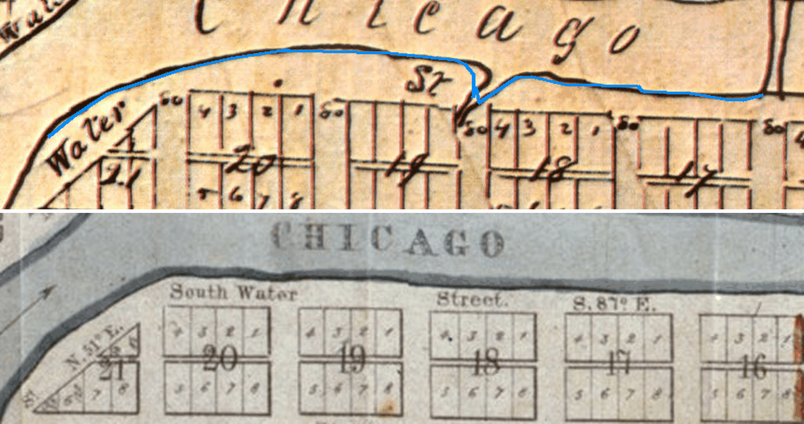

# The swell in the south bank below the bend — whose it is

**Investigated:** 2026-09-26 · **Ticket:** T-1630 (owner report, same day) · **Epoch:**
`e1834_harbor_cut` · **Reach:** local E +160 … +690, the bend at the forks to past the La
Salle slough mouth · **Sheets:** `wright_1834_nara_hup` (NA/HUP facsimile, 5050 × 6628) and
`hathaway_1834` (LOC) · **Tool:** `tools/read_south_bank_swell_1834.py` · **Record:**
`data/traces/south_bank_swell_1834.json`

The owner flew the 1835 scene along South Water Street and reported that the south bank
bulges some 20 m into the main stem from the bend to the La Salle slough, where Hathaway
draws the reach even; he ruled that the correction should follow **Wright's inked bank**
and that *"a correction that goes past Wright's ink is as wrong as the swell"*. This memo
is the measurement that ruling asked for, and it answers the question the ticket said would
decide the work: **is the swell the tracer's, or Wright's?**

It is Wright's.

## 1. Why the master scan could not be asked

`river.geojson` was traced off the Boston Public Library master by `tools/trace_river.py`,
and that region cannot be re-fetched. BPL re-encoded it in September, the pin in
`data/traces/pinned_sources.json` holds the reading to the bytes it was made from, and the
tool declines rather than read bytes it was not made from (T-1397):

```
DECLINING to re-trace wright_1834_forks: the source moved and this project has already ruled on it.
  pinned   3eae241663a2f25276bee8b7bb20235c9ade43b93da3180f2094304c34d3376d  (263,865 bytes)
  received 23e14995db4925d9b4dbbd98b8531d77195e18b05a30bb65ae78e1d140e18563  (231,112 bytes)
```

So the reading went to the **other Wright scan** — the 600 dpi National Archives / Historic
Urban Plans facsimile held in the working copy, under its own eleven-point affine (RMS
16.02 m, `data/traces/gcp/wright_1834_nara_hup_gcps.json`). That is the stronger test in any
case. A line traced off one scan under one registration, checked against the same
draughtsman's ink on a **different scan under a different registration**, agrees for reasons
that have nothing to do with either fit.

## 2. The committed bank stands on Wright's ink

The bank is followed on the facsimile as a stroke — darkness-weighted centroid of the
darkest band in a window about the predicted row, stepping east — in two runs, because the
La Salle re-entrant is a cusp a follower stepping east cannot turn into. The committed
waterline (`river.geojson` to the join at local E +314, `shoreline.geojson` east of it) is
then resampled every 5 m along its own run and measured against that ink.

| | |
|---|---|
| stations, every 5 m, E +160 … +690 | **103** |
| median distance to Wright's inked bank | **1.87 m** |
| p90 | **3.96 m** |
| worst | **9.43 m** |
| stations inside the slough mouth, not measured | 15 |

Against a trace whose own stated vertex uncertainty is ±20 m, and two registrations carrying
17.5 m and 16.0 m of RMS. There is no defect here to repair.



The committed waterline in blue over Wright's own drawing (top), and the same reach on
Hathaway (bottom). Blocks 21, 20, 19, 18 and 17 front South Water Street in both panels; the block numbering
is Thompson’s, re-read on the georeferenced scan in 2026 (`thompson_block_numbering.md`),
so 19 is Wells–La Salle and 18 La Salle–Clark. The
blue line rides the ink the whole way, **including the La Salle re-entrant**, which Wright
draws between blocks 19 and 18 and the trace carries as a notch. Hathaway draws no
re-entrant there at all. (Derived from `wright_1834_nara_hup` and `hathaway_1834`, both
`rights_status: no_known_restrictions` / `public_domain`.)

This also settles the ticket's first hypothesis, which was the `clark_reach_bulge_1834`
failure — outline lettering read as dry ground. It is not that. Wright letters CHICAGO across this reach too, but here the type falls in
the channel well north of the bank — the top panel shows the traced line passing clear
beneath it — where at Clark a letter sat against the bank with a foxing stain joining the
two into one dry region.

## 3. Wright draws the swell; Hathaway does not

The two 1834 sheets disagree about the forks by 58 m, so "how far north is the bank" cannot
be compared between them — the answer would be the registration's. What can be compared is a
distance measured **inside one sheet**: the ground each draughtsman draws between his own
bank and his own block tier's north line, block by block. That number is free of both fits
and of the paper's stretch.

| block | Wright (NA/HUP) | Hathaway | Wright wider by |
|---|---|---|---|
| 20 (Franklin–Wells) | 34.9 m | 29.3 m | **+5.6 m** |
| 19 (Wells–La Salle) | **39.0 m** | 28.2 m | **+10.8 m** |
| 18 (La Salle–Clark) | 31.7 m | 24.2 m | **+7.5 m** |
| 17 (Clark–Dearborn) | 19.8 m | 21.3 m | −1.5 m |

Wright's riverfront ground swells to a local maximum at block 19 and falls away east of it.
Hathaway's narrows monotonically with no maximum in it. **The owner is right that Hathaway
draws this reach even, and right that the model does not.** He is wrong only about why: the
model is not departing from Wright, it is reproducing him.

The disagreement between the two sheets across the reach is **12.3 m** — about half the 20 m
the scene reads. The rest of what the eye picks up is the block grid's own corridor-line
offset: `south_water`'s drawn line and its survey control stand 8.58 m apart, and the block
tier is cut on the drawn one by the owner's 2026-09-21 ruling (T-0419, `docs/CORRIDOR-LINES.md`).
Moving the tier is explicitly refused there and nothing in this memo reopens it.

## 4. The scene is not adding anything either

The rendered ground was checked separately, because a bank that is right in the data can
still be wrong in the terrain. It is not: reading the committed heightfield's own waterline
northward along the reach gives land ending at N +42.5 from E +320 to E +400, N +40 at
E +420 … +440, the notch at the slough mouth at E +460 … +480, and N +20 from E +600 to
E +640. That is the committed bank, cell for cell. The wooded strip, the landing sheds and
the plank walk's curve all stand on ground Wright drew.

## 5. What this leaves, and why it is a question and not a change

The ticket's acceptance asks for two things that this measurement has put in tension:

- *"the south bank sits on Wright's inked bank within the trace's own ink-distance tolerance"* —
  **already true**, at 1.87 m median and 3.96 m p90;
- *"the swell is gone"* — **not reachable** without moving the bank off that ink.

Nothing in the record decides which of the owner's own two instructions governs, because the
answer is not a number. It is a choice about what the reconstruction's waterline rests on:
the master survey the datum, the plat and the block grid are all fitted to, or the second
1834 sheet, which draws this reach the way he sees it. Taking that silently would downgrade
a bank the project holds at `inferred` on a documented trace to a reconstruction, on a reach
whose lots, landings and plank walk are about to be built against it (T-1200). So it is
asked, on T-1630's own `## Decision needed`, and the ticket keeps its place in the queue.

Whichever way it goes, this reading is what the change will be measured against.
