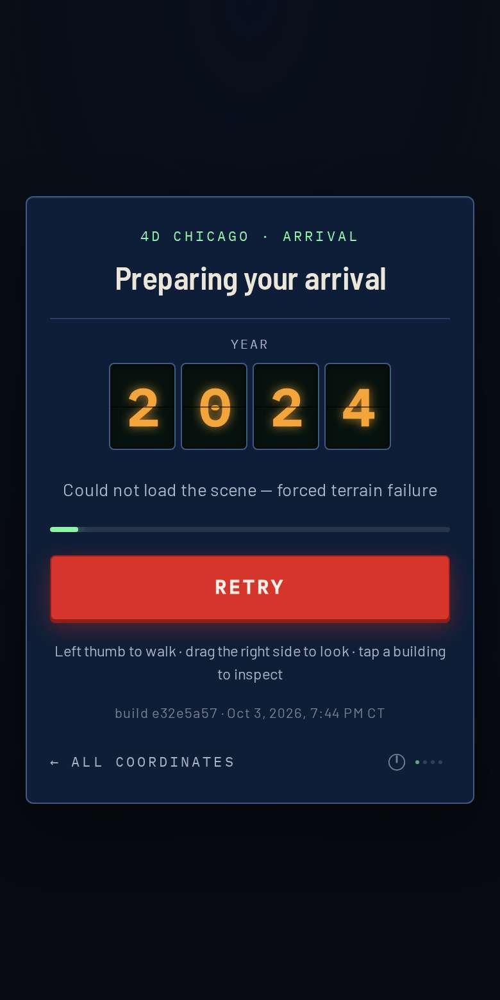
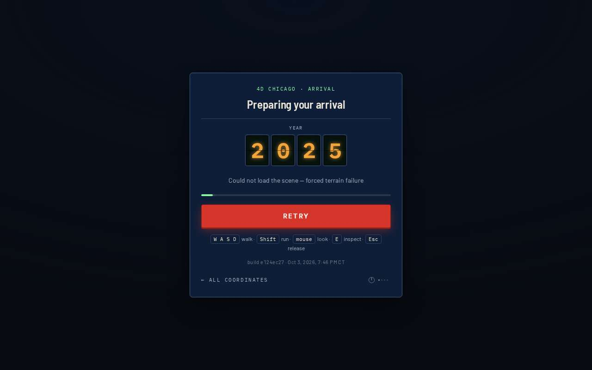
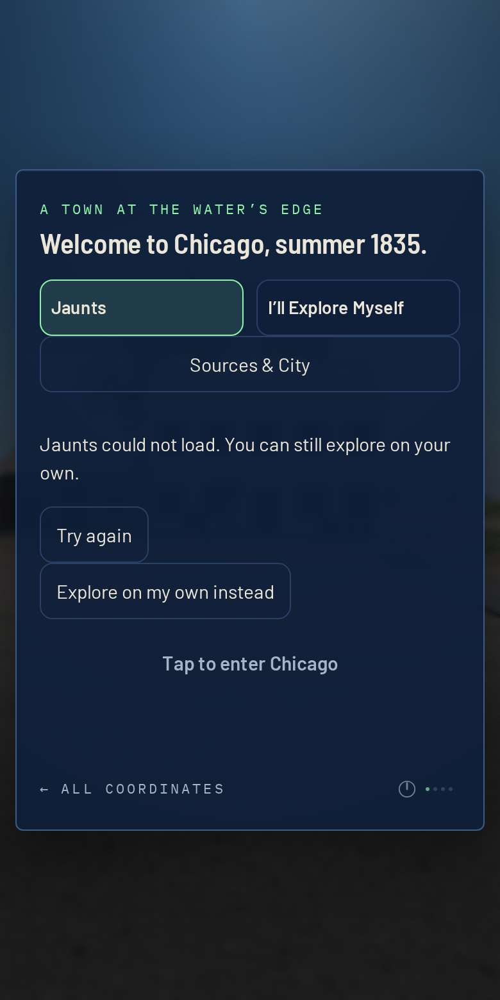
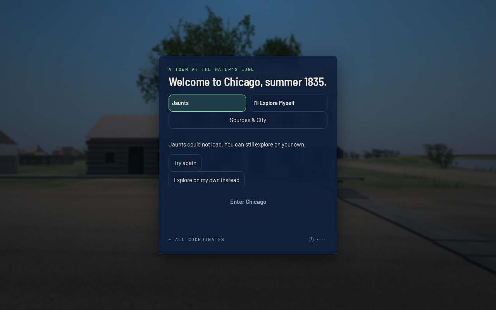
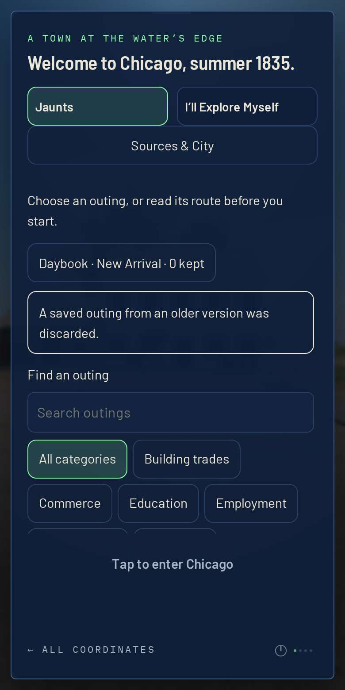
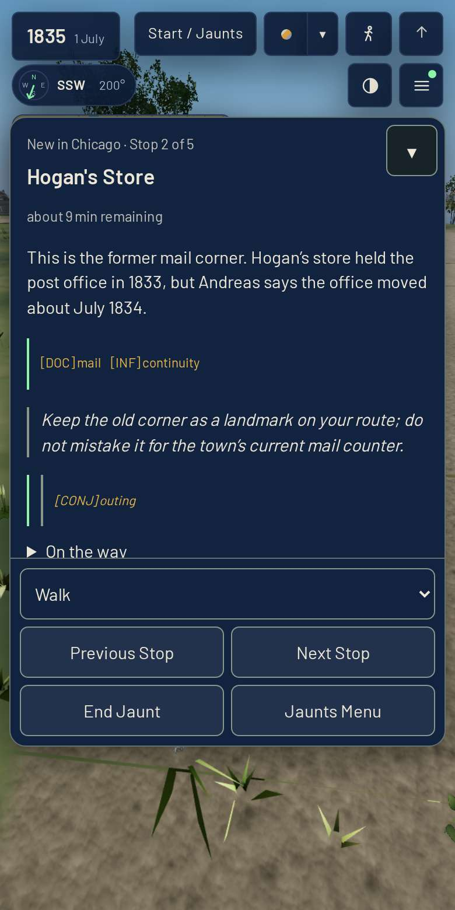
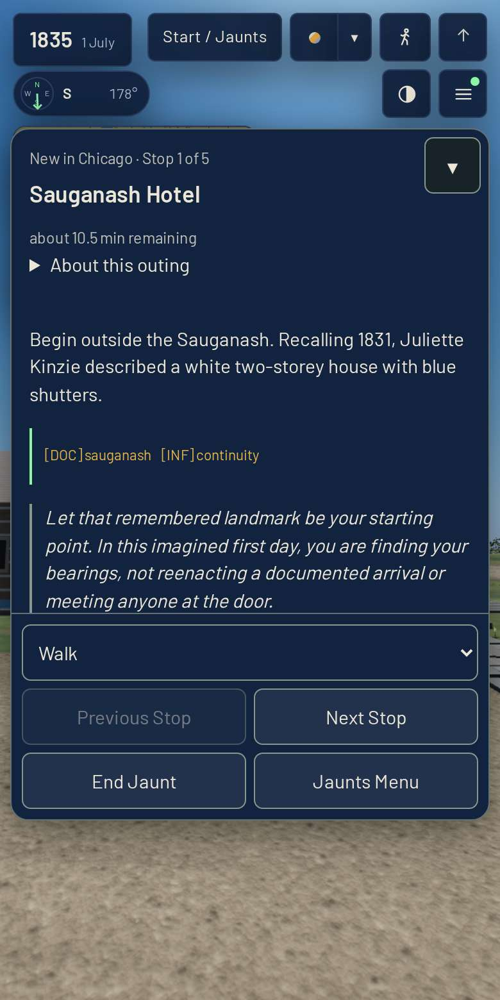
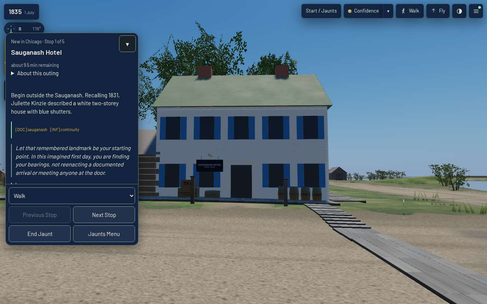

# Arrival and jaunts: boot variants — T-2045, 2026-10-04

Piece 2 of 4 of T-1272. Smoke part 14 (T-2044) walks the arrival-to-jaunt path once,
on a clean cold boot. This page shows eight other ways a visitor arrives, all against the
**published mirror**, at **390×780 touch** and **1280×800 mouse**.

    node tools/measure_arrival_jaunt_variants.mjs [--only warm,slow] [--stills DIR]
    VARIANTS_VIEWPORT=desktop node tools/measure_arrival_jaunt_variants.mjs …

Every variant asks the same three things. First, the arrival counts down, never counts
back up, and reads 1835 only once `api.ready` is true. Second, the welcome is reached, or
a failure says so and offers Retry. Third, a jaunt then starts at its first stop. Page
errors must be zero throughout. The harness serves the mirror the way GitHub Pages does:
gzipped, `max-age=600`, with an ETag answering 304. Headless Chromium cannot put a tab in
the background (bringToFront and the lifecycle freeze both leave `visibilityState` at
`visible`), so `background` copies what a browser does to a hidden tab: `document.hidden`
reads true, `visibilitychange` fires, and animation frames are held until the tab returns.

## Results

| variant | what is done to the boot | 390×780 | 1280×800 |
|---|---|---|---|
| warm | a second visit in the same browser | pass · 1,333 req / 13.76 MB cold → 1,222 req, **all 304**, 0 MB warm | pass · 1,334 / 13.78 MB → 1,222 × 304, 0 MB |
| slow | CPU 4×, Fast 3G (1.6 Mbps, 150 ms) | pass · welcome at 144.7 s, 141 distinct years | pass · welcome at 150.9 s, 83 distinct years |
| essential | terrain.js throws | pass · "Could not load the scene — forced terrain failure", Retry, held at 2024; Retry arrives | pass · held at 2025; Retry arrives |
| optional | people.json 503 | pass · arrives at 1835, error kept on `people` | pass |
| reduced | prefers-reduced-motion | pass · 2026 1996 1931 1866 1835, 0 animations | pass · same five years |
| background | hidden mid-boot for 6 s, then at a stop and mid-ride for 3 s each | pass · hidden at 2017, 0 flips while hidden; same stop; the ride lands at stop 2 | pass · hidden at 2019 |
| stale | another build's history; this build's made absurd; corrupt; older and corrupt saved outings | pass · defaults ×1.00; clamped to ×0.25–×4.00; both outings discarded with their notice | pass |
| catalog | statuses.json and jaunts/catalog.json 503 | pass · 6 of 7 cards from the early set; "Jaunts could not load" + Try again; Explore Myself enters; Try again recovers | pass · 8 of 9 early cards |

**Defect found and fixed here.** The gate's hint row was tied to the live control backend
(`body.is-touch`). But the gate is shown exactly when no backend is live: one is only
activated on entering the town, and dropped again on returning to the welcome. So on a
phone the gate showed **W A S D walk · Shift run · mouse look · E inspect · Esc release**
for the whole arrival, on a failed boot, and back on the welcome. The harness now checks
the hint row in every arrival and on the failure screen. That check was red on the
unfixed mirror (`mobile/essential`: "shows keys", twice). It is green after the fix, which
sets `body.touch-first` from `prefersTouch()` at module start and shows the thumb row
under either class. On 1280×800 the keyboard row is unchanged.

Which runs were taken after the fix: mobile essential, optional, reduced and background,
and desktop essential. All of these passed, including the hint checks. Mobile warm, slow,
stale and catalog, and desktop optional, reduced, background, warm, stale, catalog and
slow, passed on the same tree before the fix, which changes one body class and two CSS
selectors.

## Findings for the successors

- **A warm visit still makes 1,222 requests.** The data loaders fetch with
  `cache: 'no-cache'`, so each one is a revalidation round trip. They cost no bytes, but a
  warm boot was no faster than a cold one here (26.1 s against 24.3 s at 390×780; the
  time goes to the CPU in software WebGL). On a phone at 150 ms that is still 1,222
  conditional requests. Whether a build-stamped URL could replace `no-cache` belongs to
  T-2047's budgets.
- **Throttled CPU 4× + Fast 3G reaches the welcome in about 2.5 minutes** at both
  viewports. The year keeps moving throughout (141 and 83 distinct readings), so a slow
  arrival never looks stalled.

## Stills

| | 390×780 | 1280×800 |
|---|---|---|
| essential failure (after the fix) |  |  |
| catalog failure |  |  |
| older saved outing |  | |
| a ride hidden mid-way, landed |  | |
| throttled boot, jaunt at stop 1 |  |  |

Gate for this PR: `./tools/check.sh` green (759 steps). Smoke `--published` mobile parts
1–2: 174 passed, 0 failed. Desktop part 1 passed 73 checks and was then stopped by the
600 s foreground ceiling. Dev's own record for that part is 10 m 31 s on a 9-CPU host,
so it cannot finish inside the ceiling here.
