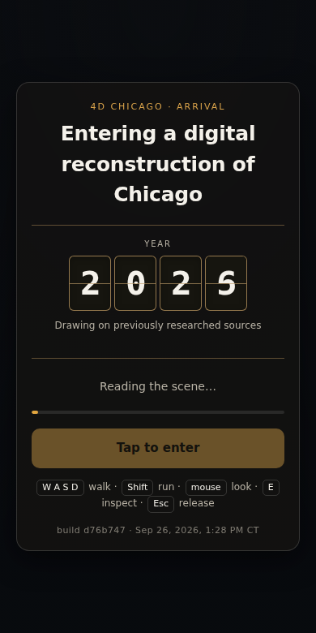
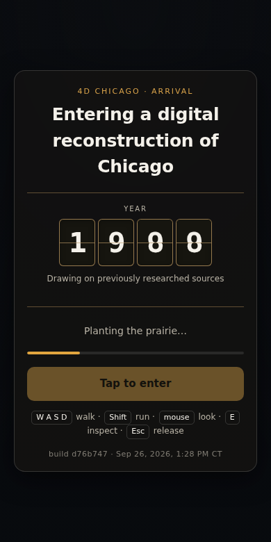
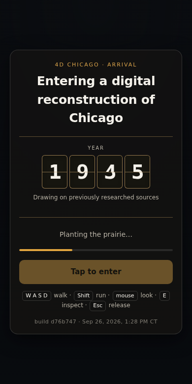
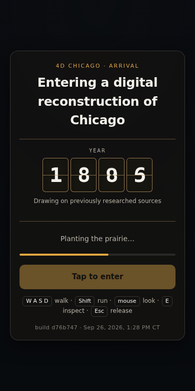
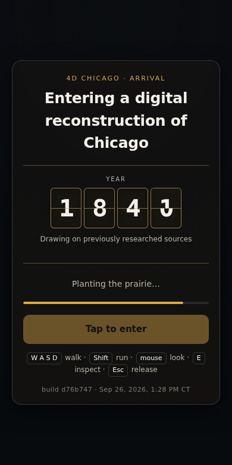
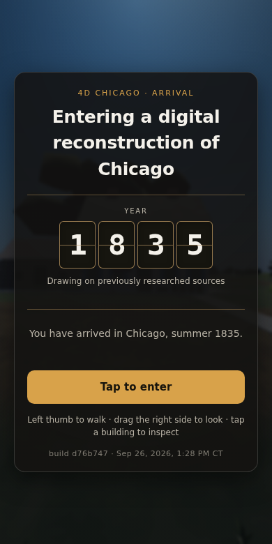

# T-1247 — arrival acceptance

PR #87 reuses the original arrival work. Recovery gives the gate one presentation
owner: `arrival.js`. The legacy `progress()` adapter and post-ready `world.describe()`
write no longer overwrite the year, progress rule, phase announcements or final copy.

The year interpolates between real boot events, using the device/detail/history
weights from `api.boot.expected`. Uncounted active work approaches 92% of its weight;
counted work follows units. Progress never decreases when estimates become counts.
The continuous year follows that bound monotonically. No frame may show 1835 until
the readiness barrier; the final number, arrival message and enabled entry button
are committed together, within 300 ms. Reduced motion and a boot under 1.5 seconds
settle synchronously, with all leftover flap animations removed.

Only essential phase changes update the polite live region. Optional people/census
failure cannot replace its copy or prevent entry. Essential failure cancels the
presentation frame, freezes the year and offers a capture-phase Retry click handler.

## Browser evidence

Measured 2026-09-26 in headless Chromium 153.0.8010.0 on Linux, software rendering.
These are viewport emulations, not physical-phone measurements. The cold case uses
390×780 touch/light, CPU 4× and Fast 3G (1.6 Mbps down, 750 Kbps up, 150 ms latency),
serving the generated published mirror with gzip. Other cases are unthrottled.

| Case | Result |
| --- | --- |
| Throttled cold boot | Monotone years, never 1835 before `api.ready`; arrival copy persists |
| Reduced motion | Five year readings including 1835; zero flap animations |
| Forced terrain failure | Frozen year above 1835, failure text, enabled Retry; never arrived |
| Forced `people.json` 503 | People phase records its error; essential boot still arrives |
| 320 / 390 / 1280 px, light and dark | Long phase and card text stay inside the viewport without overlapping; card is intentionally clamped to two lines |
| Sub-1.5-second browser fixture | Real boot and arrival controllers finish in 101.2 ms; same-turn 1835/message/enabled button, zero remaining animations |

The fast fixture supplies synthetic completed work to the real controllers. It
proves the fast path; it does **not** claim this software renderer boots the full
town in under 1.5 seconds. The ordinary reduced-motion town load took 18 seconds.

Receipts: [boot variants](arrival/boot-cases.json), [fast fixture](arrival/fast-fixture.json),
[cold sequence](arrival/cold-results.json). Six stills follow the year through the
throttled run, then show the ready state:








[320 light](arrival/layout-320-light.png) · [320 dark](arrival/layout-320-dark.png) ·
[390 light](arrival/layout-390-light.png) · [390 dark](arrival/layout-390-dark.png) ·
[1280 light](arrival/layout-1280-light.png) · [1280 dark](arrival/layout-1280-dark.png)

## Reproduce

```sh
bash tools/publish.sh
node tools/test_arrival.mjs
NODE_PATH=/path/to/node_modules PW_EXECUTABLE=/path/to/chromium node tools/measure_arrival.mjs
NODE_PATH=/path/to/node_modules PW_EXECUTABLE=/path/to/chromium node tools/measure_boot_payload.mjs --check
./tools/preflight.sh
```

`measure_arrival.mjs` writes to `/tmp/arrival-evidence` by default; set
`ARRIVAL_EVIDENCE` to choose another directory. `--cold-only` repeats the throttled
sequence/layouts; `--fast-only` runs the controlled fast-path browser fixture.

The pure gate test also exercises the real boot emitter with a controlled clock:
count corrections cannot reverse the year; optional phase events cannot replace
arrival; failure followed by `phaseend` cannot erase failure; Retry reloads; a finished
or failed controller leaves no animation frame scheduled. Its isolation was measured
with `measure_step_isolation.mjs --tool tools/test_arrival.mjs` (no in-tree writes).

The module is under 9 KB **unminified**, below its 12 KB budget. Measured cold boot
wire payload: **9.617 MB / 12.000 MB**. Full renderer smoke results are recorded in
`tools/dev-smoke-state.json` and the PR; a unit/controller pass is not described as a
full renderer smoke pass.
