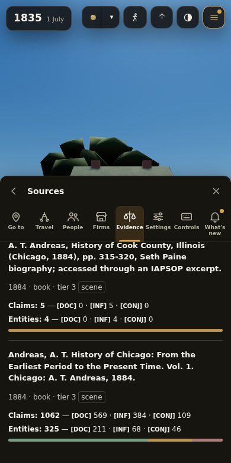
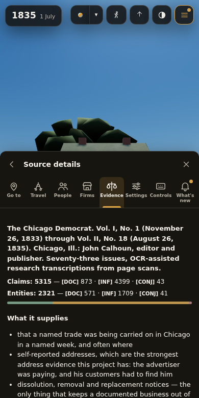
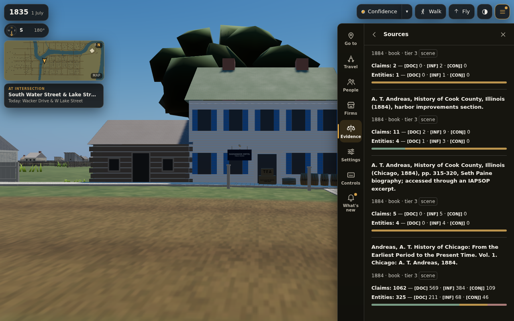
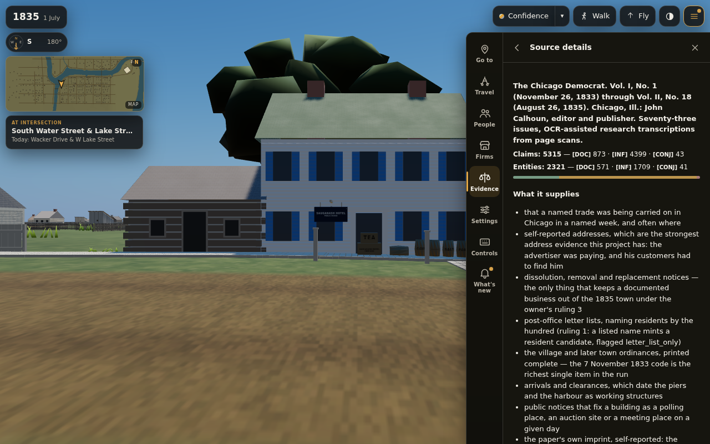

# Sources browser — T-1276

Published Chromium 153 acceptance at 390×780 (touch/light) and 1280×800 (light),
on the T-1276 working tree based on dev `f5cd1867`.

Both widths pass: 293 registered sources, 223 used in this scene, initially 40 rows;
Andreas search/type/tier filtering; date/title/claim/entity sorts checked separately;
collapsed newspaper issues; the Chicago Democrat → Sauganash card link; return to
identical search, filter and scroll; switching Evidence topics preserves that state;
no horizontal overflow; zero page errors. A forced catalog 503 leaves an honest
unavailable note and the other Evidence topics usable.

The first topic open transfers **31,776 gzip bytes** for module, stylesheet and index.
The index alone is **108,135 uncompressed bytes**, below its 120,000-byte ceiling.
No Sources module or index is requested at boot. The full boot measurement is
**9.683 MB / 12 MB**; this includes the existing scene, not just the browser UI.

`test_sources_view.mjs` independently recounts every source's claims and entities
from its edge file and checks the compiler's confidence vectors. A mixed-confidence
entity counts once at its strongest grade; separate claims still count separately.
Counts cover all of a source's recorded uses. Scene-only is a filter on which
sources appear, not a silent removal of their other-scene or research claims.

The published Evidence regression is in `tools/smoke_renderer.mjs` parts 12–13.
Mobile completed with 196 checks passed and zero failed. The combined run then
hit the session limit during desktop (84 passed, none failed); the standalone
desktop rerun completed with 198 passed and zero failed, including two vendor checks.
Both widths reached the final zero-page-errors assertion. Logs retain both attempts.
Those parts test the existing drawer, City, people, firms, Evidence and inspection
surfaces, including the new lazy Sources tile/count/search assertions. Their results
are filed in the PR and smoke ledger; a staged run is not a full renderer verdict.

## Reproduce

From `chicago/4d`, with Playwright and Chromium available:

```sh
bash tools/publish.sh
node tools/test_sources_view.mjs
NODE_PATH=<node_modules> PW_EXECUTABLE=<chromium> node tools/measure_sources.mjs
NODE_PATH=<node_modules> PW_EXECUTABLE=<chromium> node tools/measure_boot_payload.mjs --check
SMOKE_STAGE=12-13 NODE_PATH=<node_modules> PW_EXECUTABLE=<chromium> node tools/smoke_renderer.mjs --published
./tools/preflight.sh
```

The focused harness writes `/tmp/sources-evidence/` by default; set `SOURCES_EVIDENCE`
to choose a different receipt directory. Do not republish while a browser run is active.





